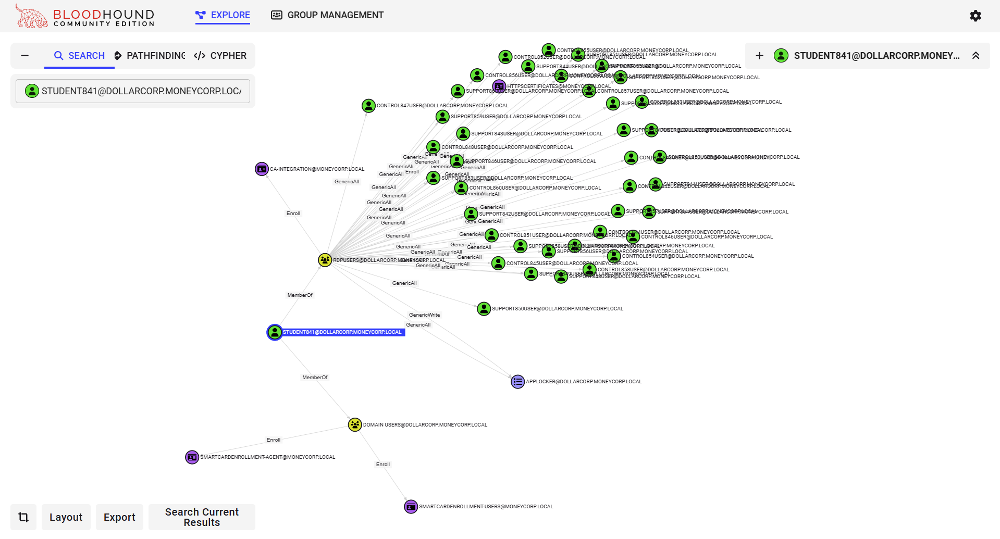

# Learning Objective 02

## Tasks

1. **Enumerate following for the `dollarcorp` domain:**
	- **ACLs for the "Domain Admins" group**
	- **ACLs where `student422` has interesting permissions**
2. **Analyze the permissions for `student422` in BloodHound UI**

---

## Solution

1. **Enumerate following for the `dollarcorp` domain:**
	- **ACLs for the "Domain Admins" group**
	- **ACLs where `student422` has interesting permissions**

To enumerate ACLs, we can use `Get-DomainObjectACL` from PowerView.

**Note:** Remember to continue using the PowerShell session started using `Invisi-Shell`.

**Enumerate ACLs for the "Domain Admins" group**


`cd \AD\Tools`

`C:\AD\Tools\InviShell\RunWithRegistryNonAdmin.bat`:
```
[SNIP]
```

`Get-DomainObjectAcl -Identity "Domain Admins" -ResolveGUIDs -Verbose`:
```
AceQualifier           : AccessAllowed
ObjectDN               : CN=Domain Admins📌,CN=Users,DC=dollarcorp,DC=moneycorp,DC=local
ActiveDirectoryRights  : ReadProperty📌
ObjectAceType          : User-Account-Restrictions📌
ObjectSID              : S-1-5-21-719815819-3726368948-3917688648-512
InheritanceFlags       : None
BinaryLength           : 60
AceType                : AccessAllowedObject📌
ObjectAceFlags         : ObjectAceTypePresent, InheritedObjectAceTypePresent
IsCallback             : False
PropagationFlags       : None
SecurityIdentifier     : S-1-5-32-554
AccessMask             : 16
AuditFlags             : None
IsInherited            : False
AceFlags               : None
InheritedObjectAceType : inetOrgPerson
OpaqueLength           : 0

AceQualifier           : AccessAllowed
ObjectDN               : CN=Domain Admins📌,CN=Users,DC=dollarcorp,DC=moneycorp,DC=local
ActiveDirectoryRights  : ReadProperty📌
ObjectAceType          : User-Account-Restrictions📌
ObjectSID              : S-1-5-21-719815819-3726368948-3917688648-512
InheritanceFlags       : None
BinaryLength           : 60
AceType                : AccessAllowedObject📌
ObjectAceFlags         : ObjectAceTypePresent, InheritedObjectAceTypePresent
IsCallback             : False
PropagationFlags       : None
SecurityIdentifier     : S-1-5-32-554
AccessMask             : 16
AuditFlags             : None
IsInherited            : False
AceFlags               : None
InheritedObjectAceType : User
OpaqueLength           : 0

[SNIP]
```

`whoami`:
```
dcorp\student422
```

**Enumerate ACLs where `student422` has interesting permissions**

Finally, to check for modify rights/permissions for the `student422`, we can use `Find-InterestingDomainACL` from PowerView.

`Find-InterestingDomainAcl -ResolveGUIDs | ?{$_.IdentityReferenceName -match "student422"}`:
```
```
❌

Nothing interesting!

`Get-DomainUser -Name student422`:
```
logoncount            : 12
badpasswordtime       : 2/11/2025 3:49:37 AM
distinguishedname     : CN=student422,CN=Users,DC=dollarcorp,DC=moneycorp,DC=local
objectclass           : {top, person, organizationalPerson, user}
displayname           : student422
lastlogontimestamp    : 2/8/2025 9:14:18 PM
userprincipalname     : student422@dollarcorp.moneycorp.local
samaccountname        : student422👤
codepage              : 0
samaccounttype        : USER_OBJECT
accountexpires        : NEVER
countrycode           : 0
whenchanged           : 2/9/2025 5:14:18 AM
instancetype          : 4
usncreated            : 307616
objectguid            : 3c631361-8660-452d-849c-59269b9c99fc
lastlogoff            : 12/31/1600 4:00:00 PM
whencreated           : 1/16/2025 3:59:30 PM
objectcategory        : CN=Person,CN=Schema,CN=Configuration,DC=moneycorp,DC=local
dscorepropagationdata : {1/16/2025 3:59:30 PM, 1/1/1601 12:00:00 AM}
givenname             : student422
usnchanged            : 483797
memberof              : CN=RDP Users👥,CN=Users,DC=dollarcorp,DC=moneycorp,DC=local
lastlogon             : 2/11/2025 3:25:38 AM
badpwdcount           : 2748
cn                    : student422
useraccountcontrol    : NORMAL_ACCOUNT, DONT_EXPIRE_PASSWORD
objectsid             : S-1-5-21-719815819-3726368948-3917688648-20607
primarygroupid        : 513
pwdlastset            : 1/16/2025 7:59:38 AM
name                  : student422
```

Since `student422` is a member of the "RDPUsers" group, let us check permissions for it too.

`Find-InterestingDomainAcl -ResolveGUIDs | ?{$_.IdentityReferenceName -match "RDPUsers"}`:
```
ObjectDN                : CN=Control416User📌,CN=Users,DC=dollarcorp,DC=moneycorp,DC=local
AceQualifier            : AccessAllowed
ActiveDirectoryRights   : GenericAll📌
ObjectAceType           : None
AceFlags                : None
AceType                 : AccessAllowed
InheritanceFlags        : None
SecurityIdentifier      : S-1-5-21-719815819-3726368948-3917688648-1123
IdentityReferenceName   : RDPUsers👥
IdentityReferenceDomain : dollarcorp.moneycorp.local
IdentityReferenceDN     : CN=RDP Users,CN=Users,DC=dollarcorp,DC=moneycorp,DC=local
IdentityReferenceClass  : group

ObjectDN                : CN=Control417User📌,CN=Users,DC=dollarcorp,DC=moneycorp,DC=local
AceQualifier            : AccessAllowed
ActiveDirectoryRights   : GenericAll📌
ObjectAceType           : None
AceFlags                : None
AceType                 : AccessAllowed
InheritanceFlags        : None
SecurityIdentifier      : S-1-5-21-719815819-3726368948-3917688648-1123
IdentityReferenceName   : RDPUsers👥
IdentityReferenceDomain : dollarcorp.moneycorp.local
IdentityReferenceDN     : CN=RDP Users,CN=Users,DC=dollarcorp,DC=moneycorp,DC=local
IdentityReferenceClass  : group

[SNIP]

ObjectDN                : CN=Support416User📌,CN=Users,DC=dollarcorp,DC=moneycorp,DC=local
AceQualifier            : AccessAllowed
ActiveDirectoryRights   : GenericAll📌
ObjectAceType           : None
AceFlags                : None
AceType                 : AccessAllowed
InheritanceFlags        : None
SecurityIdentifier      : S-1-5-21-719815819-3726368948-3917688648-1123
IdentityReferenceName   : RDPUsers👥
IdentityReferenceDomain : dollarcorp.moneycorp.local
IdentityReferenceDN     : CN=RDP Users,CN=Users,DC=dollarcorp,DC=moneycorp,DC=local
IdentityReferenceClass  : group

[SNIP]

ObjectDN                : CN={0D1CC23D-1F20-4EEE-AF64-D99597AE2A6E}📌,CN=Policies,CN=System,DC=dollarcorp,DC=moneycorp,DC=local
AceQualifier            : AccessAllowed
ActiveDirectoryRights   : GenericAll📌
ObjectAceType           : None
AceFlags                : None
AceType                 : AccessAllowed
InheritanceFlags        : None
SecurityIdentifier      : S-1-5-21-719815819-3726368948-3917688648-1123
IdentityReferenceName   : RDPUsers👥
IdentityReferenceDomain : dollarcorp.moneycorp.local
IdentityReferenceDN     : CN=RDP Users,CN=Users,DC=dollarcorp,DC=moneycorp,DC=local
IdentityReferenceClass  : group

[SNIP]
```

`Get-DomainGPO -Identity '{0D1CC23D-1F20-4EEE-AF64-D99597AE2A6E}'`:
```
flags                    : 0
displayname              : Applocker📑
gpcmachineextensionnames : [{35378EAC-683F-11D2-A89A-00C04FBBCFA2}{62C1845D-C4A6-4ACB-BBB0-C895FD090385}{D02B1F72-3407-48AE-BA88-E8213C6761F1}][{827D319E-6EAC-11D2-A4
                           EA-00C04F79F83A}{803E14A0-B4FB-11D0-A0D0-00A0C90F574B}]
whenchanged              : 1/6/2025 8:33:19 AM
versionnumber            : 15
name                     : {0D1CC23D-1F20-4EEE-AF64-D99597AE2A6E}
cn                       : {0D1CC23D-1F20-4EEE-AF64-D99597AE2A6E}
usnchanged               : 303528
dscorepropagationdata    : {1/6/2025 8:33:19 AM, 12/18/2024 8:31:49 AM, 12/18/2024 8:31:01 AM, 12/18/2024 8:30:36 AM...}
objectguid               : bcf4770b-b560-468b-88cb-6beaeb6793f9
gpcfilesyspath           : \\dollarcorp.moneycorp.local\SysVol\dollarcorp.moneycorp.local\Policies\{0D1CC23D-1F20-4EEE-AF64-D99597AE2A6E}📌
distinguishedname        : CN={0D1CC23D-1F20-4EEE-AF64-D99597AE2A6E}📌,CN=Policies,CN=System,DC=dollarcorp,DC=moneycorp,DC=local
whencreated              : 11/15/2022 4:21:20 AM
showinadvancedviewonly   : True
usncreated               : 45231
gpcfunctionalityversion  : 2
instancetype             : 4
objectclass              : {top, container, groupPolicyContainer}
objectcategory           : CN=Group-Policy-Container,CN=Schema,CN=Configuration,DC=moneycorp,DC=local
```

2. **Analyze the permissions for `student422` using BloodHound UI**

Note that **it is easier to analyze ACLs using BloodHound** as it shows interesting ACLs for the user and the groups it is a member of.

Let's look at the 'Outbound Object Control' for the `student841` in the BloodHound CE UI.



Multiple permissions stand out in the above diagram.

Due to the membership of the "RDPUsers" group, the `student841` user has the following interesting permissions:
- Full Control/`GenericAll` over `supportx` and `controlx` users.
- Full Control/`GenericAll` on the `Applocker` group policy.
- `Enrollment` permissions on multiple certificate templates.

---
---
