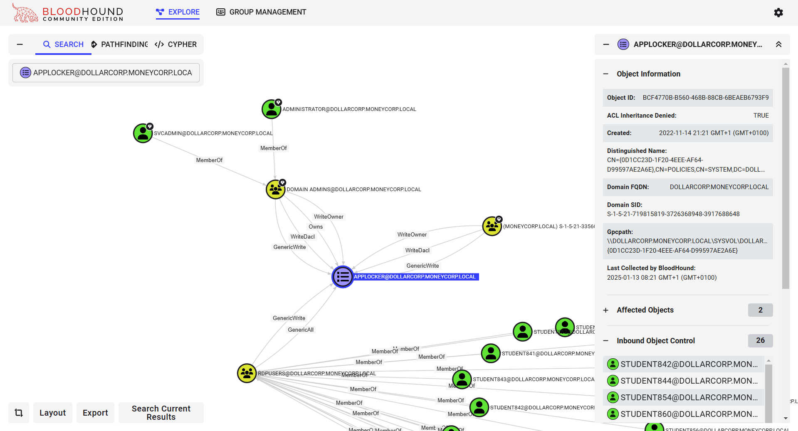
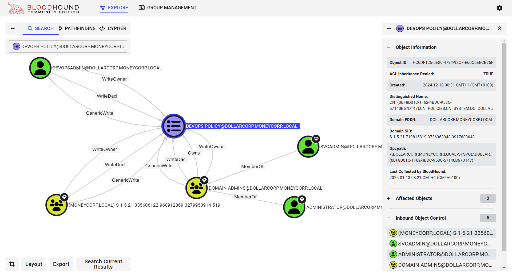

# Learning Objective 03 (OUs/GPOs/ACLs Enumeration)

## Tasks

1. **Enumerate following for the `dollarcorp` domain:**
	- **List all the OUs**
	- **List all the computers in the `DevOps` OU**
	- **List all the GPOs**
	- **Enumerate GPOs applied on the `DevOps` OU**
	- **Enumerate ACLs for the `Applocker` and `DevOps Policy` GPOs**

---

## Solution

1. **Enumerate following for the `dollarcorp` domain:**
	- **List all the OUs**
	- **List all the computers in the `DevOps` OU**
	- **List all the GPOs**
	- **Enumerate GPO applied on the DevOps OU**
	- **Enumerate ACLs for the `Applocker` and `DevOps Policy` GPOs**

We can continue using PowerView for enumeration.

To list all the OUs, run the below PowerView command form a PowerShell session started using Invisi-Shell.


`cd \AD\Tools`

`C:\AD\Tools\InviShell\RunWithRegistryNonAdmin.bat`:
```
[SNIP]
```

`. C:\AD\Tools\PowerView.ps1`

**List all the OUs**

`Get-DomainOU`:
```
description            : Default container for domain controllers
systemflags            : -1946157056
iscriticalsystemobject : True
gplink                 : [LDAP://CN={6AC1786C-016F-11D2-945F-00C04fB984F9},CN=Policies,CN=System,DC=dollarcorp,DC=moneycorp,DC=local;0]
whenchanged            : 11/12/2022 5:59:00 AM
objectclass            : {top, organizationalUnit}
showinadvancedviewonly : False
usnchanged             : 7921
dscorepropagationdata  : {12/5/2024 12:47:28 PM, 11/15/2022 3:49:24 AM, 11/12/2022 5:59:41 AM, 1/1/1601 6:12:17 PM}
name                   : Domain Controllers📌
distinguishedname      : OU=Domain Controllers,DC=dollarcorp,DC=moneycorp,DC=local
ou                     : Domain Controllers
usncreated             : 7921
whencreated            : 11/12/2022 5:59:00 AM
instancetype           : 4
objectguid             : 802da67f-f1f8-40a7-9d13-7e76ccb25e39
objectcategory         : CN=Organizational-Unit,CN=Schema,CN=Configuration,DC=moneycorp,DC=local

usncreated            : 44996
displayname           : StudentMachines
gplink                : [LDAP://cn={7478F170-6A0C-490C-B355-9E4618BC785D},cn=policies,cn=system,DC=dollarcorp,DC=moneycorp,DC=local;0]
whenchanged           : 11/15/2022 5:46:19 AM
objectclass           : {top, organizationalUnit}
usnchanged            : 45933
dscorepropagationdata : {12/5/2024 12:47:28 PM, 11/15/2022 3:49:24 AM, 11/15/2022 3:49:24 AM, 1/1/1601 12:00:01 AM}
name                  : StudentMachines📌
distinguishedname     : OU=StudentMachines,DC=dollarcorp,DC=moneycorp,DC=local
ou                    : StudentMachines
whencreated           : 11/15/2022 3:49:24 AM
instancetype          : 4
objectguid            : 1c7cd8cb-d8bb-412f-9d76-9cff8afa021f
objectcategory        : CN=Organizational-Unit,CN=Schema,CN=Configuration,DC=moneycorp,DC=local

usncreated            : 45190
name                  : Applocked📌
gplink                : [LDAP://cn={0D1CC23D-1F20-4EEE-AF64-D99597AE2A6E},cn=policies,cn=system,DC=dollarcorp,DC=moneycorp,DC=local;0]
whenchanged           : 11/15/2022 4:21:20 AM
objectclass           : {top, organizationalUnit}
usnchanged            : 45237
dscorepropagationdata : {12/5/2024 12:47:28 PM, 11/15/2022 4:16:38 AM, 1/1/1601 12:00:01 AM}
distinguishedname     : OU=Applocked,DC=dollarcorp,DC=moneycorp,DC=local
ou                    : Applocked
whencreated           : 11/15/2022 4:16:38 AM
instancetype          : 4
objectguid            : e33cfcdb-8c09-4a51-a0bf-c67815e72615
objectcategory        : CN=Organizational-Unit,CN=Schema,CN=Configuration,DC=moneycorp,DC=local

[SNIP]

usncreated            : 293036
name                  : DevOps📌
gplink                : [LDAP://cn={0BF8D01C-1F62-4BDC-958C-57140B67D147},cn=policies,cn=system,DC=dollarcorp,DC=moneyc
                        orp,DC=local;0]
whenchanged           : 12/24/2024 7:08:45 AM
objectclass           : {top, organizationalUnit}
usnchanged            : 296492
dscorepropagationdata : {12/18/2024 7:28:35 AM, 1/1/1601 12:00:00 AM}
distinguishedname     : OU=DevOps,DC=dollarcorp,DC=moneycorp,DC=local
ou                    : DevOps
whencreated           : 12/18/2024 7:28:35 AM
instancetype          : 4
objectguid            : 6659e940-fadf-4dc4-9eb7-3852bb441a52
objectcategory        : CN=Organizational-Unit,CN=Schema,CN=Configuration,DC=moneycorp,DC=local

[SNIP]
```

`Get-DomainOU | select -ExpandProperty name`:
```
Domain Controllers
StudentMachines
Applocked
Servers
DevOps📌
```
🚩

**List all the computers in the `DevOps` OU**

`(Get-DomainOU -Identity DevOps).distinguishedname | %{Get-DomainComputer -SearchBase $_} | select -ExpandProperty name`:
```
DCORP-CI🖥️
```
🚩

**List all the GPOs**

`Get-DomainGPO`:
```
[SNIP]

flags                    : 0
displayname              : Applocker📑
gpcmachineextensionnames : [{35378EAC-683F-11D2-A89A-00C04FBBCFA2}{62C1845D-C4A6-4ACB-BBB0-C895FD090385}{D02B1F72-3407-48AE-BA88-E8213C6761F1}][{827D319E-6EAC-11D2-A4EA-00C04F79F83A}{803E1
                           4A0-B4FB-11D0-A0D0-00A0C90F574B}]
whenchanged              : 1/6/2025 8:33:19 AM
versionnumber            : 15
name                     : {0D1CC23D-1F20-4EEE-AF64-D99597AE2A6E}📌
cn                       : {0D1CC23D-1F20-4EEE-AF64-D99597AE2A6E}
usnchanged               : 303528
dscorepropagationdata    : {1/6/2025 8:33:19 AM, 12/18/2024 8:31:49 AM, 12/18/2024 8:31:01 AM, 12/18/2024 8:30:36 AM...}
objectguid               : bcf4770b-b560-468b-88cb-6beaeb6793f9
gpcfilesyspath           : \\dollarcorp.moneycorp.local\SysVol\dollarcorp.moneycorp.local\Policies\{0D1CC23D-1F20-4EEE-AF64-D99597AE2A6E}
distinguishedname        : CN={0D1CC23D-1F20-4EEE-AF64-D99597AE2A6E},CN=Policies,CN=System,DC=dollarcorp,DC=moneycorp,DC=local
whencreated              : 11/15/2022 4:21:20 AM
showinadvancedviewonly   : True
usncreated               : 45231
gpcfunctionalityversion  : 2
instancetype             : 4
objectclass              : {top, container, groupPolicyContainer}
objectcategory           : CN=Group-Policy-Container,CN=Schema,CN=Configuration,DC=moneycorp,DC=local

[SNIP]

flags                    : 0
displayname              : DevOps Policy📑
gpcmachineextensionnames : [{35378EAC-683F-11D2-A89A-00C04FBBCFA2}{D02B1F72-3407-48AE-BA88-E8213C6761F1}][{827D319E-6EAC-11D2-A4EA-00C04F79F83A}{803E14A0-B4FB-11D0-A0
                           D0-00A0C90F574B}]
whenchanged              : 12/24/2024 7:09:01 AM
versionnumber            : 3
name                     : {0BF8D01C-1F62-4BDC-958C-57140B67D147}📌
cn                       : {0BF8D01C-1F62-4BDC-958C-57140B67D147}
usnchanged               : 296496
dscorepropagationdata    : {12/18/2024 7:31:56 AM, 1/1/1601 12:00:00 AM}
objectguid               : fc0df125-5e26-4794-93c7-e60c6eecb75f
gpcfilesyspath           : \\dollarcorp.moneycorp.local\SysVol\dollarcorp.moneycorp.local\Policies\{0BF8D01C-1F62-4BDC-958C-57140B67D147}
distinguishedname        : CN={0BF8D01C-1F62-4BDC-958C-57140B67D147},CN=Policies,CN=System,DC=dollarcorp,DC=moneycorp,DC=local
whencreated              : 12/18/2024 7:31:22 AM
showinadvancedviewonly   : True
usncreated               : 293100
gpcfunctionalityversion  : 2
instancetype             : 4
objectclass              : {top, container, groupPolicyContainer}
objectcategory           : CN=Group-Policy-Container,CN=Schema,CN=Configuration,DC=moneycorp,DC=local

[SNIP]
```

`Get-DomainGPO | select -ExpandProperty displayname`:
```
Default Domain Policy
Default Domain Controllers Policy
Applocker📑
Servers
Students
DevOps Policy📑
```
🚩

**Enumerate GPOs applied on the `DevOps` OU**

To enumerate GPO applied on the `DevOps` OU, we need the name of the policy from the `gplink` attribute from the OU.

`(Get-DomainOU -Identity 'DevOps').gplink`:
```
[LDAP://cn={0BF8D01C-1F62-4BDC-958C-57140B67D147}📌,cn=policies,cn=system,DC=dollarcorp,DC=moneycorp,DC=local;0]
```

`Get-DomainGPO -Identity '{0BF8D01C-1F62-4BDC-958C-57140B67D147}'`:
```
flags                    : 0
displayname              : DevOps Policy📑
gpcmachineextensionnames : [{35378EAC-683F-11D2-A89A-00C04FBBCFA2}{D02B1F72-3407-48AE-BA88-E8213C6761F1}][{827D319E-6EAC-11D2-A4EA-00C04F79F83A}{803E14A0-B4FB-11D0-A0
                           D0-00A0C90F574B}]
whenchanged              : 12/24/2024 7:09:01 AM
versionnumber            : 3
name                     : {0BF8D01C-1F62-4BDC-958C-57140B67D147}
cn                       : {0BF8D01C-1F62-4BDC-958C-57140B67D147}
usnchanged               : 296496
dscorepropagationdata    : {12/18/2024 7:31:56 AM, 1/1/1601 12:00:00 AM}
objectguid               : fc0df125-5e26-4794-93c7-e60c6eecb75f
gpcfilesyspath           : \\dollarcorp.moneycorp.local\SysVol\dollarcorp.moneycorp.local\Policies\{0BF8D01C-1F62-4BDC-958C-57140B67D147}📌
distinguishedname        : CN={0BF8D01C-1F62-4BDC-958C-57140B67D147},CN=Policies,CN=System,DC=dollarcorp,DC=moneycorp,DC=local
whencreated              : 12/18/2024 7:31:22 AM
showinadvancedviewonly   : True
usncreated               : 293100
gpcfunctionalityversion  : 2
instancetype             : 4
objectclass              : {top, container, groupPolicyContainer}
objectcategory           : CN=Group-Policy-Container,CN=Schema,CN=Configuration,DC=moneycorp,DC=local
```

It is possible to hack both the commands together in a single command (profiting from the static length for GUIDs).

`Get-DomainGPO -Identity (Get-DomainOU -Identity 'DevOps').gplink.substring(11,(Get-DomainOU -Identity DevOps).gplink.length-72)`:
```
flags                    : 0
displayname              : DevOps Policy📑
gpcmachineextensionnames : [{35378EAC-683F-11D2-A89A-00C04FBBCFA2}{D02B1F72-3407-48AE-BA88-E8213C6761F1}][{827D319E-6EAC-11D2-A4EA-00C04F79F83A}{803E14A0-B4FB-11D0-A0
                           D0-00A0C90F574B}]
whenchanged              : 12/24/2024 7:09:01 AM
versionnumber            : 3
name                     : {0BF8D01C-1F62-4BDC-958C-57140B67D147}
cn                       : {0BF8D01C-1F62-4BDC-958C-57140B67D147}
usnchanged               : 296496
dscorepropagationdata    : {12/18/2024 7:31:56 AM, 1/1/1601 12:00:00 AM}
objectguid               : fc0df125-5e26-4794-93c7-e60c6eecb75f
gpcfilesyspath           : \\dollarcorp.moneycorp.local\SysVol\dollarcorp.moneycorp.local\Policies\{0BF8D01C-1F62-4BDC-958C-57140B67D147}📌
distinguishedname        : CN={0BF8D01C-1F62-4BDC-958C-57140B67D147},CN=Policies,CN=System,DC=dollarcorp,DC=moneycorp,DC=local
whencreated              : 12/18/2024 7:31:22 AM
showinadvancedviewonly   : True
usncreated               : 293100
gpcfunctionalityversion  : 2
instancetype             : 4
objectclass              : {top, container, groupPolicyContainer}
objectcategory           : CN=Group-Policy-Container,CN=Schema,CN=Configuration,DC=moneycorp,DC=local
```
🚩

**Enumerate ACLs for the `Applocker` and `DevOps Policy` GPOs**

To enumerate the ACLs for the `Applocker` and `DevOps Policy` GPO, let's use the BloodHound CE UI.

Search for "Applocker" in the UI -> click on the node -> click on `Inboud Object Control`.



It turns out that the "RDPUsers" group has `GenericAll` over the `Applocker` GPO.

Similarly, search for "DevOps" and look at its `Inbound Object Control`.



A user named `devopsadmin` has `WriteDACL` on `DevOps Policy` GPO.
🚩

---
---
